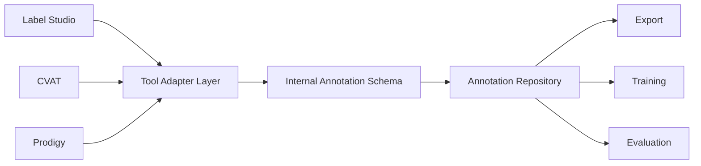
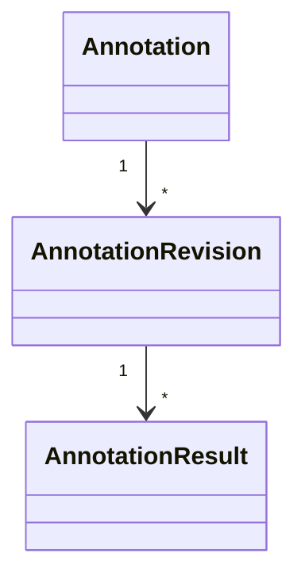
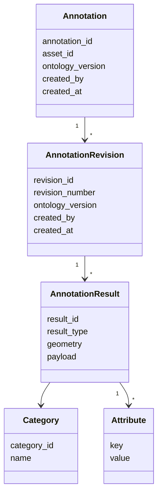
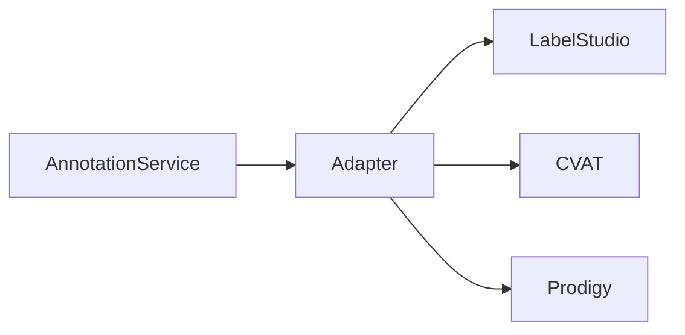
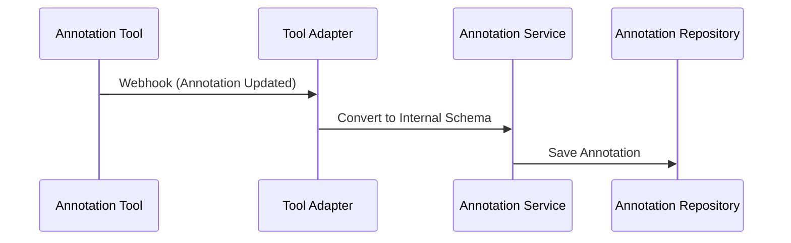
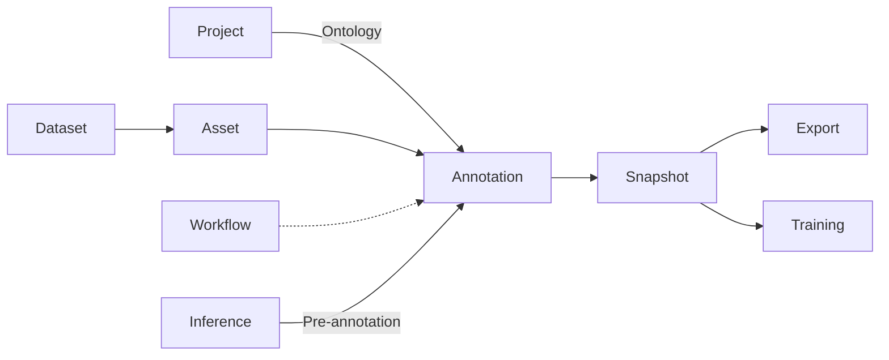

# Annotation Domain

# Mục tiêu

`Annotation Domain` chịu trách nhiệm quản lý toàn bộ dữ liệu gán nhãn (Annotation Data) trong AI Data Platform.

Domain này cung cấp một mô hình dữ liệu thống nhất (**Internal Annotation Schema**) để biểu diễn kết quả gán nhãn cho mọi loại bài toán AI. Nhờ đó, toàn bộ hệ thống có thể làm việc với một định dạng chung mà không phụ thuộc vào công cụ gán nhãn hoặc loại dữ liệu.

Annotation Domain chỉ quản lý **dữ liệu gán nhãn** và **lịch sử thay đổi của dữ liệu**, không quản lý quy trình xử lý (Workflow), phân công công việc hay kiểm duyệt.

Annotation Domain chịu trách nhiệm:

- Quản lý Annotation.
- Chuẩn hóa dữ liệu.
- Quản lý Annotation Revision.
- Kiểm tra tính hợp lệ của Annotation.
- Đồng bộ dữ liệu với Annotation Tool.
- Cung cấp dữ liệu cho Snapshot.

# Thiết kế (Design)

Annotation Domain được thiết kế theo nguyên tắc **Tool Agnostic**, nghĩa là toàn bộ nghiệp vụ của hệ thống không phụ thuộc vào Label Studio, CVAT hay bất kỳ công cụ annotation nào.

Mọi dữ liệu được tạo ra từ Annotation Tool đều phải được chuyển đổi sang **Internal Annotation Schema** trước khi lưu trữ hoặc cung cấp cho các module khác.

Kiến trúc này giúp AI Data Platform có thể thay thế hoặc bổ sung Annotation Tool mà không ảnh hưởng đến các Domain còn lại.

# Domain Model

Annotation Domain được xây dựng xoay quanh các Entity sau.

| Entity | Trách nhiệm |
| --- | --- |
| Annotation | Đại diện cho một lần gán nhãn của một Asset. |
| Annotation Result | Đại diện cho từng kết quả gán nhãn trong Annotation. |
| Category | Nhãn (Label) được sử dụng trong Annotation. |
| Attribute | Thuộc tính bổ sung của Category hoặc Result. |
| Ontology Reference | Tham chiếu đến Ontology mà Annotation tuân theo. |
| **Annotation Revision** | Lưu từng lần thay đổi của Annotation. |

---

## Annotation

Annotation là thực thể trung tâm của Domain.

Một Annotation đại diện cho kết quả gán nhãn của một Asset theo một Ontology xác định.

Annotation không trực tiếp chứa hình học hoặc nội dung gán nhãn, mà quản lý tập hợp các `Annotation Result`.

Ví dụ:

- Một ảnh có thể có một Annotation.
- Một Annotation có thể chứa nhiều Bounding Box.
- Một Annotation có thể chứa nhiều Polygon.
- Một Annotation có thể chứa nhiều đoạn văn bản OCR.
- Một Annotation có thể chứa nhiều Caption hoặc Entity trong NLP.

---

## Annotation Result

`Annotation Result` biểu diễn một kết quả gán nhãn cụ thể.

Ví dụ:

| Task | Annotation Result |
| --- | --- |
| Detection | Bounding Box |
| Segmentation | Polygon hoặc Mask |
| OCR | Text Region |
| Captioning | Caption |
| Classification | Class Prediction |
| NER | Named Entity |
| Speech | Transcript Segment |

Việc tách `Annotation` và `Annotation Result` giúp hệ thống hỗ trợ các bài toán có nhiều kết quả trên cùng một Asset.

---

## Ontology Reference

Category đại diện cho nhãn được sử dụng trong Annotation.

Ví dụ:

| Task | Category |
| --- | --- |
| Detection | Person, Car |
| OCR | Title, Paragraph |
| NLP | Person, Organization |
| Speech | Speaker A, Speaker B |

Category không được định nghĩa trực tiếp trong Annotation mà tham chiếu đến Ontology của Project.

---

## Attribute

Attribute mô tả các thuộc tính bổ sung của một `Annotation Result`.

Ví dụ:

| Attribute | Giá trị |
| --- | --- |
| Confidence | 0.95 |
| Language | vi |
| Occluded | true |
| Difficult | false |

Thiết kế này cho phép mở rộng mà không cần thay đổi cấu trúc dữ liệu.

---

## Ontology Reference

Mỗi Annotation tham chiếu đến một phiên bản Ontology cụ thể.

Điều này đảm bảo Annotation luôn được diễn giải theo đúng tập Category, Attribute và quy tắc tại thời điểm tạo.

## Annotation Revision

`Annotation Revision` đại diện cho một lần chỉnh sửa của `Annotation`.

Mỗi lần Annotator hoặc hệ thống cập nhật nội dung Annotation sẽ tạo ra một Revision mới. Revision là **immutable**, nghĩa là sau khi được tạo sẽ không bị sửa đổi. Việc tách `Annotation` và `Annotation Revision` giúp hệ thống theo dõi lịch sử chỉnh sửa, hỗ trợ truy vết, so sánh và khôi phục dữ liệu mà không làm thay đổi định danh của Annotation.

Một `Annotation` có thể bao gồm nhiều `Annotation Revision`.

Trong đó:

- `Annotation` là thực thể logic, có định danh ổn định trong suốt vòng đời.
- `Annotation Revision` lưu trạng thái của Annotation tại một thời điểm cụ thể.
- `Annotation Result` luôn thuộc về một Revision cụ thể.

`Annotation Revision` chịu trách nhiệm:

- Lưu trạng thái của Annotation tại thời điểm chỉnh sửa.
- Theo dõi lịch sử thay đổi.
- Hỗ trợ khôi phục về Revision trước.
- Cung cấp dữ liệu cho Snapshot khi tạo Dataset Version.
- Hỗ trợ so sánh sự khác biệt giữa các Revision.

# Internal Annotation Schema

Internal Annotation Schema là mô hình dữ liệu chuẩn của toàn bộ AI Data Platform.

Tất cả Annotation Tool đều phải chuyển đổi dữ liệu về schema này trước khi lưu trữ.

Schema này cho phép biểu diễn nhiều loại dữ liệu AI mà không cần thay đổi mô hình lưu trữ. Nhờ đó, các module như Export hoặc Training không cần quan tâm Annotation được tạo bởi công cụ nào.

# **Business Rules**

- Một Annotation chỉ thuộc một Asset.
- Một Revision chỉ thuộc một Annotation.
- Một Revision là Immutable.
- Một Annotation Result phải tham chiếu một Category hợp lệ.
- Mọi Annotation Result phải tuân theo Ontology.
- Snapshot chỉ tham chiếu Revision đã tồn tại.

# Domain Service

| Service | Vai trò |
| --- | --- |
| Annotation Validator | Kiểm tra dữ liệu hợp lệ theo Ontology |
| Annotation Merge Service | Gộp nhiều Revision hoặc nhiều Annotator (phục vụ Consensus) |

# Infrastructure

| Thành phần | Trách nhiệm |
| --- | --- |
| Tool Adapter | Giao tiếp với Label Studio, CVAT hoặc các Annotation Tool khác |
| Annotation Repository | Lưu trữ annotation đã được chuẩn hóa |

## Tool Adapter

Tool Adapter chịu trách nhiệm chuyển đổi dữ liệu giữa AI Data Platform và Annotation Tool.

Mỗi Annotation Tool sẽ có một Adapter riêng.

Các chức năng chính:

- Đồng bộ Annotation.
- Nhận Webhook từ Annotation Tool.

Toàn bộ API của Annotation Tool chỉ được sử dụng trong Adapter.

### Webhook Synchronization

Webhook Synchronization chịu trách nhiệm đồng bộ dữ liệu từ Annotation Tool về AI Data Platform.

Khi Annotator hoàn thành hoặc cập nhật Annotation, Annotation Tool sẽ gửi Webhook tới AI Data Platform.

Workflow đồng bộ:

## Annotation Repository

Annotation Repository là nơi lưu trữ toàn bộ Annotation đã được chuẩn hóa.

Repository không lưu dữ liệu gốc của Label Studio hoặc CVAT mà chỉ lưu Internal Annotation Schema.

Các module khác trong hệ thống chỉ được phép đọc dữ liệu từ Repository.

# Database Design

### annotations

| Cột | Mô tả |
| --- | --- |
| id | Annotation ID |
| asset_id | Asset được gán nhãn |
| created_at | Thời gian tạo |
| updated_at | Thời gian cập nhật |

---

### annotation_revisions

| Cột | Mô tả |
| --- | --- |
| id | Revision ID |
| annotation_id | Annotation |
| revision_number | Số thứ tự Revision |
| ontology_version | Phiên bản Ontology |
| created_by | Người tạo Revision |
| created_at | Thời gian tạo |

---

### annotation_results

| Cột | Mô tả |
| --- | --- |
| id | Result ID |
| revision_id | Annotation Revision |
| category_id | Category |
| result_type | Detection, OCR, Caption... |
| geometry | Hình học (Bounding Box, Polygon...) |
| payload | Dữ liệu đặc thù theo từng Task |
| attributes | JSONB chứa các thuộc tính mở rộng |

---

# Quan hệ với các Domain khác

| Domain | Quan hệ với Annotation Domain |
| --- | --- |
| **Project** | Cung cấp **Ontology** (Category, Attribute, Label Schema) mà Annotation phải tuân theo. |
| **Dataset** | Quản lý tập dữ liệu và cung cấp các **Asset** cần được gán nhãn. |
| **Asset** | Là đối tượng được Annotation tham chiếu và thực hiện gán nhãn. |
| **Workflow** | Điều phối vòng đời xử lý của Annotation (Assignment, Review, Approval), nhưng không lưu dữ liệu Annotation. |
| **Snapshot** | Đóng băng một tập hợp **Annotation Revision** tại thời điểm tạo Snapshot để đảm bảo khả năng tái lập dữ liệu. |
| **Export** | Chuyển đổi dữ liệu Annotation từ Snapshot sang các định dạng huấn luyện như COCO, YOLO, Pascal VOC, PaddleOCR hoặc HuggingFace Datasets. |
| **Training** | Sử dụng dữ liệu từ Snapshot để huấn luyện mô hình, không truy cập trực tiếp Annotation đang hoạt động (Live Annotation). |
| **Inference** | Sinh kết quả Pre-annotation hoặc Auto-label và ghi nhận dưới dạng Annotation mới thông qua Annotation Domain. |

---

# Design Decisions

## Internal Annotation Schema là Source of Truth

AI Data Platform chỉ làm việc với Internal Annotation Schema. Dữ liệu từ Label Studio, CVAT hoặc các Annotation Tool khác chỉ mang tính trung gian và phải được chuyển đổi trước khi lưu trữ.

---

## Annotation Domain chỉ quản lý dữ liệu

Annotation Domain không quản lý Assignment, Review, SLA hay trạng thái xử lý. Các nghiệp vụ này thuộc `Workflow Domain`.

Việc tách biệt dữ liệu và quy trình giúp giảm sự phụ thuộc giữa các Domain và tuân thủ nguyên tắc **Single Responsibility**.

---

## Annotation Result là đơn vị dữ liệu nhỏ nhất

Một Annotation có thể chứa nhiều `Annotation Result`, giúp mô hình dữ liệu hỗ trợ tự nhiên các bài toán như Detection, OCR, Segmentation hoặc NER mà không cần thay đổi kiến trúc.

# Benefits

- Chuẩn hóa dữ liệu gán nhãn cho mọi loại bài toán AI.
- Không phụ thuộc vào công cụ annotation.
- Dễ dàng mở rộng sang các Domain AI mới.
- Tách biệt rõ dữ liệu nghiệp vụ và quy trình xử lý.
- Đơn giản hóa Snapshot, Export và Training nhờ sử dụng một mô hình dữ liệu thống nhất.

---

# Limitations

- Cần xây dựng Adapter riêng cho từng Annotation Tool.
- Internal Annotation Schema cần được thiết kế đủ linh hoạt để hỗ trợ nhiều loại dữ liệu và bài toán AI.
- Khi Annotation Tool thay đổi API hoặc bổ sung tính năng mới, Adapter cần được cập nhật để đảm bảo khả năng tương thích.

---

# Future Extension

- Hỗ trợ nhiều Annotation Tool hoạt động đồng thời trong cùng một Project.
- Tích hợp Active Learning để tự động sinh Annotation Task từ kết quả Inference.
- Hỗ trợ Consensus Annotation với nhiều Annotator trên cùng một Asset.
- Hỗ trợ Schema Versioning để quản lý nhiều phiên bản Ontology và Annotation Schema.
- Tích hợp Quality Assurance nhằm tự động kiểm tra tính hợp lệ của Annotation trước khi chuyển sang bước Review.
- Hỗ trợ nhiều Annotation Tool hoạt động đồng thời trong cùng một Project.
- Bổ sung các loại `Annotation Result` mới mà không thay đổi kiến trúc tổng thể.
- Hỗ trợ Schema Versioning và Migration khi Ontology thay đổi.
- Tích hợp Active Learning để tạo Annotation từ kết quả Inference.
- Mở rộng sang dữ liệu 3D, Point Cloud hoặc Video Timeline thông qua các kiểu `Annotation Result` mới.