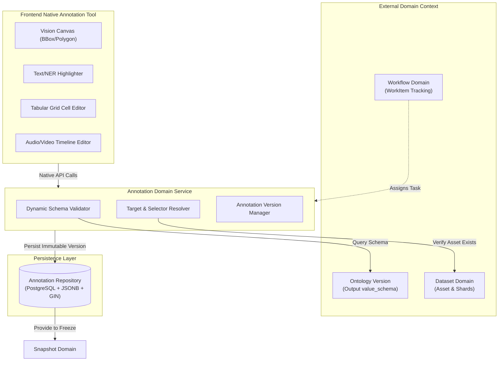
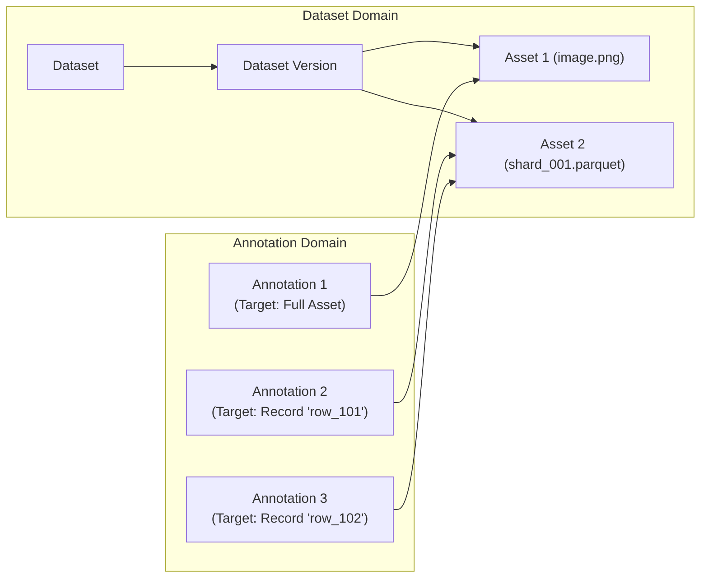
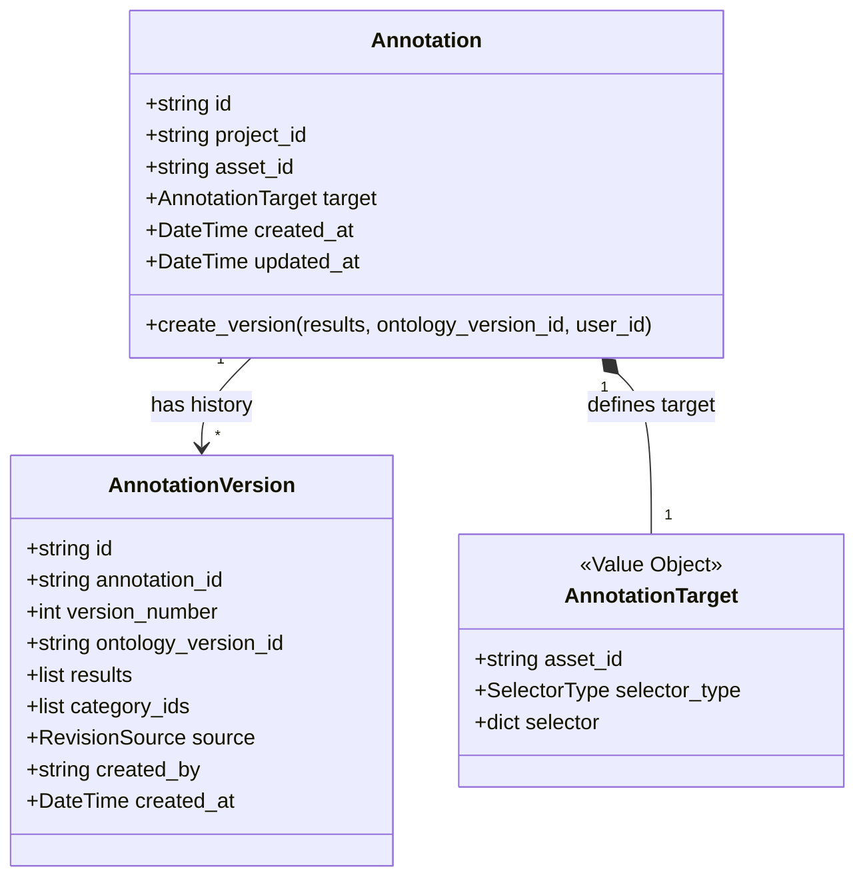
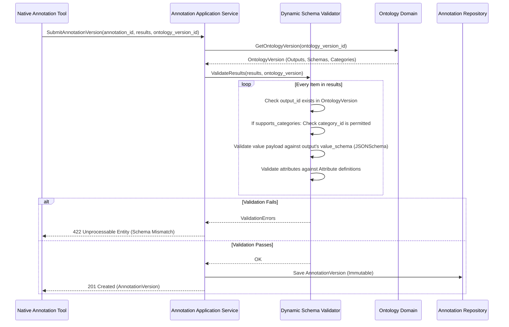
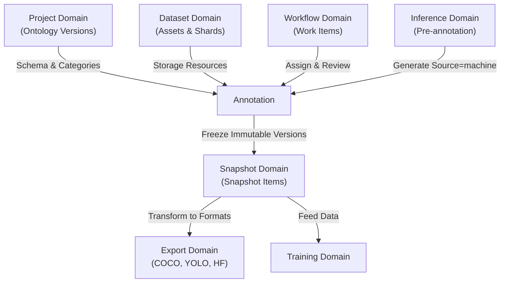

# Annotation Domain

## 1. Mục tiêu (Objective)

`Annotation Domain` chịu trách nhiệm quản lý toàn bộ dữ liệu gán nhãn (Annotation Data) và lịch sử phiên bản gán nhãn trong AI Data Platform.

Domain này cung cấp mô hình gán nhãn **Native (Built-in Annotation Model)** chuẩn hóa, hỗ trợ đa phương thức dữ liệu (Computer Vision, NLP/Text, Audio, Video, Tabular Data, OCR) mà không cần phụ thuộc vào công cụ hay cơ chế adapter của bên thứ ba.

Hệ thống phân định rõ ràng giữa **Tài nguyên lưu trữ dữ liệu (`Asset` - File/Shard)** và **Đơn vị gán nhãn thực tế (`Record/Sample`)** thông qua đặc tả **Target & Selector** lấy cảm hứng từ chuẩn quốc tế W3C Web Annotation.

### Phạm vi trách nhiệm

Annotation Domain chịu trách nhiệm:

- Quản lý vòng đời của thực thể `Annotation` gắn liền với từng mục tiêu gán nhãn cụ thể (`Target`).
- Quản lý các phiên bản gán nhãn (**Annotation Version**) bất biến, lưu trữ trực tiếp toàn bộ kết quả gán nhãn (`results` payload).
- Kiểm tra tính hợp lệ động (**Dynamic Schema Validation**) của kết quả gán nhãn dựa trên `OutputDefinition` và `value_schema` của `Ontology Version`.
- Định vị và tham chiếu dữ liệu con bên trong Asset thông qua cơ chế `Target & Selector` (`RECORD`, `TEXT_SPAN`, `TIME_RANGE`, `FRAME_RANGE`, `DOCUMENT_PAGE`).
- Cung cấp dữ liệu phiên bản gán nhãn cho `Snapshot Domain` phục vụ đóng băng dữ liệu huấn luyện.
- Tiếp nhận kết quả gán nhãn tự động (Pre-annotation / Auto-labeling) từ `Inference Domain`.

### Không thuộc phạm vi

Annotation Domain không chịu trách nhiệm:

- Quản lý quy trình xử lý, phân công Annotator/Reviewer, SLA, State Machine (thuộc `Workflow Domain`).
- Quản lý file vật lý, lưu trữ MinIO/S3, phân vùng file (thuộc `Dataset Domain` & `Storage Layer`).
- Định nghĩa danh mục nhãn Category, Attribute, cấu hình Schema đầu vào/đầu ra (thuộc `Project Domain` / `Ontology Aggregate`).
- Huấn luyện mô hình và đánh giá độ chính xác (thuộc `Training Domain` & `Evaluation Domain`).
- Đóng gói và chuyển đổi định dạng huấn luyện COCO, YOLO, HuggingFace (thuộc `Export Domain`).

---

## 2. Thiết kế Kiến trúc (Design Architecture)

### 2.1. Nguyên tắc Native Tool (Built-in Annotation)

Thay vì sử dụng kiến trúc Adapter phức tạp để đồng bộ hai chiều với các công cụ gán nhãn bên ngoài (như Label Studio, CVAT, Prodigy) qua Webhook, AI Data Platform tích hợp công cụ gán nhãn **Native**:

1. **Loại bỏ Adapter & Webhook Sync:** Dữ liệu gán nhãn từ giao diện người dùng (UI) được gửi trực tiếp về Annotation API của hệ thống, loại bỏ nguy cơ mất dữ liệu, trễ mạng, xung đột race-condition hoặc lệch schema (schema drift).
2. **Editor Component Registry (Frontend):** Giao diện gán nhãn phía Frontend được xây dựng dạng module hóa linh hoạt. Mỗi `OutputDefinition` trong Ontology (BBox, Polygon, Classification, Key-Value, Audio Waveform, Text NER, Tabular Grid) tương ứng với một Editor Component riêng, hiển thị đồng nhất trên web.
3. **Single Source of Truth:** `Annotation Repository` là nơi lưu trữ duy nhất và chuẩn hóa của toàn bộ dữ liệu gán nhãn.



---

## 3. Mô hình Asset vs Record/Sample (Target & Selector Specification)

### 3.1. Sự khác biệt giữa Asset và Record/Sample

Trong các hệ thống thuần về annotation (như Label Studio), một "Task" thường được tạo bằng cách bóc tách từng dòng CSV/bảng thành 1 đơn vị dữ liệu độc lập. Tuy nhiên, đối với một **AI Data Platform**:

- `Dataset Domain` quản lý dữ liệu ở mức **Resource có thể version, tái sử dụng và dùng chung xuyên suốt nhiều domain**.
- Do đó: **1 File CSV / JSONL / Parquet (hoặc 1 Shard dữ liệu) = 1 Asset**. Hệ thống không lưu mỗi dòng thành một Asset riêng biệt nhằm ngăn ngừa tình trạng bùng nổ hàng triệu dòng trong cơ sở dữ liệu (Database Explosion).
- Các dòng dữ liệu, đoạn text hoặc khoảng thời gian bên trong Asset được gọi là **Record / Sample**, và việc tham chiếu tới từng Sample cụ thể thuộc trách nhiệm của `Annotation Domain`.



### 3.2. Cấu trúc DataItemRef (Target & Selector Spec)

Mỗi thực thể `Annotation` gắn liền với một mục tiêu xác định qua cấu trúc `target`:

```json
{
  "target": {
    "asset_id": "01JM6T3V8A4X9Q2Z1B5E7K9W3D",
    "selector_type": "RECORD",
    "selector": {
      "key_field": "review_id",
      "record_key": "rev_2026_09871"
    }
  }
}
```

### 3.3. Bảng phân loại Selector Types

| Dữ liệu | `selector_type` | `selector` (Tọa độ / Định vị bên trong Asset) | Ý nghĩa nghiệp vụ |
| --- | --- | --- | --- |
| **Ảnh / Document đơn** | `FULL_ASSET` | `null` hoặc `{}` | Toàn bộ file ảnh/tài liệu là một đơn vị dữ liệu cần gán nhãn. |
| **NLP Structured / Tabular** | `RECORD` | `{"key_field": "id", "record_key": "rec_123"}` | Gắn nhãn riêng cho dòng có mã định danh `rec_123` trong file shard Parquet/CSV. |
| **Text Raw (NER)** | `TEXT_SPAN` | `{"start": 124, "end": 153}` | Nhãn gắn cho đoạn văn bản từ ký tự thứ 124 đến 153 trong file `sample.txt`. |
| **Audio** | `TIME_RANGE` | `{"start": 12.5, "end": 18.2}` | Đoạn âm thanh từ giây thứ 12.5 đến 18.2 trong file `audio.wav`. |
| **Video** | `FRAME_RANGE` | `{"start_frame": 100, "end_frame": 180}` | Đoạn video từ khung hình 100 đến 180 của file `clip.mp4`. |
| **Tài liệu đa trang (PDF)** | `DOCUMENT_PAGE` | `{"page_number": 3}` | Gán nhãn cho trang số 3 của tài liệu `contract.pdf`. |

> [!IMPORTANT]
> **Quy tắc bất biến cho `record_key` trong Tabular / Parquet Shard:**
> - Tuyệt đối không dùng số thứ tự dòng tạm thời (`row_index`) làm `record_key`, bởi vì khi file bị shuffle, sắp xếp lại hoặc re-partition, vị trí dòng sẽ thay đổi làm sai lệch toàn bộ nhãn!
> - Bắt buộc dùng cột khóa chính tự nhiên (`id`, `uuid`, `code`). Nếu file dữ liệu thô không có sẵn ID, dịch vụ Ingestion của `Dataset Domain` sẽ tự động sinh và đánh chỉ mục cột ID bất biến (ví dụ `__row_id__`).

---

## 4. Domain Model

Annotation Domain được xây dựng xoay quanh các Entity và Value Object sau:



### 4.1. Annotation (Aggregate Root)

`Annotation` là Aggregate Root của domain. Nó đại diện cho việc gán nhãn một `Target` cụ thể (toàn bộ Asset hoặc một Record bên trong Asset).

- `Annotation` sở hữu định danh logic ổn định (`id`) trong suốt vòng đời.
- Mỗi `Annotation` có quan hệ 1 - N với các `AnnotationVersion`.

### 4.2. AnnotationTarget (Value Object)

Xác định chính xác đối tượng mà nhãn áp dụng. Gồm:
- `asset_id`: Định danh của Asset chứa dữ liệu.
- `selector_type`: Loại selector (`FULL_ASSET`, `RECORD`, `TEXT_SPAN`, `TIME_RANGE`, `FRAME_RANGE`, `DOCUMENT_PAGE`).
- `selector`: Thông số định vị chi tiết bên trong Asset.

### 4.3. AnnotationVersion (Entity - Immutable)

`AnnotationVersion` đại diện cho kết quả của một lần gán nhãn hoàn chỉnh.
- **Tính bất biến (Immutability):** Sau khi được lưu, một version không bao giờ bị chỉnh sửa. Mỗi lần cập nhật sẽ tạo một `version_number` mới (1, 2, 3...).
- **Inlined Results:** Lưu trữ trực tiếp toàn bộ dữ liệu kết quả gán nhãn dưới dạng cấu trúc JSONB `results`.
- **Category Indexing:** Lưu kèm danh sách `category_ids` thu gọn để phục vụ lọc, thống kê và truy vấn tốc độ cao mà không phải parse toàn bộ cấu trúc JSONB.

---

## 5. Cấu trúc Results & Dynamic Schema Validation

### 5.1. Kết quả gán nhãn phụ thuộc vào Ontology Output Schema

Không sử dụng các cột hình học cố định (`geometry`, `bbox_x`), `results` trong `AnnotationVersion` là một mảng các đối tượng tuân thủ chặt chẽ theo cấu hình của `OntologyVersion`:

```json
[
  {
    "output_id": "out_detection_01",
    "category_id": "cat_car_001",
    "value": {
      "type": "bbox",
      "x": 120.5,
      "y": 80.0,
      "width": 300.2,
      "height": 185.0
    },
    "attributes": {
      "occluded": false,
      "color": "black"
    }
  },
  {
    "output_id": "out_classification_01",
    "category_id": "cat_scene_daylight",
    "value": null,
    "attributes": null
  }
]
```

### 5.2. Quy trình Kiểm tra hợp lệ động (Dynamic Validation Workflow)

Khi Annotator submit một phiên bản gán nhãn mới, `AnnotationValidationService` sẽ thực thi quy trình:



---

## 6. Xử lý Dataset lớn & Dữ liệu Tabular / NLP Shards

### 6.1. Nguyên tắc phân chia Shard (Sharding Strategy)

Đối với các bài toán có hàng triệu mẫu (Text Corpus, Tabular Transactions, Log Data):
- File dữ liệu được cắt thành nhiều shard (ví dụ `shard_0001.parquet`, `shard_0002.parquet` dung lượng ~100MB - 500MB mỗi shard).
- Mỗi file shard được đăng ký là **1 Asset** trong `Dataset Domain`.
- Không tạo Asset cho từng dòng, tránh làm tê liệt hệ thống quản lý siêu dữ liệu.

### 6.2. Điều phối Gán nhãn Đồng thời (Concurrency Control)

Khi phân công gán nhãn cho một file shard 50.000 dòng:
- `Workflow Domain` sẽ tạo các `WorkItem` cho từng nhóm `Target` cụ thể (ví dụ Annotator A nhận dòng 1 - 500, Annotator B nhận dòng 501 - 1000).
- Mỗi dòng dữ liệu được đại diện bởi một thực thể `Annotation` độc lập (`target: { asset_id: "shard_1", selector: { record_key: "..." } }`).
- **Lợi ích:**
  - Annotator A và Annotator B làm việc hoàn toàn độc lập trên cùng một file shard mà không gây xung đột khóa (Lock contention).
  - Kích thước của mỗi `AnnotationVersion` chỉ vài KB (kết quả của 1 dòng), không tạo ra các JSON blob khổng lồ hàng chục MB.
  - Theo dõi tiến độ gán nhãn ở mức granular (từng sample một cách chính xác).

---

## 7. Thiết kế Cơ sở Dữ liệu (Database Design)

Hệ thống sử dụng PostgreSQL với sự kết hợp giữa các trường quan hệ chuẩn hóa và cột JSONB có chỉ mục GIN:

### 7.1. Bảng `annotations`

Quản lý thông tin định danh và Target mục tiêu gán nhãn.

| Cột | Kiểu dữ liệu | Ràng buộc | Mô tả |
| --- | --- | --- | --- |
| `id` | VARCHAR(26) | PRIMARY KEY | Định danh duy nhất (ULID). |
| `project_id` | VARCHAR(26) | NOT NULL, INDEX | Thuộc Project nào. |
| `asset_id` | VARCHAR(26) | NOT NULL, INDEX | Thuộc Asset nào (File/Shard). |
| `target_type` | VARCHAR(32) | NOT NULL | `FULL_ASSET`, `RECORD`, `TEXT_SPAN`, `TIME_RANGE`, `FRAME_RANGE`, `DOCUMENT_PAGE`. |
| `target_selector` | JSONB | NOT NULL | Cấu trúc selector định vị bên trong asset (chứa record_key, start, end...). |
| `created_at` | TIMESTAMPTZ | NOT NULL | Thời điểm tạo. |
| `updated_at` | TIMESTAMPTZ | NOT NULL | Thời điểm cập nhật cuối cùng. |

*Chỉ mục & Ràng buộc:*
- UNIQUE INDEX trên `(asset_id, target_selector)`: Đảm bảo trong cùng 1 Asset không tạo 2 thực thể Annotation trùng lặp tọa độ/dòng.
- GIN INDEX trên `target_selector`: Hỗ trợ tìm kiếm theo `record_key` hoặc tọa độ cực nhanh.

---

### 7.2. Bảng `annotation_versions`

Lưu trữ lịch sử gán nhãn bất biến và kết quả theo Schema.

| Cột | Kiểu dữ liệu | Ràng buộc | Mô tả |
| --- | --- | --- | --- |
| `id` | VARCHAR(26) | PRIMARY KEY | Định danh phiên bản (ULID). |
| `annotation_id` | VARCHAR(26) | NOT NULL, REFERENCES annotations(id) | Thuộc Annotation nào. |
| `version_number` | INTEGER | NOT NULL | Số thứ tự phiên bản (1, 2, 3...). |
| `ontology_version_id` | VARCHAR(26) | NOT NULL, INDEX | Phiên bản Ontology dùng để validate nhãn này. |
| `results` | JSONB | NOT NULL | Mảng payload kết quả gán nhãn tuân theo Ontology Output Schema. |
| `category_ids` | JSONB | NOT NULL, DEFAULT '[]' | Mảng chứa danh sách ID các Category có mặt trong kết quả. |
| `source` | VARCHAR(16) | NOT NULL | `human` (người gán), `machine` (pre-annotation/auto-label). |
| `created_by` | VARCHAR(26) | NOT NULL | User ID của người tạo hoặc Model ID. |
| `created_at` | TIMESTAMPTZ | NOT NULL | Thời điểm lưu phiên bản. |

*Chỉ mục & Ràng buộc:*
- UNIQUE INDEX trên `(annotation_id, version_number)`: Mỗi version_number của một Annotation là duy nhất.
- GIN INDEX trên `results`: Hỗ trợ truy vấn chuyên sâu vào các thuộc tính bên trong kết quả gán nhãn.
- GIN INDEX trên `category_ids`: Cho phép lọc siêu tốc các sample có gắn category X (`WHERE category_ids ? 'cat_car_001'`).
- B-TREE INDEX trên `(annotation_id, version_number DESC)`: Lấy nhanh phiên bản mới nhất của Annotation.

---

## 8. Quan hệ với các Domain khác



| Domain | Quan hệ với Annotation Domain |
| --- | --- |
| **Project Domain** | Cung cấp **Ontology Version** chứa tập `OutputDefinition`, `value_schema`, `Category` và `Attribute`. Mọi `AnnotationVersion` đều phải tham chiếu một Ontology Version xác định. |
| **Dataset Domain** | Quản lý các tập dữ liệu vật lý và cung cấp các **Asset** (bao gồm cả các file shard dữ liệu lớn) để Annotation Domain tạo Target tham chiếu. |
| **Workflow Domain** | Quản lý tiến trình công việc (Assignment, Review, Reject, Approve) ở cấp độ WorkItem liên kết với từng `Annotation`. Workflow điều phối nhưng **không lưu trữ kết quả gán nhãn**. |
| **Inference Domain** | Chạy mô hình để sinh nhãn sơ bộ (Pre-annotation), ghi nhận vào Annotation Domain dưới dạng một `AnnotationVersion` mới với `source = 'machine'`. |
| **Snapshot Domain** | Đóng băng trạng thái gán nhãn tại thời điểm phát hành dataset bằng cách liên kết `Asset` với một `AnnotationVersion` cụ thể trong `SnapshotItem`. |
| **Export Domain** | Đọc dữ liệu `results` JSONB từ Snapshot đã đóng băng và chuyển đổi sang các định dạng đầu ra của cộng đồng AI (như COCO JSON, YOLO TXT, HuggingFace Arrow, CoNLL). |

---

## 9. Quy tắc Nghiệp vụ (Business Rules)

1. **Target Uniqueness:** Trong cùng một Asset, không thể tồn tại hai thực thể `Annotation` có cùng `target_selector`.
2. **Version Immutability:** Thực thể `AnnotationVersion` là bất biến (Read-only). Sau khi được tạo, không thể cập nhật nội dung `results`. Mọi thao tác sửa đổi phải sinh ra phiên bản mới với `version_number = version_number + 1`.
3. **Strict Ontology Conformance:** Một `AnnotationVersion` chỉ được phép lưu vào cơ sở dữ liệu nếu toàn bộ cấu trúc trong `results` vượt qua kiểm tra của `Dynamic Schema Validator` theo đúng `OntologyVersion` được chỉ định.
4. **Stable Record Keys:** Khi `selector_type` là `RECORD`, `record_key` bắt buộc phải là định danh bất biến của dòng dữ liệu trong shard. Không được sử dụng số thứ tự dòng tạm thời (`row_index`).
5. **Traceability:** Mọi `AnnotationVersion` bắt buộc phải ghi nhận rõ nguồn gốc (`source`: `human` hoặc `machine`) và định danh người/mô hình tạo (`created_by`).
6. **Snapshot Isolation:** `Snapshot Domain` chỉ được phép tham chiếu tới các `AnnotationVersion` đã hoàn thành và phê duyệt, không truy cập trực tiếp vào các draft đang gán nhãn dở dang.

---

## 10. Quyết định Thiết kế (Design Decisions & Trade-offs)

### 10.1. Tự xây dựng Native Annotation Tool thay vì dùng Plugin ngoài
- **Đánh đổi:** Cần đầu tư công sức phát triển giao diện Web Canvas/Highlighter/Grid phía Frontend.
- **Lý do lựa chọn:** Mang lại quyền kiểm soát tuyệt đối về trải nghiệm người dùng, loại bỏ 100% rủi ro đồng bộ dữ liệu qua Webhook, hợp nhất phân quyền RBAC và tích hợp trực tiếp với Ontology động của nền tảng.

### 10.2. Inlined Results JSONB thay vì tách bảng con `annotation_results`
- **Đánh đổi:** Truy vấn SQL dạng quan hệ thuần túy phức tạp hơn, cần dùng toán tử JSONB của PostgreSQL.
- **Lý do lựa chọn:**
  - Giao dịch ghi mang tính nguyên tử (Atomic write): Lưu toàn bộ kết quả của 1 phiên bản gán nhãn trong 1 row duy nhất, không có rủi ro lưu thiếu hoặc dở dang.
  - Dễ dàng so sánh lịch sử (Diffing): So sánh hai version chỉ đơn giản là so sánh 2 JSON documents.
  - Thích ứng tức thì với mọi loại schema mới của AI (LLM Conversation, RLHF ranking, 3D Bounding Box, Multi-label) mà không phải chạy migration thay đổi cấu trúc bảng SQL.

### 10.3. 1 File/Shard = 1 Asset thay vì 1 Dòng = 1 Asset
- **Đánh đổi:** Cần cơ chế `Target & Selector` để định vị dữ liệu con bên trong file shard.
- **Lý do lựa chọn:** Ngăn chặn bùng nổ hàng triệu dòng trong database khi xử lý các tập dữ liệu Tabular/NLP lớn; duy trì hiệu năng cao của các định dạng lưu trữ dạng cột (Parquet) trên Cloud Storage/S3.

---

## 11. Hướng mở rộng Tương lai (Future Extensions)

- **Annotation Consensus / Agreement Scoring:** Hỗ trợ nhiều Annotator cùng gán nhãn trên một `Target` để tính toán chỉ số đồng thuận (Cohen's Kappa, Fleiss' Kappa, IoU Consensus).
- **Streaming Tabular Annotation:** Hỗ trợ nạp trước (prefetch) và stream các record bên trong Parquet file xuống client thông qua Apache Arrow WebAssembly.
- **Active Learning Loop:** Tự động ưu tiên phân phối các Target có độ tự tin dự đoán thấp (Inference Confidence < threshold) thành các WorkItem cho người gán nhãn.
- **Semantic Vector Target:** Hỗ trợ selector dựa trên nhúng ngữ nghĩa (Embedding similarity span) cho các tác vụ RAG và LLM fine-tuning.