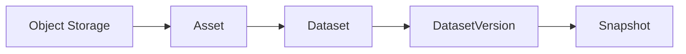
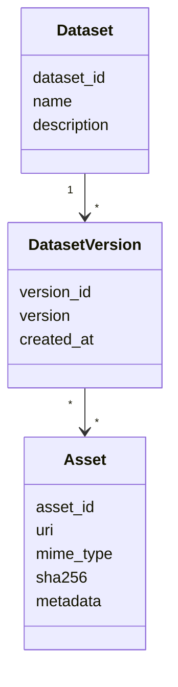
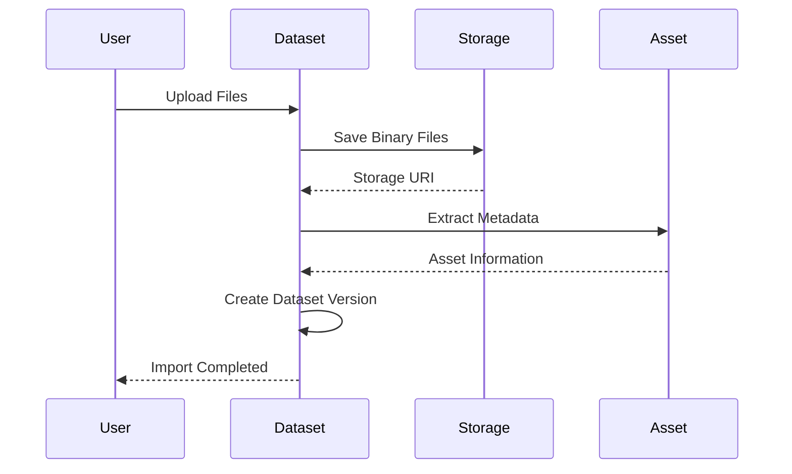
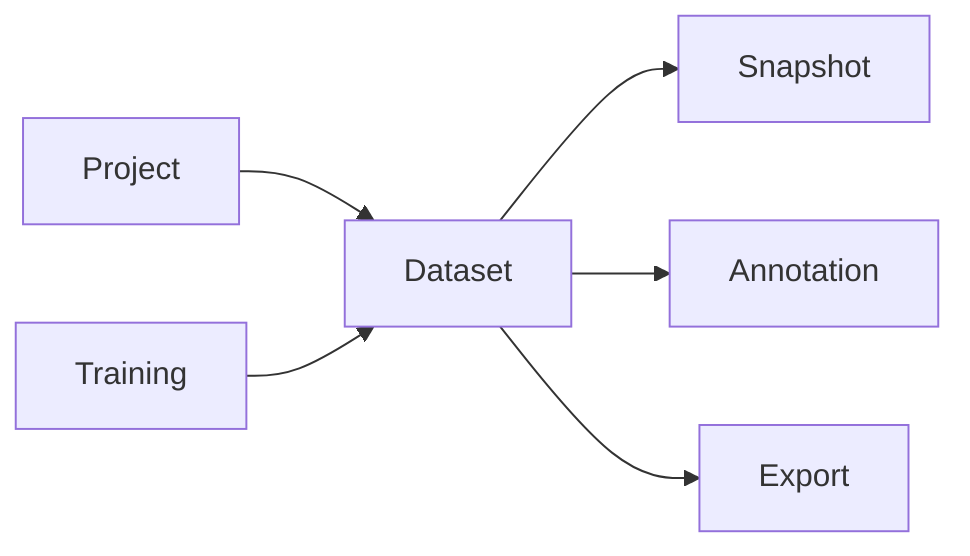

# Dataset Domain

# Mục tiêu

`Dataset Domain` chịu trách nhiệm quản lý tập dữ liệu (**Dataset**) và các tài nguyên dữ liệu (**Asset**) trong AI Data Platform.

Domain này cung cấp cơ chế tổ chức, quản lý phiên bản và truy xuất dữ liệu phục vụ cho quá trình gán nhãn, tạo Snapshot, Export và Training.

Dataset Domain không quản lý Annotation, Snapshot hay quy trình huấn luyện. Các Domain này chỉ tham chiếu đến dữ liệu do Dataset Domain cung cấp.

Dataset Domain chịu trách nhiệm:

- Quản lý Dataset.
- Quản lý Asset.
- Quản lý Dataset Version.
- Quản lý Metadata của Dataset và Asset.
- Kiểm tra trùng lặp dữ liệu.
- Quản lý vị trí lưu trữ của Asset.
- Cung cấp Asset cho các Domain khác.

---

# Thiết kế (Design)

Dataset Domain được thiết kế theo nguyên tắc **Data Catalog**.

Mọi dữ liệu vật lý chỉ tồn tại một lần dưới dạng `Asset`.

`Dataset` chỉ đóng vai trò tổ chức các Asset theo mục đích nghiệp vụ.

Khi Dataset thay đổi (thêm hoặc xóa Asset), hệ thống sẽ tạo **Dataset Version** mới thay vì ghi đè dữ liệu cũ.

Thiết kế này giúp dữ liệu luôn có khả năng truy vết và tái lập trong các phiên bản Dataset khác nhau.

---

# Domain Model

Dataset Domain được xây dựng xoay quanh các Entity sau.

| Entity | Trách nhiệm |
| --- | --- |
| Dataset | Đại diện cho một tập dữ liệu phục vụ một mục tiêu nghiệp vụ. |
| Dataset Version | Đại diện cho trạng thái của Dataset tại một thời điểm. |
| Asset | Đại diện cho một tài nguyên dữ liệu vật lý. |

---

## Dataset

Dataset là Aggregate Root của Domain.

Một Dataset đại diện cho tập hợp các Asset được sử dụng cho một mục đích cụ thể.

Ví dụ:

- COCO Train Dataset
- Invoice OCR Dataset
- Face Recognition Dataset

Dataset không trực tiếp lưu Asset mà quản lý mối quan hệ giữa Dataset và Asset thông qua Dataset Version.

---

## Dataset Version

`Dataset Version` đại diện cho một phiên bản của Dataset.

Mỗi lần Dataset thay đổi (thêm Asset, xóa Asset hoặc cập nhật cấu hình), hệ thống sẽ tạo một Dataset Version mới.

Dataset Version là **immutable**, đảm bảo mọi thay đổi đều có thể truy vết.

Ví dụ:

| Dataset | Version |
| --- | --- |
| Invoice OCR | v1.0 |
| Invoice OCR | v1.1 |
| Invoice OCR | v2.0 |

Dataset Version chịu trách nhiệm:

- Ghi nhận trạng thái Dataset tại một thời điểm.
- Liên kết đến tập Asset thuộc phiên bản đó.
- Là cơ sở để tạo Snapshot.

---

## Asset

`Asset` là đại diện chuẩn hóa cho mọi loại dữ liệu trong hệ thống.

Một Asset có thể là:

- Image
- Video
- Audio
- PDF
- Text
- Point Cloud
- Document

Asset không phụ thuộc vào bất kỳ bài toán AI nào.

Asset chịu trách nhiệm:

- Quản lý Metadata.
- Quản lý Storage URI.
- Định danh duy nhất cho dữ liệu.
- Kiểm tra trùng lặp.
- Cung cấp dữ liệu cho các Domain khác.

---

# Internal Data Model

---

# Business Rules

- Một Dataset có thể có nhiều Dataset Version.
- Một Dataset Version thuộc duy nhất một Dataset.
- Một Dataset Version là Immutable.
- Một Asset có thể được sử dụng trong nhiều Dataset Version.
- Asset được định danh bằng `asset_id`.
- Nội dung Asset được kiểm tra bằng `sha256`.
- Hai Asset có cùng `sha256` được xem là cùng nội dung.
- Metadata phải phù hợp với loại Asset.

---

# Domain Service

| Service | Vai trò |
| --- | --- |
| Asset Import Service | Nhập dữ liệu vào hệ thống. |
| Asset Metadata Extractor | Trích xuất Metadata từ Asset. |
| Duplicate Detection Service | Phát hiện Asset trùng lặp bằng SHA256. |
| Dataset Version Builder | Tạo Dataset Version mới khi Dataset thay đổi. |

---

# Infrastructure

| Thành phần | Trách nhiệm |
| --- | --- |
| Dataset Repository | Lưu Dataset và Dataset Version. |
| Asset Repository | Lưu Metadata của Asset. |
| Storage Adapter | Giao tiếp với Object Storage (MinIO, S3...). |

---

## Storage Adapter

Storage Adapter chịu trách nhiệm giao tiếp với hệ thống lưu trữ.

Asset chỉ lưu URI đến dữ liệu.

Dữ liệu vật lý được lưu trong Object Storage.

---

## Asset Repository

Repository chịu trách nhiệm lưu:

- Asset Metadata
- Storage URI
- SHA256
- MIME Type

Không lưu dữ liệu nhị phân.

---

# Workflow

## Import Asset

---

# Database Design

## datasets

| Cột | Mô tả |
| --- | --- |
| id | Dataset ID |
| name | Dataset Name |
| description | Description |
| created_at | Created Time |

---

## dataset_versions

| Cột | Mô tả |
| --- | --- |
| id | Version ID |
| dataset_id | Dataset |
| version | Version Tag |
| created_at | Created Time |

---

## dataset_version_assets

| Cột | Mô tả |
| --- | --- |
| dataset_version_id | Dataset Version |
| asset_id | Asset |

---

## assets

| Cột | Mô tả |
| --- | --- |
| id | Asset ID |
| uri | Storage URI |
| mime_type | MIME Type |
| sha256 | Content Hash |
| metadata | JSONB |

---

# Quan hệ với các Domain khác

| Domain | Quan hệ với Dataset Domain |
| --- | --- |
| **Project** | Quản lý và tổ chức các Dataset thuộc Project. |
| **Annotation** | Sử dụng Asset từ Dataset để thực hiện gán nhãn. |
| **Snapshot** | Đóng băng một Dataset Version tại thời điểm tạo Snapshot. |
| **Export** | Xuất dữ liệu từ một Dataset Version hoặc Snapshot. |
| **Training** | Huấn luyện mô hình trên Snapshot được tạo từ Dataset Version. |

---

# Design Decisions

## Asset là đơn vị lưu trữ nhỏ nhất

Mọi dữ liệu vật lý đều được biểu diễn bằng một `Asset`.

Các Domain khác chỉ tham chiếu tới Asset thay vì sao chép dữ liệu.

---

## Dataset Version là Immutable

Dataset Version không được chỉnh sửa sau khi tạo.

Mọi thay đổi sẽ tạo ra một Dataset Version mới.

---

## Asset và Dataset tách biệt

Asset có thể được chia sẻ giữa nhiều Dataset Version.

Thiết kế này giúp giảm trùng lặp dữ liệu và tối ưu dung lượng lưu trữ.

---

# Benefits

- Quản lý dữ liệu tập trung và nhất quán.
- Hỗ trợ Versioning cho Dataset.
- Giảm trùng lặp dữ liệu nhờ Asset dùng chung.
- Dễ dàng tạo Snapshot và tái lập dữ liệu.
- Hỗ trợ mở rộng cho nhiều loại dữ liệu khác nhau.

---

# Limitations

- Cần quản lý quan hệ giữa Dataset Version và Asset.
- Việc chia sẻ Asset giữa nhiều Dataset Version làm tăng độ phức tạp khi quản lý quyền truy cập.
- Metadata của nhiều loại Asset cần có cơ chế mở rộng linh hoạt.

---

# Future Extension

- Hỗ trợ Branch và Merge cho Dataset Version.
- Hỗ trợ Incremental Dataset Version để chỉ lưu phần thay đổi.
- Tích hợp Data Lineage để theo dõi nguồn gốc Asset.
- Hỗ trợ Dataset Federation từ nhiều nguồn lưu trữ.
- Bổ sung chính sách lưu trữ (Lifecycle Policy) cho Asset và Dataset Version.