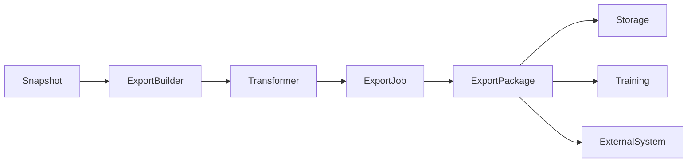
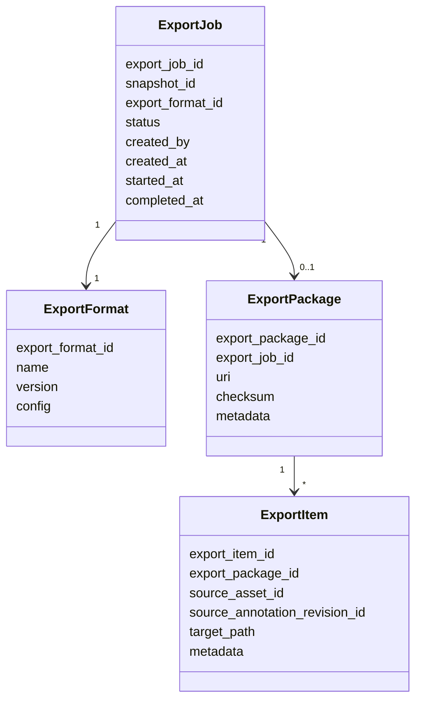
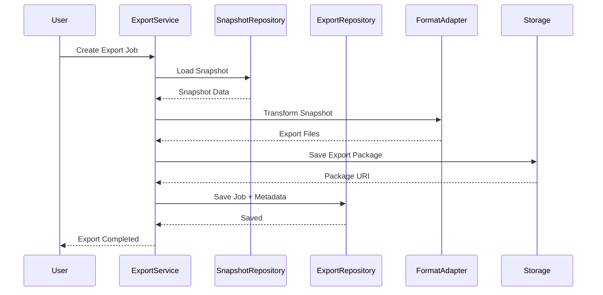
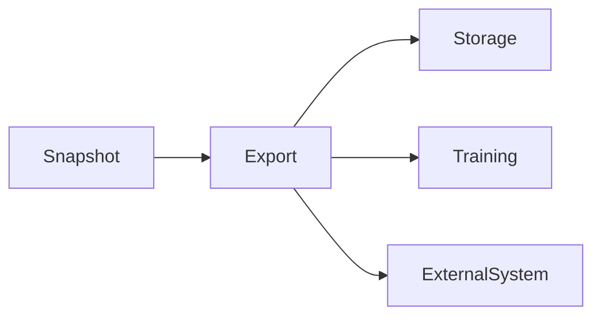

# Export Domain

# Mục tiêu (Objective)

`Export Domain` chịu trách nhiệm chuyển dữ liệu từ `Snapshot` sang các định dạng đích phục vụ cho các hệ thống downstream, công cụ bên ngoài hoặc pipeline huấn luyện.

Export là bước chuẩn hóa đầu ra của AI Data Platform. Thay vì để các Domain khác tự xuất dữ liệu theo cách riêng, Export Domain cung cấp một cơ chế thống nhất để tạo ra các gói dữ liệu có thể sử dụng ngay cho training, evaluation, sharing hoặc interoperability.

# Phạm vi trách nhiệm

Export Domain chịu trách nhiệm:

- Tạo Export Job từ một `Snapshot` hợp lệ.
- Chuyển đổi dữ liệu sang định dạng đích.
- Tạo Export Package.
- Quản lý trạng thái và lịch sử của Export Job.
- Lưu metadata của quá trình export.
- Cung cấp kết quả export cho Training, chia sẻ dữ liệu hoặc tích hợp hệ thống bên ngoài.

Không thuộc phạm vi

Export Domain không chịu trách nhiệm:

- Quản lý Dataset.
- Quản lý Annotation.
- Quản lý Snapshot.
- Quản lý Workflow annotation.
- Quản lý Training Job.
- Quản lý Model.
- Xử lý logic gán nhãn hoặc validate annotation.

Export Domain chỉ đọc dữ liệu đã được cố định trong Snapshot.

---

# Thiết kế (Design)

Export Domain được thiết kế theo nguyên tắc **Snapshot-driven Export**.

Điều đó có nghĩa là Export chỉ làm việc với dữ liệu đã bất biến, thay vì đọc trực tiếp từ Dataset hoặc Annotation đang hoạt động. Cách tiếp cận này giúp đảm bảo kết quả export luôn tái lập, nhất quán và không bị ảnh hưởng bởi thay đổi ngoài ý muốn trong các Domain nguồn.

### Nguyên tắc thiết kế

- Export chỉ đọc từ `Snapshot`.
- Export kết quả thành `Export Package` bất biến.
- Export Job có lifecycle riêng.
- Mỗi định dạng đích được xử lý bởi một exporter implementation riêng.
- Export Domain phải có khả năng mở rộng sang nhiều định dạng mà không sửa logic lõi.

---

# Domain Model

Export Domain được xây dựng xoay quanh các Entity sau.

| Entity | Trách nhiệm |
| --- | --- |
| `Export Job` | Đại diện cho một lần xuất dữ liệu từ Snapshot. |
| `Export Format` | Định nghĩa định dạng đích của dữ liệu export. |
| `Export Package` | Đại diện cho kết quả export đã được đóng gói. |
| `Export Item` | Đại diện cho một mục dữ liệu trong package export. |

---

## Export Job

`Export Job` là Aggregate Root của Domain.

Một Export Job đại diện cho yêu cầu xuất dữ liệu từ một Snapshot sang một định dạng cụ thể.

Export Job chịu trách nhiệm:

- Ghi nhận nguồn dữ liệu export.
- Ghi nhận định dạng đích.
- Theo dõi trạng thái xử lý.
- Lưu tiến trình và kết quả.
- Gắn với một Export Package sau khi hoàn thành.

---

## Export Format

`Export Format` mô tả định dạng đích mà hệ thống hỗ trợ.

Ví dụ:

- COCO
- YOLO
- Pascal VOC
- CSV
- JSON
- HuggingFace Dataset
- Custom format

Export Format có thể đi kèm cấu hình riêng, ví dụ:

- loại annotation cần xuất
- mapping category
- split strategy
- include metadata hay không

---

## Export Package

`Export Package` là kết quả cuối cùng của Export Job.

Package có thể là:

- một file nén
- một thư mục object storage
- một manifest JSON
- hoặc một bundle gồm nhiều file con

Export Package phải có thể truy xuất lại và lưu được metadata để audit hoặc re-download.

---

## Export Item

`Export Item` là một phần tử trong Export Package.

Ví dụ:

- một ảnh và annotation tương ứng trong COCO
- một dòng dữ liệu trong CSV
- một file JSON theo schema custom

Export Item giúp hệ thống biểu diễn kết quả export theo từng phần, thay vì chỉ lưu một blob kết quả duy nhất.

---

# Internal Data Model

Export Domain chỉ lưu metadata và kết quả xuất, không sao chép dữ liệu gốc của Snapshot.

---

# Business Rules

- Một Export Job phải tham chiếu đến một Snapshot hợp lệ.
- Một Export Job chỉ có một Export Format chính.
- Export Job là bất biến về nguồn dữ liệu sau khi đã bắt đầu xử lý.
- Export Package chỉ được tạo từ Snapshot đã tồn tại.
- Export không được đọc trực tiếp từ Dataset hoặc Annotation live.
- Một Export Job có thể thất bại, retry hoặc bị hủy.
- Export Package phải có thể truy xuất lại sau khi export hoàn tất.
- Mỗi Export Job phải lưu được metadata đầy đủ để audit.

---

# Domain Service

| Service | Vai trò |
| --- | --- |
| `Export Builder` | Nhận Snapshot và khởi tạo Export Job. |
| `Format Transformer` | Chuyển dữ liệu Snapshot sang schema của định dạng đích. |
| `Export Validator` | Kiểm tra tính hợp lệ của kết quả export trước khi phát hành. |
| `Package Composer` | Đóng gói các file export thành package hoàn chỉnh. |
| `Manifest Generator` | Sinh manifest mô tả nội dung Export Package. |

---

# Infrastructure

| Thành phần | Trách nhiệm |
| --- | --- |
| `Export Repository` | Lưu Export Job, Export Format và Export Package metadata. |
| `Package Storage Adapter` | Ghi Export Package vào object storage hoặc filesystem. |
| `Snapshot Reader` | Đọc Snapshot phục vụ export. |
| `Format Adapter` | Tích hợp exporter cho từng định dạng đích. |

## Format Adapter

Mỗi định dạng đích nên được triển khai như một adapter riêng.

Ví dụ:

- COCO Export Adapter
- YOLO Export Adapter
- VOC Export Adapter
- CSV Export Adapter
- JSON Export Adapter
- HF Dataset Export Adapter

Cách làm này giúp Export Domain mở rộng dễ dàng mà không ảnh hưởng đến logic lõi.

---

# Workflow

## Tạo Export Job

Export chỉ được bắt đầu khi Snapshot hợp lệ và sẵn sàng sử dụng.

---

# Database Design

### export_jobs

| Cột | Mô tả |
| --- | --- |
| id | Export Job ID |
| snapshot_id | Snapshot nguồn |
| export_format_id | Định dạng đích |
| status | Pending, Running, Completed, Failed, Cancelled |
| created_by | Người tạo |
| created_at | Thời gian tạo |
| started_at | Thời gian bắt đầu |
| completed_at | Thời gian hoàn tất |

### export_formats

| Cột | Mô tả |
| --- | --- |
| id | Export Format ID |
| name | Tên định dạng |
| version | Phiên bản định dạng |
| config | JSONB cấu hình |

### export_packages

| Cột | Mô tả |
| --- | --- |
| id | Export Package ID |
| export_job_id | Export Job |
| uri | Vị trí lưu package |
| checksum | Integrity checksum |
| metadata | JSONB |

### export_items

| Cột | Mô tả |
| --- | --- |
| id | Export Item ID |
| export_package_id | Export Package |
| source_asset_id | Asset nguồn |
| source_annotation_revision_id | Annotation Revision nguồn |
| target_path | Đường dẫn trong package |
| metadata | JSONB |

---

## 10. Quan hệ với các Domain khác

| Domain | Quan hệ với Export Domain |
| --- | --- |
| **Snapshot** | Là nguồn dữ liệu duy nhất cho Export. |
| **Training** | Có thể sử dụng Export Package như đầu vào hoặc dùng Snapshot trực tiếp. |
| **Storage** | Lưu Export Package sau khi đóng gói. |
| **External System** | Nhận dữ liệu export để sử dụng bên ngoài nền tảng. |

---

## 11. Design Decisions

## Export chỉ đọc từ Snapshot

Export không được truy cập trực tiếp Dataset hay Annotation live. Điều này đảm bảo dữ liệu đầu ra luôn nhất quán với một trạng thái dữ liệu đã được chốt.

## Export Format được tách thành Adapter

Mỗi định dạng có cấu trúc riêng, nên tách thành adapter riêng sẽ dễ mở rộng và dễ bảo trì hơn.

## Export Job là thực thể nghiệp vụ riêng

Export không chỉ là một hàm xuất file đơn giản. Nó có lifecycle, trạng thái, lịch sử và kết quả riêng, vì vậy cần được mô hình hóa thành một Aggregate riêng.

## Export Package phải có thể tái sử dụng

Kết quả export không nên là dữ liệu tạm. Nó phải được lưu dưới dạng package có thể tải lại, audit và chia sẻ.

---

## 12. Benefits

- Đảm bảo dữ liệu xuất ra luôn nhất quán với Snapshot.
- Dễ mở rộng sang nhiều định dạng đích khác nhau.
- Tách biệt rõ logic export khỏi logic dataset và annotation.
- Hỗ trợ audit, trace và re-download kết quả export.
- Phù hợp với cả training nội bộ lẫn chia sẻ dữ liệu ra hệ thống bên ngoài.

---

## 13. Limitations

- Cần xây adapter riêng cho từng định dạng đích.
- Một số định dạng phức tạp sẽ yêu cầu mapping logic riêng.
- Export package lớn có thể tốn thời gian đóng gói và lưu trữ.
- Nếu Snapshot không chuẩn hóa tốt, export sẽ phức tạp hơn.

---

## 14. Future Extension

- Hỗ trợ incremental export.
- Hỗ trợ differential export giữa hai Snapshot.
- Hỗ trợ streaming export cho dataset rất lớn.
- Hỗ trợ export trực tiếp sang storage bucket bên ngoài.
- Hỗ trợ template mapping cho các format tùy biến.
- Hỗ trợ export versioning để quản lý nhiều lần xuất từ cùng một Snapshot.