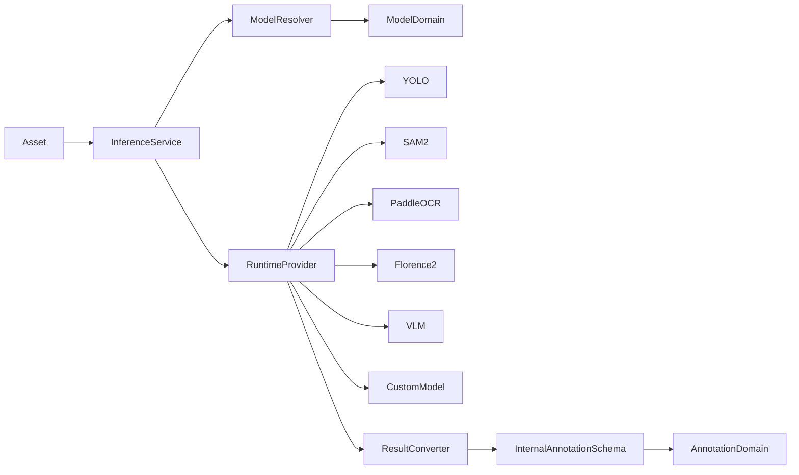
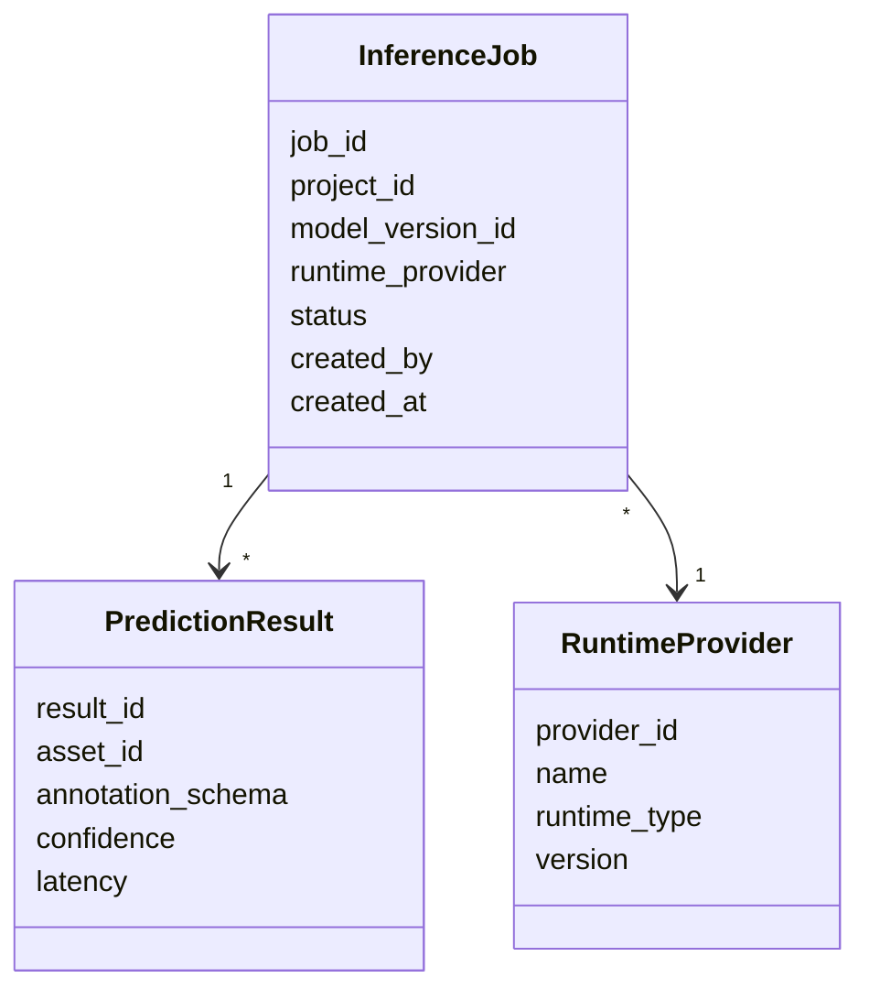
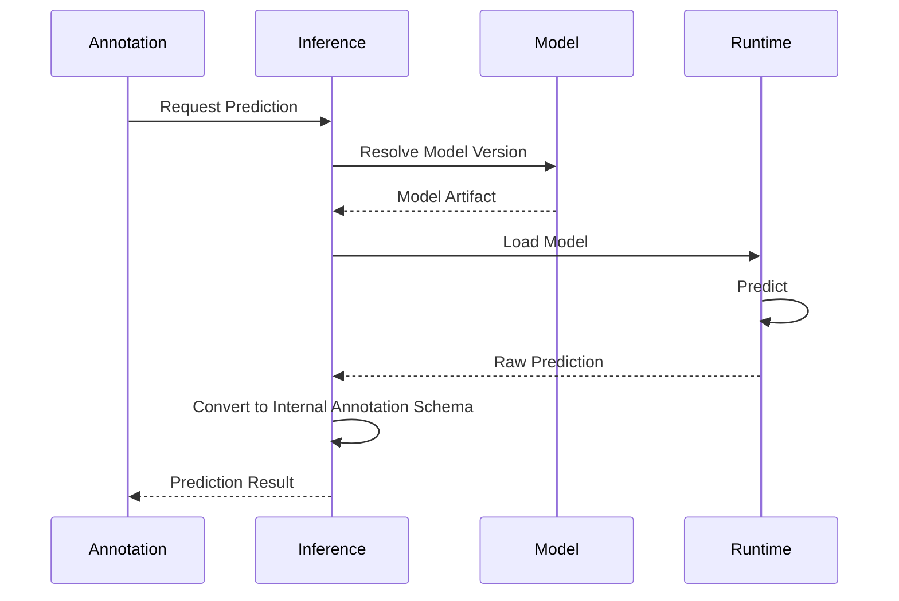
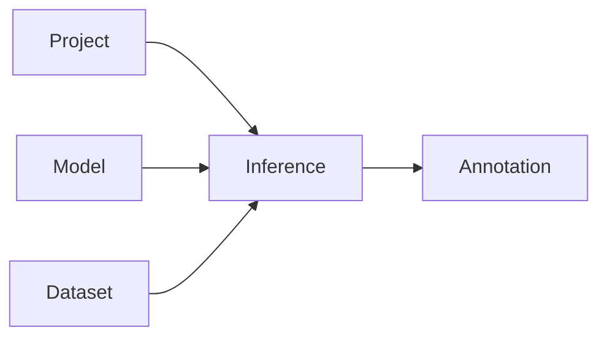

# Inference Domain

# Mục tiêu (Objective)

`Inference Domain` chịu trách nhiệm thực hiện suy luận (Inference) trên dữ liệu đầu vào nhằm hỗ trợ **Auto-Labeling** và **Pre-annotation** trong AI Data Platform.

Inference Domain cung cấp một giao diện thống nhất để chạy các mô hình AI trên nhiều loại dữ liệu như hình ảnh, văn bản, tài liệu, âm thanh hoặc video.

Domain này không quản lý quá trình huấn luyện mô hình, không quản lý Annotation và cũng không quản lý vòng đời của Model. Thay vào đó, Domain chỉ sử dụng các phiên bản Model đã được đăng ký trong **Model Domain** hoặc các mô hình được tích hợp sẵn thông qua Provider.

Inference Domain chịu trách nhiệm:

- Thực hiện suy luận trên Asset.
- Tự động tạo kết quả Pre-annotation.
- Tải đúng Model Version từ Model Domain.
- Quản lý Runtime của mô hình.
- Chuẩn hóa kết quả dự đoán thành Internal Annotation Schema.
- Cung cấp Prediction API cho Annotation Domain.

---

## Phạm vi trách nhiệm

Inference Domain chịu trách nhiệm:

- Quản lý Inference Job.
- Quản lý Prediction Result.
- Quản lý Runtime Provider.
- Thực hiện Batch Inference.
- Thực hiện Online Prediction.
- Chuyển đổi kết quả của từng mô hình sang Internal Annotation Schema.

---

## Không thuộc phạm vi

Inference Domain không chịu trách nhiệm:

- Training Model.
- Versioning Model.
- Quản lý Dataset.
- Quản lý Annotation.
- Lưu Artifact của Model.
- Deploy Model Production.

Những nghiệp vụ trên thuộc các Domain khác.

---

# Thiết kế (Design)

Inference Domain được thiết kế theo nguyên tắc **Provider-based Runtime**.

Inference Domain không tự triển khai thuật toán AI mà đóng vai trò điều phối việc thực thi các Runtime khác nhau thông qua một giao diện thống nhất.

Mỗi Runtime Provider chịu trách nhiệm tải mô hình, chuẩn bị dữ liệu đầu vào và thực hiện suy luận theo định dạng riêng của framework tương ứng.

Kết quả trả về từ các Provider sẽ được chuẩn hóa thành **Internal Annotation Schema** trước khi gửi sang Annotation Domain.



Thiết kế này cho phép bổ sung hoặc thay thế Runtime mà không ảnh hưởng đến các Domain khác.

---

# Domain Model

Inference Domain được xây dựng xoay quanh các Entity sau.

| Entity | Trách nhiệm |
| --- | --- |
| **Inference Job** | Đại diện cho một yêu cầu suy luận. |
| **Prediction Result** | Lưu kết quả suy luận của một Job. |
| **Runtime Provider** | Đại diện cho Runtime thực hiện suy luận. |

---

## Inference Job

`Inference Job` là Aggregate Root của Domain.

Một Job đại diện cho một lần thực hiện suy luận trên một hoặc nhiều Asset.

Job chịu trách nhiệm quản lý:

- Model Version
- Runtime
- Danh sách Asset
- Trạng thái xử lý
- Thời gian thực hiện

Ví dụ:

| Job | Runtime | Model |
| --- | --- | --- |
| Job #1 | YOLO | yolov11.pt |
| Job #2 | PaddleOCR | PP-OCRv5 |
| Job #3 | Florence-2 | florence-base |

---

## Prediction Result

Prediction Result lưu kết quả suy luận của từng Asset.

Prediction Result luôn được chuẩn hóa về **Internal Annotation Schema**.

Ví dụ:

```
image001.jpg

↓

YOLO

↓

{
    category: "Car",
    bbox: ...
}

↓

Internal Annotation Schema
```

Prediction Result không lưu định dạng gốc của từng Framework.

---

## Runtime Provider

Runtime Provider đại diện cho một Runtime có khả năng chạy mô hình AI.

Mỗi Provider biết cách:

- Load Model
- Chuẩn bị Input
- Thực hiện Inference
- Hậu xử lý kết quả

Ví dụ:

- YOLO Runtime
- PaddleOCR Runtime
- SAM2 Runtime
- Florence-2 Runtime
- ONNX Runtime
- Triton Runtime
- vLLM Runtime
- Custom Runtime

---

# Internal Data Model



---

# Business Rules

- Một Inference Job chỉ sử dụng một Model Version.
- Một Inference Job chỉ sử dụng một Runtime Provider.
- Một Asset có thể được suy luận nhiều lần.
- Prediction Result phải tuân theo Internal Annotation Schema.
- Runtime Provider phải hỗ trợ Model Format tương ứng.
- Chỉ Model Version ở trạng thái Available hoặc Deployed mới được sử dụng.
- Kết quả Prediction không được chỉnh sửa trực tiếp mà phải được chuyển sang Annotation Domain.

---

# Domain Service

| Service | Vai trò |
| --- | --- |
| **Inference Service** | Điều phối toàn bộ quá trình suy luận. |
| **Model Resolver** | Lấy đúng Model Version từ Model Domain. |
| **Runtime Dispatcher** | Chọn Runtime Provider phù hợp. |
| **Prediction Converter** | Chuẩn hóa kết quả về Internal Annotation Schema. |
| **Batch Inference Service** | Chạy suy luận trên nhiều Asset. |

---

# Infrastructure

| Thành phần | Trách nhiệm |
| --- | --- |
| Inference Repository | Lưu Inference Job và Prediction Result. |
| Runtime Adapter | Adapter tới các Runtime AI. |
| Model Adapter | Lấy Model từ Model Domain hoặc MLflow. |
| Queue | Xử lý Batch Inference bất đồng bộ. |

---

## Runtime Adapter

Runtime Adapter chuẩn hóa giao tiếp với các Runtime khác nhau.

Ví dụ:

- Ultralytics
- PaddleOCR
- HuggingFace Transformers
- ONNX Runtime
- Triton Inference Server
- vLLM

---

## Model Adapter

Model Adapter chịu trách nhiệm:

- Tải Model từ MLflow
- Tải Model từ Hugging Face
- Tải Model từ Object Storage
- Cache Model cục bộ
- Kiểm tra phiên bản trước khi Runtime sử dụng

Inference Domain không biết Model được lưu ở đâu, chỉ tương tác thông qua Model Adapter.

---

# Workflow

## Auto-Labeling



---

# Database Design

## inference_jobs

| Cột | Mô tả |
| --- | --- |
| id | Job ID |
| project_id | Project |
| model_version_id | Model Version |
| runtime_provider | Runtime |
| status | Job Status |
| created_by | User |
| created_at | Created Time |

---

## prediction_results

| Cột | Mô tả |
| --- | --- |
| id | Result ID |
| job_id | Inference Job |
| asset_id | Asset |
| prediction | Internal Annotation Schema (JSONB) |
| confidence | Confidence |
| latency | Inference Time |

---

## runtime_providers

| Cột | Mô tả |
| --- | --- |
| id | Provider ID |
| name | Provider Name |
| runtime_type | Runtime |
| version | Version |

---

# Quan hệ với các Domain khác



| Domain | Quan hệ với Inference Domain |
| --- | --- |
| **Project** | Cung cấp ngữ cảnh và cấu hình của Project. |
| **Dataset** | Cung cấp Asset cần suy luận. |
| **Model** | Cung cấp Model Version và Model Artifact. |
| **Annotation** | Nhận Prediction Result để tạo Auto-Labeling hoặc Pre-annotation. |

---

# Design Decisions

## Runtime được tách khỏi Model

Model Domain chỉ quản lý Model và Artifact.

Inference Domain chịu trách nhiệm thực thi Model thông qua Runtime phù hợp.

---

## Chuẩn hóa kết quả suy luận

Mọi Runtime đều phải chuyển đổi kết quả về Internal Annotation Schema trước khi trả về.

Điều này giúp Annotation Domain không phụ thuộc vào bất kỳ framework AI nào.

---

## Hỗ trợ nhiều Runtime

Inference Domain sử dụng kiến trúc Provider-based để hỗ trợ nhiều Runtime như Ultralytics, PaddleOCR, ONNX Runtime, Triton hoặc vLLM mà không cần thay đổi kiến trúc Domain.

---

## Tách biệt Prediction và Annotation

Prediction Result chỉ là kết quả gợi ý của mô hình.

Việc lưu trữ, chỉnh sửa và quản lý Annotation thuộc trách nhiệm của Annotation Domain.

---

# Benefits

- Hỗ trợ Auto-Labeling và Pre-annotation cho nhiều loại dữ liệu.
- Không phụ thuộc vào một framework AI cụ thể.
- Dễ dàng mở rộng Runtime mới thông qua Provider.
- Chuẩn hóa kết quả suy luận bằng Internal Annotation Schema.
- Tích hợp trực tiếp với Model Domain và Annotation Domain.

---

# Limitations

- Hiệu năng phụ thuộc vào Runtime Provider và kích thước mô hình.
- Cần cơ chế cache Model để giảm thời gian tải.
- Batch Inference trên tập dữ liệu lớn cần Queue và cơ chế phân phối tác vụ.

---

# Future Extension

- Hỗ trợ Multi-GPU và Distributed Inference.
- Bổ sung Model Cache dùng chung giữa nhiều Runtime.
- Tích hợp GPU Scheduling để tối ưu tài nguyên.
- Hỗ trợ Streaming Prediction cho Video và Audio.
- Bổ sung Pipeline Inference (ví dụ: Detection → OCR → KIE hoặc Detection → Segmentation → Classification) để phục vụ các bài toán AI phức tạp.