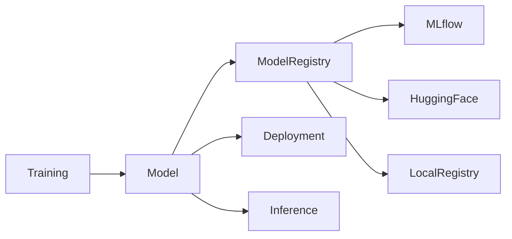
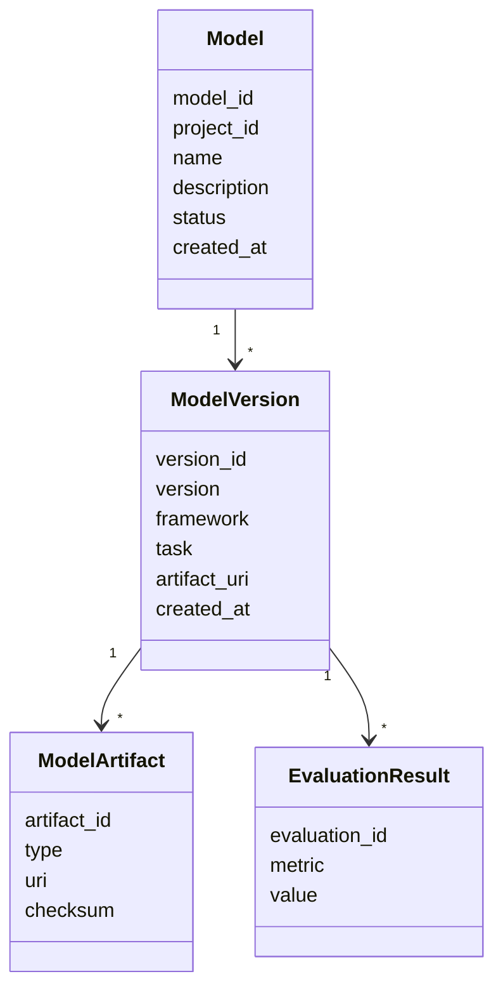
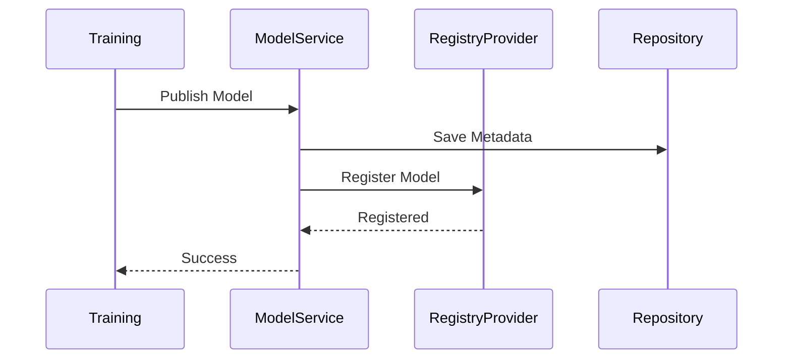
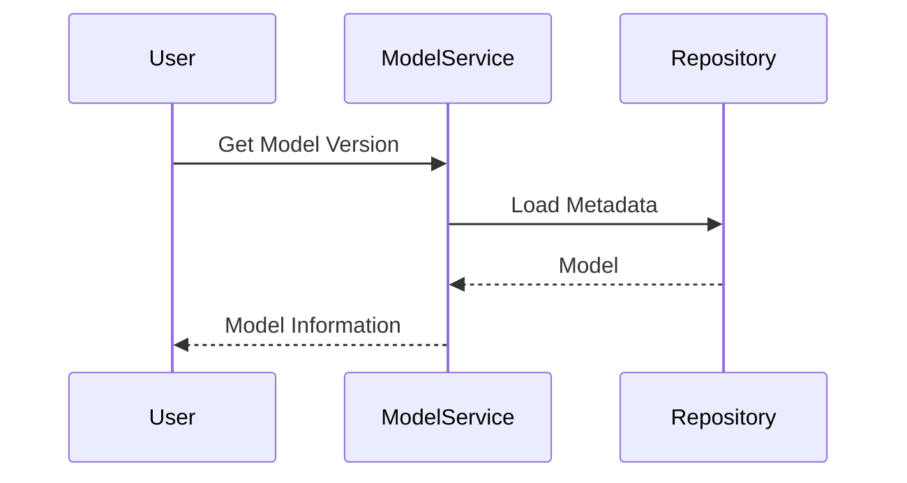
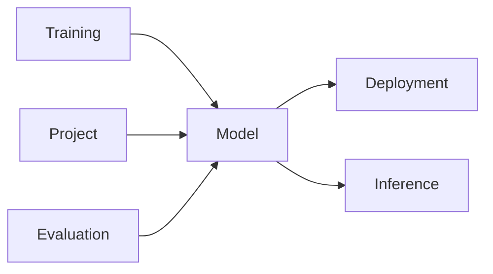

# Model Domain

# Mục tiêu (Objective)

`Model Domain` chịu trách nhiệm quản lý toàn bộ thông tin, phiên bản và vòng đời của các mô hình AI (AI Model) trong AI Data Platform.

Sau khi một mô hình được huấn luyện thành công bởi **Training Domain**, Model Domain sẽ tiếp nhận kết quả, lưu trữ metadata và đăng ký (Register) mô hình vào Model Registry để phục vụ các tác vụ như triển khai, đánh giá, chia sẻ hoặc tái sử dụng.

Model Domain **không chịu trách nhiệm huấn luyện mô hình**, **không thực hiện suy luận (Inference)** và **không quản lý dữ liệu huấn luyện**.

### Phạm vi trách nhiệm

Model Domain chịu trách nhiệm:

- Quản lý Model Registry.
- Quản lý Model Version.
- Quản lý Artifact của Model.
- Quản lý Metadata của Model.
- Quản lý trạng thái (Lifecycle) của Model.
- Cung cấp Model cho Deployment hoặc Inference Domain.
- Quản lý Evaluation Result của Model.
- Tích hợp với các Model Registry Provider.

### Không thuộc phạm vi

Model Domain **không** chịu trách nhiệm:

- Huấn luyện mô hình.
- Quản lý Dataset.
- Quản lý Snapshot.
- Thực hiện Inference.
- Triển khai Model Runtime.
- Quản lý GPU hoặc Compute Resource.

---

# Thiết kế (Design)

Model Domain được thiết kế theo nguyên tắc **Registry-centric**.

Model chỉ được tạo ra từ kết quả của Training Domain. Sau đó Model Domain sẽ đăng ký (Register), quản lý phiên bản và cung cấp Model cho các Domain downstream.

Model Domain không phụ thuộc vào bất kỳ Registry cụ thể nào. Thay vào đó, Domain sử dụng **Registry Provider Interface**, cho phép tích hợp nhiều hệ thống như MLflow, Hugging Face Hub hoặc Local Registry.



Thiết kế này giúp thay thế hoặc bổ sung Registry Provider mà không làm thay đổi Domain Model.

---

# 3. Domain Model

Model Domain được xây dựng xoay quanh các Entity sau.

| Entity | Trách nhiệm |
| --- | --- |
| **Model** | Aggregate Root đại diện cho một mô hình AI. |
| **Model Version** | Đại diện cho một phiên bản cụ thể của Model. |
| **Model Artifact** | Quản lý các file của Model. |
| **Evaluation Result** | Lưu kết quả đánh giá của Model. |

---

## Model

`Model` là Aggregate Root của Domain.

Một Model đại diện cho một mô hình AI thuộc một Project.

Ví dụ:

- YOLOv11
- PaddleOCR
- PhoBERT
- Llama-3 Fine-tuned

Model chịu trách nhiệm:

- Quản lý Version.
- Quản lý Metadata.
- Quản lý Lifecycle.
- Liên kết tới Artifact.
- Liên kết tới Evaluation.

---

## Model Version

Mỗi lần Training hoàn thành sẽ sinh ra một Model Version mới.

Ví dụ

| Model | Version |
| --- | --- |
| YOLOv11 | v1 |
| YOLOv11 | v2 |
| YOLOv11 | v3 |

Model Version bao gồm:

- Version Number
- Framework
- Task Type
- Created Time
- Source Training Job
- Artifact URI

---

## Model Artifact

Model Artifact đại diện cho toàn bộ file liên quan đến Model.

Ví dụ:

```
best.pt

config.yaml

label_map.json

tokenizer.json

vocab.txt

onnx_model.onnx
```

Artifact chỉ lưu URI đến Object Storage.

---

## Evaluation Result

Lưu kết quả đánh giá của Model.

Ví dụ:

```
mAP

Precision

Recall

F1 Score

Accuracy

BLEU

CER

WER
```

Evaluation Result giúp lựa chọn phiên bản Model tốt nhất.

---

# Internal Data Model



---

# Business Rules

- Một Model thuộc duy nhất một Project.
- Một Model có nhiều Model Version.
- Model Version là Immutable.
- Một Model Version có thể chứa nhiều Artifact.
- Artifact phải thuộc đúng một Model Version.
- Evaluation Result chỉ thuộc một Model Version.
- Chỉ Model Version ở trạng thái `Registered` mới được phép Deployment.
- Chỉ Training Domain mới được tạo Model Version mới.
- Không được sửa Artifact sau khi Model Version đã được đăng ký.

---

# Domain Service

| Service | Vai trò |
| --- | --- |
| Model Registry Service | Đăng ký Model mới. |
| Version Management Service | Quản lý phiên bản Model. |
| Artifact Management Service | Quản lý Artifact của Model. |
| Evaluation Service | Quản lý kết quả đánh giá Model. |
| Model Lifecycle Service | Quản lý trạng thái của Model. |

---

# 7. Infrastructure

| Thành phần | Trách nhiệm |
| --- | --- |
| Model Repository | Lưu metadata của Model. |
| Artifact Repository | Lưu thông tin Artifact. |
| Registry Provider | Đồng bộ Model tới Registry bên ngoài. |
| Object Storage Adapter | Lưu Artifact trên MinIO, S3 hoặc Local Storage. |

## Registry Provider

Registry Provider là abstraction cho các hệ thống Model Registry.

Các implementation có thể bao gồm:

- MLflow Registry
- Hugging Face Hub
- Local Registry

Nhờ đó Model Domain không phụ thuộc vào bất kỳ công nghệ cụ thể nào.

---

# 8. Workflow

## Đăng ký Model



---

## Lấy Model



---

# 9. Database Design

## models

| Cột | Mô tả |
| --- | --- |
| id | Model ID |
| project_id | Project |
| name | Model Name |
| description | Description |
| status | Lifecycle Status |
| created_at | Created Time |

---

## model_versions

| Cột | Mô tả |
| --- | --- |
| id | Version ID |
| model_id | Model |
| version | Version |
| framework | PyTorch / TensorFlow / ONNX |
| task | Detection / OCR / NLP |
| artifact_uri | Artifact Location |
| training_job_id | Source Training |
| created_at | Created Time |

---

## model_artifacts

| Cột | Mô tả |
| --- | --- |
| id | Artifact ID |
| version_id | Model Version |
| type | Weight / Config / Tokenizer |
| uri | Object Storage URI |
| checksum | SHA256 |

---

## evaluation_results

| Cột | Mô tả |
| --- | --- |
| id | Evaluation ID |
| version_id | Model Version |
| metric | Metric Name |
| value | Metric Value |

---

# 10. Quan hệ với các Domain khác



| Domain | Quan hệ với Model Domain |
| --- | --- |
| **Project** | Quản lý các Model thuộc Project. |
| **Training** | Sinh ra Model Version mới sau khi huấn luyện. |
| **Evaluation** | Cung cấp kết quả đánh giá cho Model Version. |
| **Deployment** | Sử dụng Model Version để triển khai. |
| **Inference** | Tải Model Version để thực hiện suy luận. |

---

# 11. Design Decisions

## Model là Aggregate Root

Model là thực thể trung tâm quản lý toàn bộ vòng đời và phiên bản của mô hình AI.

---

## Model Version là Immutable

Sau khi được đăng ký, Model Version không được chỉnh sửa. Mọi thay đổi phải tạo ra một phiên bản mới để đảm bảo khả năng truy vết và tái lập.

---

## Tách Metadata và Artifact

Metadata được lưu trong cơ sở dữ liệu, trong khi Artifact chỉ được tham chiếu thông qua URI đến Object Storage. Điều này giúp tối ưu dung lượng và hỗ trợ nhiều backend lưu trữ.

---

## Registry Provider độc lập với Domain

Model Domain chỉ làm việc với `Registry Provider Interface`, còn các hệ thống như MLflow hoặc Hugging Face Hub được triển khai dưới dạng Adapter ở tầng Infrastructure. Điều này giúp thay đổi hoặc bổ sung Registry mà không ảnh hưởng đến Domain.

---

# 12. Benefits

- Quản lý tập trung toàn bộ Model Registry.
- Hỗ trợ Versioning và Lifecycle của Model.
- Dễ dàng tích hợp nhiều Registry Provider.
- Tách biệt nghiệp vụ với công nghệ triển khai.
- Hỗ trợ Audit và Reproducibility cho mô hình AI.

---

# 13. Limitations

- Cần đồng bộ trạng thái giữa Registry nội bộ và Registry bên ngoài.
- Quản lý nhiều Artifact cho mỗi Model Version làm tăng độ phức tạp lưu trữ.
- Việc hỗ trợ nhiều Registry Provider yêu cầu duy trì nhiều Adapter.

---

# 14. Future Extension

- Hỗ trợ Model Lineage để theo dõi nguồn gốc của Model từ Training, Dataset Version và Snapshot.
- Hỗ trợ Model Promotion (Development → Staging → Production).
- Hỗ trợ Model Approval Workflow trước khi triển khai.
- Tích hợp thêm các Registry Provider như OpenMMLab Model Zoo hoặc NVIDIA NGC.
- Bổ sung khả năng ký số (Model Signing) và xác minh tính toàn vẹn của Artifact trước khi Deployment.