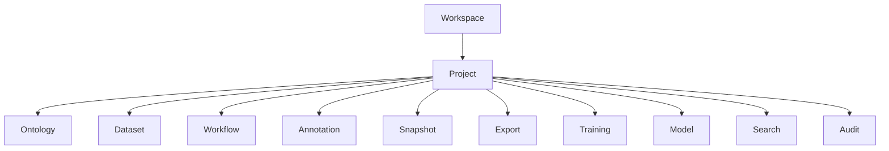
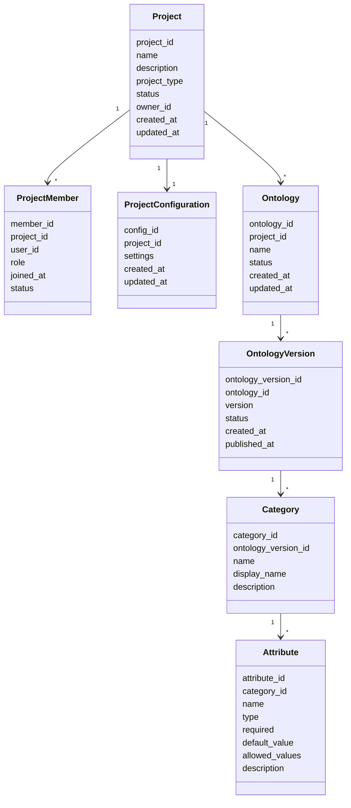
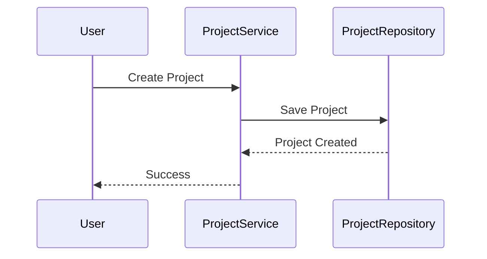
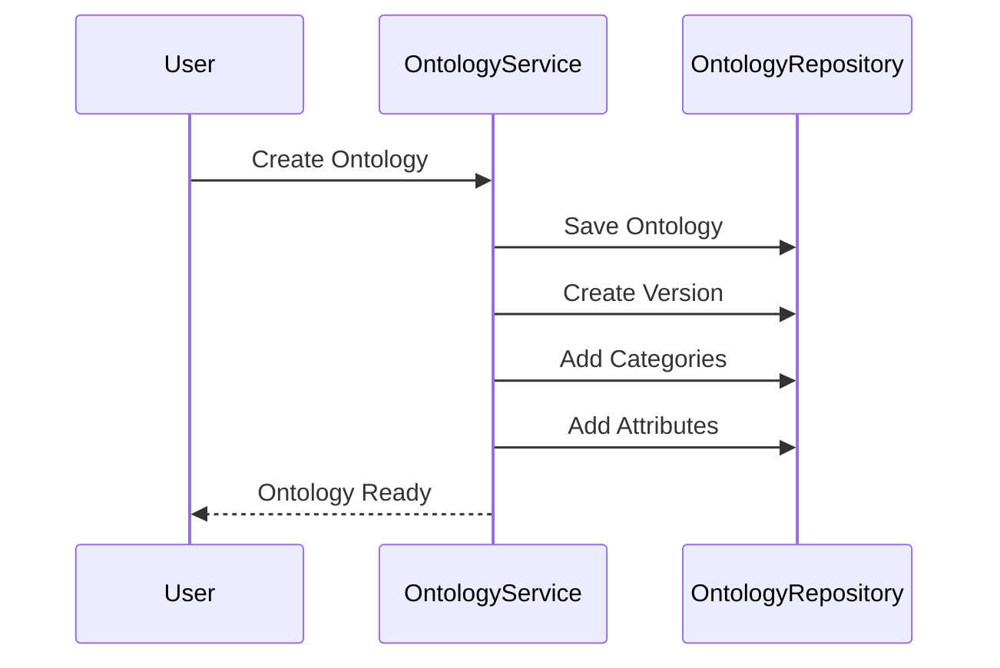
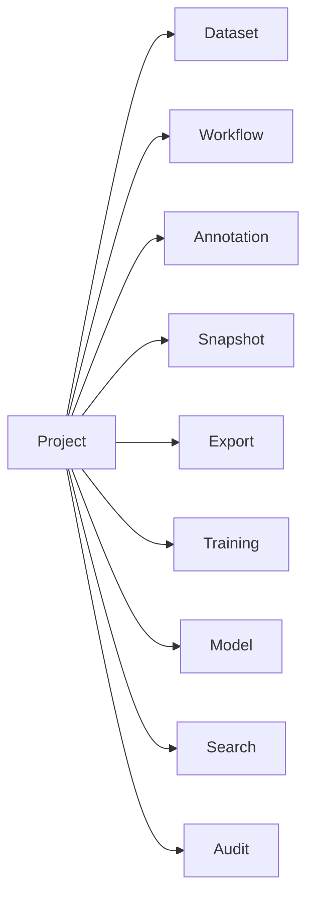

# Project Domain Design

# Project Domain Design

## 1. Mục tiêu (Objective)

`Project` là đơn vị quản lý nghiệp vụ (**Business Boundary**) cao nhất trong AI Data Platform.

Mỗi Project đại diện cho một bài toán AI hoặc một sản phẩm AI mà người dùng đang xây dựng. Toàn bộ Dataset, Annotation, Workflow, Snapshot, Export, Training, Model và các tài nguyên liên quan đều được tổ chức bên trong Project.

Project đóng vai trò là **Workspace** để tập trung quản lý tài nguyên, cấu hình dùng chung và quyền truy cập của các thành viên.

### Phạm vi trách nhiệm

Project Domain chịu trách nhiệm:

- Quản lý thông tin Project.
- Quản lý thành viên và quyền truy cập.
- Quản lý Ontology dùng chung trong Project.
- Quản lý cấu hình Project.
- Tổ chức các Domain nghiệp vụ thuộc Project.
- Cung cấp ngữ cảnh (Context) cho toàn bộ vòng đời dữ liệu AI.

### Không thuộc phạm vi

Project Domain không chịu trách nhiệm:

- Quản lý Asset.
- Quản lý Dataset Version.
- Quản lý Annotation.
- Quản lý Workflow execution.
- Quản lý Snapshot.
- Quản lý Training Job.
- Quản lý Model artifact.
- Quản lý dữ liệu vật lý.

Những nghiệp vụ này thuộc các Domain chuyên biệt.

---

## 2. Thiết kế (Design)

Project Domain được thiết kế theo nguyên tắc **Workspace-centric**.

Project là ranh giới nghiệp vụ cao nhất trong hệ thống, đóng vai trò không gian làm việc thống nhất cho mọi tài nguyên AI liên quan đến một bài toán cụ thể.



Mọi tài nguyên nghiệp vụ đều phải thuộc về đúng một Project.

Project không sở hữu trực tiếp dữ liệu của các Domain khác mà chỉ quản lý quan hệ, vòng đời và cấu hình liên quan.

---

## 3. Domain Model

Project Domain được xây dựng xoay quanh các Entity sau.

| Entity | Trách nhiệm |
| --- | --- |
| **Project** | Aggregate Root đại diện cho một Workspace AI. |
| **Project Member** | Quản lý thành viên và vai trò trong Project. |
| **Project Configuration** | Quản lý cấu hình và thiết lập của Project. |
| **Ontology** | Aggregate riêng để định nghĩa Annotation Schema dùng chung cho Project. |
| **Ontology Version** | Phiên bản bất biến của Ontology. |
| **Category** | Định nghĩa Label thuộc một Ontology Version. |
| **Attribute** | Định nghĩa thuộc tính của Category. |

---

## Project

`Project` là Aggregate Root của Project Domain.

Một Project đại diện cho một bài toán AI hoàn chỉnh và là điểm truy cập nghiệp vụ cho các tài nguyên liên quan trong cùng Workspace.

Project chịu trách nhiệm:

- Xác định phạm vi nghiệp vụ của một bài toán AI.
- Quản lý metadata mức Project.
- Quản lý thành viên và thiết lập chung.
- Gắn kết các Domain khác vào cùng một ngữ cảnh nghiệp vụ.

Project không trực tiếp lưu dữ liệu huấn luyện, dữ liệu gán nhãn hay file vật lý.

---

## Project Member

`Project Member` đại diện cho mối quan hệ giữa **User** và **Project**, đồng thời mô tả vai trò và quyền hạn của người dùng trong phạm vi Project.

Project Member không phải là User. Một User có thể tham gia nhiều Project khác nhau và đảm nhận các vai trò khác nhau ở từng Project.

Ví dụ:

| User | Project | Role |
| --- | --- | --- |
| Alice | OCR Dataset | Owner |
| Alice | Face Detection | Reviewer |
| Bob | OCR Dataset | Annotator |

Project Member chịu trách nhiệm:

- Liên kết User với Project.
- Quản lý Role trong Project.
- Quản lý trạng thái tham gia như Active, Suspended, Removed.
- Theo dõi thời điểm tham gia Project.
- Là cơ sở cho Authorization của các Domain khác.

Project Member không quản lý tài khoản người dùng, thông tin xác thực hoặc hồ sơ cá nhân. Những thông tin này thuộc Identity Domain hoặc User Domain.

---

## Project Configuration

`Project Configuration` lưu các thiết lập dùng chung của Project.

Ví dụ:

- Annotation Tool mặc định.
- Storage Provider.
- Default Workflow.
- AI Task Type.
- Cấu hình hiển thị hoặc hành vi mặc định của Project.

Project Configuration giúp hệ thống vận hành linh hoạt mà không phải thay đổi logic cốt lõi của các Domain khác.

---

## Ontology Aggregate

`Ontology` là Aggregate chịu trách nhiệm quản lý toàn bộ **Annotation Schema** của một Project.

Khác với các hệ thống annotation truyền thống chỉ quản lý danh sách Label, Ontology trong AI Data Platform định nghĩa toàn bộ ngữ nghĩa của dữ liệu ở mức schema.

Ontology đóng vai trò là **Source of Truth** cho mọi Annotation trong Project.

Toàn bộ Annotation, Snapshot, Export và Training đều phải tham chiếu đến một phiên bản Ontology cụ thể để đảm bảo khả năng tái lập và tính nhất quán của dữ liệu.

---

### Ontology

`Ontology` là Aggregate Root của phần schema.

Ontology chịu trách nhiệm:

- Quản lý vòng đời schema annotation.
- Quản lý các phiên bản Ontology.
- Đảm bảo tính nhất quán của cấu trúc annotation.

Ontology không lưu dữ liệu Annotation.

---

### Ontology Version

Ontology luôn có phiên bản.

Mỗi khi schema thay đổi, hệ thống tạo một phiên bản Ontology mới thay vì ghi đè phiên bản cũ.

Ví dụ:

| Version | Trạng thái |
| --- | --- |
| v1 | Published |
| v2 | Draft |
| v3 | Published |

Annotation luôn tham chiếu đến một Ontology Version cụ thể.

Điều này giúp:

- Snapshot có thể tái lập.
- Training sử dụng đúng Label Schema.
- Export luôn nhất quán.

---

### Category

Category định nghĩa một loại đối tượng hoặc một Label trong Ontology.

Ví dụ:

Object Detection:

```
Person
Car
Truck
Traffic Light
```

OCR:

```
Title
Paragraph
Table
Signature
```

NER:

```
Person
Organization
Location
Date
```

Category chịu trách nhiệm:

- Định danh Label.
- Quản lý metadata của Label.
- Liên kết với Attribute.
- Liên kết với các ràng buộc schema nếu cần.

---

### Attribute

Attribute định nghĩa các thuộc tính của Category.

Ví dụ:

Vehicle:

```
Color
Occluded
Truncated
Confidence
```

Invoice:

```
Currency
Language
Tax Code
```

Attribute có thể bao gồm:

- Data Type.
- Required.
- Default Value.
- Allowed Values.
- Description.

Attribute cho phép mở rộng Annotation mà không cần thay đổi mô hình dữ liệu lõi.

---

# 4. Internal Data Model



---

# 5. Business Rules

- Một Project có thể có nhiều Project Member.
- Một User có thể tham gia nhiều Project.
- Trong một Project, một User chỉ có một Project Member duy nhất.
- Một Project có thể có nhiều Ontology.
- Mỗi Ontology có thể có nhiều Ontology Version.
- Chỉ có một Ontology Version được kích hoạt tại một thời điểm trong phạm vi một Ontology.
- Category phải thuộc một Ontology Version.
- Attribute phải thuộc một Category.
- Dataset chỉ thuộc duy nhất một Project.
- Workflow Definition chỉ thuộc duy nhất một Project.
- Chỉ Owner hoặc Admin mới được thay đổi Ontology hoặc Project Configuration.
- Ontology Version sau khi Published là bất biến.

---

# 6. Domain Service

| Service | Vai trò |
| --- | --- |
| Project Service | Quản lý vòng đời Project. |
| Member Management Service | Quản lý thành viên và quyền truy cập. |
| Ontology Service | Quản lý Ontology và phiên bản Ontology. |
| Project Configuration Service | Quản lý cấu hình Project. |

---

# 7. Infrastructure

| Thành phần | Trách nhiệm |
| --- | --- |
| Project Repository | Lưu trữ Project. |
| Member Repository | Lưu Project Member. |
| Ontology Repository | Lưu Ontology và Ontology Version. |
| Ontology Schema Repository | Lưu Category và Attribute. |
| Configuration Repository | Lưu Project Configuration. |

## Repository

Project Domain chỉ lưu thông tin quản lý nghiệp vụ.

Không lưu:

- Asset.
- Annotation.
- Snapshot.
- Training Data.
- Model artifacts.

---

# 8. Workflow

## Tạo Project



## Thiết lập Ontology



---

# 9. Database Design

## projects

| Cột | Mô tả |
| --- | --- |
| id | Project ID |
| name | Project Name |
| description | Description |
| project_type | AI Task Type |
| owner_id | Owner |
| status | Active / Archived |
| created_at | Created Time |
| updated_at | Updated Time |

## project_members

| Cột | Mô tả |
| --- | --- |
| id | Member ID |
| project_id | Project |
| user_id | User |
| role | Member Role |
| joined_at | Join Time |
| status | Member Status |

## project_configurations

| Cột | Mô tả |
| --- | --- |
| id | Configuration ID |
| project_id | Project |
| settings | JSONB |
| created_at | Created Time |
| updated_at | Updated Time |

## ontologies

| Cột | Mô tả |
| --- | --- |
| id | Ontology ID |
| project_id | Project |
| name | Ontology Name |
| status | Active / Archived |
| created_at | Created Time |
| updated_at | Updated Time |

## ontology_versions

| Cột | Mô tả |
| --- | --- |
| id | Ontology Version ID |
| ontology_id | Ontology |
| version | Version Tag |
| status | Draft / Published / Archived |
| created_at | Created Time |
| published_at | Published Time |

## categories

| Cột | Mô tả |
| --- | --- |
| id | Category ID |
| ontology_version_id | Ontology Version |
| name | Label Name |
| display_name | Tên hiển thị |
| description | Mô tả |

## attributes

| Cột | Mô tả |
| --- | --- |
| id | Attribute ID |
| category_id | Category |
| name | Attribute Name |
| type | Data Type |
| required | Bắt buộc hay không |
| default_value | Giá trị mặc định |
| allowed_values | Danh sách giá trị hợp lệ |
| description | Mô tả |

---

# 10. Quan hệ với các Domain khác



| Domain | Quan hệ với Project Domain |
| --- | --- |
| **Dataset** | Tổ chức và quản lý các Dataset thuộc Project. |
| **Annotation** | Sử dụng Ontology Version để gán nhãn theo schema chung. |
| **Workflow** | Lưu Workflow Definition của Project. |
| **Snapshot** | Cần Ontology Version để tạo Snapshot bất biến. |
| **Export** | Quản lý các Export Job thuộc Project. |
| **Training** | Quản lý các Training Job thuộc Project. |
| **Model** | Quản lý Model Registry của Project. |
| **Search** | Lập chỉ mục các tài nguyên trong Project. |
| **Audit** | Ghi nhận toàn bộ hoạt động trong Project. |

---

# 11. Design Decisions

## Project là Business Boundary

Project là ranh giới nghiệp vụ cao nhất của AI Data Platform.

Mọi tài nguyên đều phải thuộc về đúng một Project.

## Ontology là Aggregate riêng

Ontology có lifecycle riêng, versioning riêng và cấu trúc schema riêng. Vì vậy, nó nên được thiết kế như một Aggregate độc lập nhưng vẫn thuộc ngữ cảnh của Project Domain.

## Project không sở hữu dữ liệu nghiệp vụ

Project chỉ quản lý không gian làm việc và cấu hình.

Các Domain như Dataset, Annotation, Snapshot hay Training tự quản lý dữ liệu của mình.

## Ontology Version là điểm neo của schema

Annotation, Snapshot và Export luôn tham chiếu đến Ontology Version thay vì tham chiếu trực tiếp vào Ontology gốc. Điều này giúp hệ thống tái lập được dữ liệu trong tương lai.

---

# 12. Benefits

- Tạo ranh giới nghiệp vụ rõ ràng cho toàn bộ AI Data Platform.
- Quản lý tập trung thành viên, Ontology và cấu hình.
- Đảm bảo mọi tài nguyên thuộc đúng một Project.
- Hỗ trợ versioning cho schema annotation.
- Dễ dàng mở rộng sang nhiều loại bài toán AI.
- Giảm sự phụ thuộc giữa các Domain.

---

# 13. Limitations

- Cần cơ chế phân quyền hiệu quả khi số lượng thành viên lớn.
- Quản lý nhiều phiên bản Ontology làm tăng độ phức tạp.
- Cần đồng bộ Project Configuration với các Domain khác khi thay đổi.
- Nếu Ontology phát triển quá lớn, có thể cần tách thành Domain riêng ở giai đoạn sau.

---

# 14. Future Extension

- Hỗ trợ **Multi-Workspace** và **Organization**.
- Hỗ trợ chia sẻ Ontology giữa nhiều Project thông qua cơ chế Import/Export hoặc Template.
- Bổ sung **Project Template** để khởi tạo nhanh các Project theo từng bài toán AI.
- Tích hợp **RBAC/ABAC** nâng cao cho quản lý quyền truy cập.
- Hỗ trợ **Project Archival**, **Lifecycle Policy** và **Quota Management** cho tài nguyên của Project.
- Mở rộng Ontology với các thành phần như Constraint, Relationship và Validation Rule khi bài toán thực sự cần.