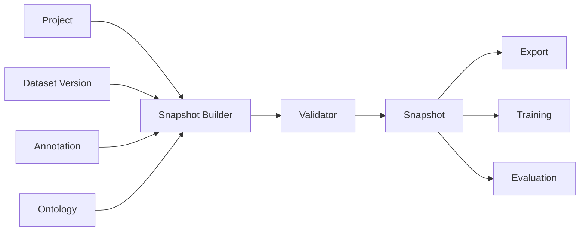
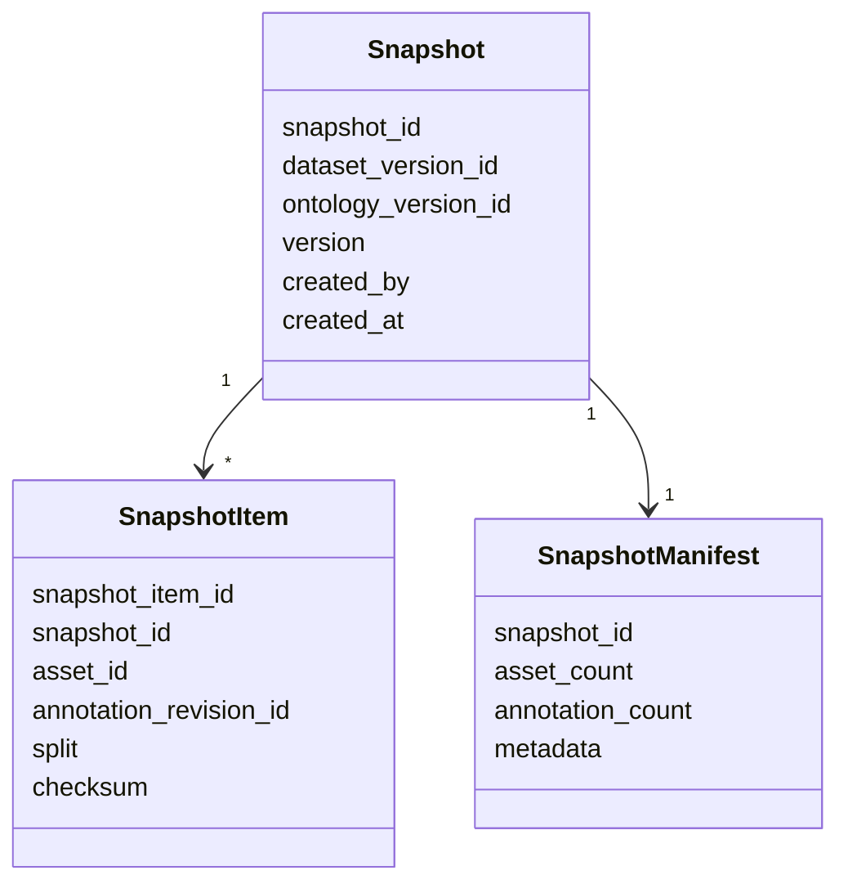
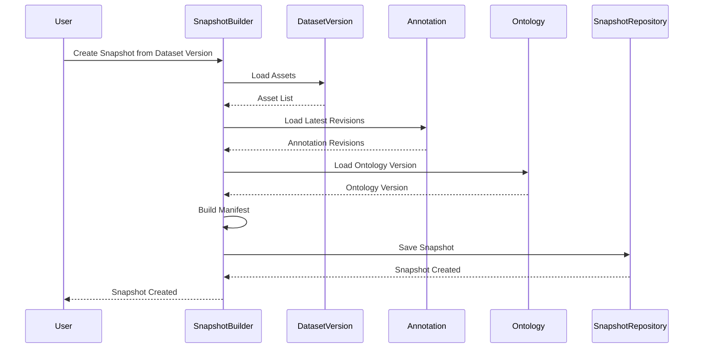
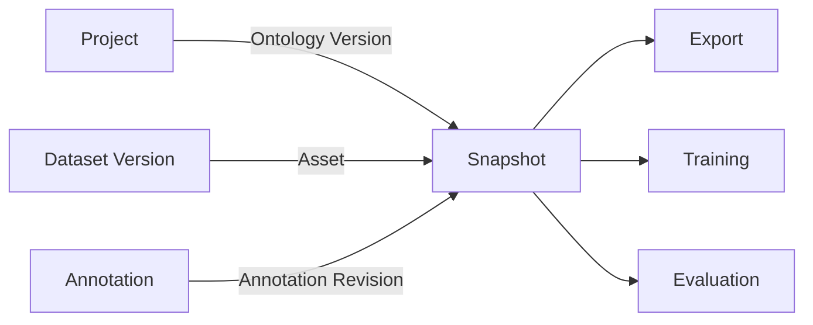

# Snapshot Domain

# Snapshot Domain Design

## 1. Mục tiêu (Objective)

`Snapshot Domain` chịu trách nhiệm quản lý các **phiên bản bất biến (Immutable Snapshot)** của dữ liệu trong AI Data Platform.

Snapshot đại diện cho một **phiên bản dữ liệu có thể tái lập (Reproducible Dataset State)** tại một thời điểm xác định. Mỗi Snapshot lưu tập hợp các tham chiếu (Reference) đến `Dataset Version`, `Asset`, `Annotation Revision` và `Ontology Version`, đảm bảo mọi tác vụ downstream luôn sử dụng cùng một trạng thái dữ liệu.

Snapshot Domain **không sở hữu Dataset, Asset hoặc Annotation**, mà chỉ quản lý các tham chiếu đến các Domain này.

### Phạm vi trách nhiệm

Snapshot Domain chịu trách nhiệm:

- Tạo Snapshot từ một `Dataset Version` xác định.
- Quản lý các phiên bản Snapshot.
- Đảm bảo Snapshot là Immutable.
- Quản lý Manifest mô tả Snapshot.
- Cung cấp Snapshot cho Export, Training và Evaluation.

### Không thuộc phạm vi

Snapshot Domain không chịu trách nhiệm:

- Quản lý Dataset gốc.
- Quản lý Asset vật lý.
- Quản lý Annotation đang hoạt động.
- Quản lý Workflow.
- Quản lý Training Job.
- Quản lý Model.

---

## 2. Thiết kế (Design)

Snapshot Domain được thiết kế theo nguyên tắc **Immutable Snapshot**.

Sau khi được tạo, Snapshot sẽ không bao giờ bị chỉnh sửa. Nếu `Dataset Version` hoặc `Annotation Revision` thay đổi, hệ thống sẽ tạo một Snapshot mới thay vì cập nhật Snapshot cũ.

Snapshot không sao chép dữ liệu mà chỉ lưu tham chiếu đến các Entity thuộc các Domain khác.

Thiết kế này giúp đảm bảo mọi tác vụ downstream luôn làm việc trên cùng một phiên bản dữ liệu đã được cố định.

---

## 3. Domain Model

Snapshot Domain được xây dựng xoay quanh các Entity sau.

| Entity | Trách nhiệm |
| --- | --- |
| `Snapshot` | Đại diện cho một phiên bản dữ liệu bất biến. |
| `Snapshot Item` | Liên kết Asset với Annotation Revision trong Snapshot. |
| `Snapshot Manifest` | Mô tả metadata và thống kê của Snapshot. |

---

### Snapshot

`Snapshot` là Aggregate Root của Domain.

Một Snapshot đại diện cho trạng thái dữ liệu tại một thời điểm xác định và luôn gắn với một `Dataset Version` cụ thể.

Snapshot không lưu dữ liệu Asset hoặc Annotation mà chỉ lưu tham chiếu đến các phiên bản dữ liệu tương ứng.

Mỗi Snapshot bao gồm:

- `Dataset Version`
- `Ontology Version`
- Danh sách `Snapshot Item`
- Metadata của Snapshot

Ví dụ:

| Thành phần | Mô tả |
| --- | --- |
| Snapshot Version | Phiên bản Snapshot |
| Dataset Version ID | Phiên bản Dataset nguồn |
| Ontology Version | Phiên bản Ontology |
| Asset Count | Tổng số Asset |
| Annotation Count | Tổng số Annotation |
| Created By | Người tạo |
| Created At | Thời gian tạo |

---

### Snapshot Item

`Snapshot Item` đại diện cho một đơn vị dữ liệu trong Snapshot.

Mỗi Item liên kết:

- Một Asset
- Một Annotation Revision
- Một Dataset Split
- Checksum phục vụ kiểm tra toàn vẹn dữ liệu

Ví dụ:

| Asset | Annotation Revision | Split |
| --- | --- | --- |
| image001.jpg | Revision #5 | Train |
| image002.jpg | Revision #2 | Validation |
| image003.jpg | Revision #8 | Test |

Snapshot Item không sở hữu dữ liệu mà chỉ lưu các khóa tham chiếu.

---

### Snapshot Manifest

`Snapshot Manifest` mô tả cấu trúc và thống kê của Snapshot.

Manifest thường được dùng để:

- Audit
- Export
- Training
- Traceability
- So sánh Snapshot

Ví dụ các thông tin trong Manifest:

- Dataset Version ID
- Ontology Version
- Tổng số Asset
- Tổng số Annotation
- Danh sách split
- Thông tin kiểm tra toàn vẹn
- Metadata bổ sung

---

## 4. Internal Snapshot Schema

Snapshot chỉ lưu tham chiếu đến dữ liệu, không sao chép Asset hoặc Annotation.

---

## 5. Business Rules

- Một Snapshot chỉ thuộc một `Dataset Version`.
- Một Snapshot là Immutable sau khi được tạo.
- Một Asset chỉ xuất hiện một lần trong cùng một Snapshot.
- Mỗi Snapshot Item phải tham chiếu đến một Annotation Revision hợp lệ.
- Snapshot chỉ tham chiếu đến các Revision đã tồn tại.
- Snapshot chỉ được tạo từ một Dataset Version đã được xác định rõ.
- Snapshot không được cập nhật trực tiếp sau khi phát hành.
- Export, Training và Evaluation chỉ được phép đọc dữ liệu từ Snapshot.

---

## 6. Domain Service

| Service | Vai trò |
| --- | --- |
| Snapshot Builder | Thu thập dữ liệu từ các Domain để tạo Snapshot. |
| Snapshot Validator | Kiểm tra tính hợp lệ của Snapshot trước khi lưu. |
| Snapshot Diff Service | So sánh sự khác biệt giữa hai Snapshot. |

---

## 7. Infrastructure

| Thành phần | Trách nhiệm |
| --- | --- |
| Snapshot Repository | Lưu trữ Snapshot, Snapshot Item và Snapshot Manifest. |
| Storage Adapter | Ghi Manifest vào MinIO hoặc Object Storage. |

---

## Snapshot Repository

Snapshot Repository chịu trách nhiệm lưu và truy xuất Snapshot.

Repository chỉ lưu:

- Snapshot
- Snapshot Item
- Snapshot Manifest

Repository không lưu:

- Dataset
- Dataset Version
- Asset
- Annotation

---

## Storage Adapter

Storage Adapter chịu trách nhiệm lưu Snapshot Manifest vào Object Storage để phục vụ Export, Training và Audit.

---

## 8. Workflow

## Tạo Snapshot

Snapshot chỉ được tạo khi toàn bộ dữ liệu cần thiết đã được thu thập thành công.

---

## 9. Database Design

### snapshots

| Cột | Mô tả |
| --- | --- |
| id | Snapshot ID |
| dataset_version_id | Dataset Version |
| ontology_version_id | Phiên bản Ontology |
| version | Phiên bản Snapshot |
| created_by | Người tạo |
| created_at | Thời gian tạo |

### snapshot_items

| Cột | Mô tả |
| --- | --- |
| id | Snapshot Item ID |
| snapshot_id | Snapshot |
| asset_id | Asset |
| annotation_revision_id | Annotation Revision |
| split | Train / Validation / Test |
| checksum | Integrity Checksum |

### snapshot_manifest

| Cột | Mô tả |
| --- | --- |
| snapshot_id | Snapshot |
| asset_count | Tổng số Asset |
| annotation_count | Tổng số Annotation |
| metadata | JSONB |

---

## 10. Quan hệ với các Domain khác

| Domain | Quan hệ với Snapshot Domain |
| --- | --- |
| **Project** | Cung cấp Ontology Version được sử dụng khi tạo Snapshot. |
| **Dataset Version** | Cung cấp danh sách Asset thuộc phiên bản dữ liệu đã được chốt. |
| **Annotation** | Cung cấp Annotation Revision của từng Asset. |
| **Export** | Sử dụng Snapshot làm nguồn dữ liệu để chuyển đổi sang các định dạng huấn luyện. |
| **Training** | Đọc dữ liệu từ Snapshot để đảm bảo khả năng tái lập quá trình huấn luyện. |
| **Evaluation** | Sử dụng Snapshot để đánh giá mô hình trên một tập dữ liệu cố định. |

---

## 11. Design Decisions

### Snapshot là Source of Truth cho Downstream

Mọi tác vụ Export, Training và Evaluation đều phải sử dụng Snapshot thay vì truy cập trực tiếp Dataset hoặc Annotation.

Thiết kế này đảm bảo toàn bộ downstream luôn làm việc trên cùng một phiên bản dữ liệu.

### Snapshot chỉ lưu Reference

Snapshot không sao chép Asset hoặc Annotation.

Thay vào đó, Snapshot chỉ lưu:

- Dataset Version ID
- Asset ID
- Annotation Revision ID
- Ontology Version

Thiết kế này giúp giảm chi phí lưu trữ và tránh trùng lặp dữ liệu.

### Snapshot gắn với Dataset Version

Snapshot phải được tạo từ một Dataset Version cụ thể, không phải từ Dataset mơ hồ. Điều này giúp hệ thống tái lập dữ liệu chính xác hơn.

### Snapshot là Immutable

Snapshot không được phép chỉnh sửa sau khi được tạo.

Nếu dữ liệu thay đổi, hệ thống sẽ tạo Snapshot mới thay vì cập nhật Snapshot hiện tại.

---

## 12. Benefits

- Đảm bảo khả năng tái lập (Reproducibility) cho Export, Training và Evaluation.
- Tách biệt dữ liệu đang hoạt động với dữ liệu phục vụ downstream.
- Giảm chi phí lưu trữ nhờ chỉ lưu tham chiếu.
- Hỗ trợ Audit và Traceability thông qua các Snapshot bất biến.
- Cho phép nhiều phiên bản dữ liệu cùng tồn tại.
- Gắn chặt với Dataset Version nên dễ truy vết và rollback.

---

## 13. Limitations

- Việc tạo Snapshot phụ thuộc vào nhiều Domain.
- Cần đảm bảo tính nhất quán của dữ liệu tại thời điểm tạo Snapshot.
- Số lượng Snapshot lớn có thể làm tăng chi phí quản lý metadata.
- Cần quản lý rõ mối quan hệ giữa Dataset Version và Ontology Version.

---

## 14. Future Extension

- Hỗ trợ Snapshot Incremental để chỉ lưu các thay đổi giữa các Snapshot.
- Hỗ trợ Snapshot Diff nhằm so sánh sự khác biệt giữa hai Snapshot.
- Tích hợp với MLflow hoặc Weights & Biases để liên kết Snapshot với Experiment.
- Hỗ trợ Dataset Branching và Merge.
- Bổ sung Retention Policy để tự động lưu trữ hoặc xóa các Snapshot cũ.