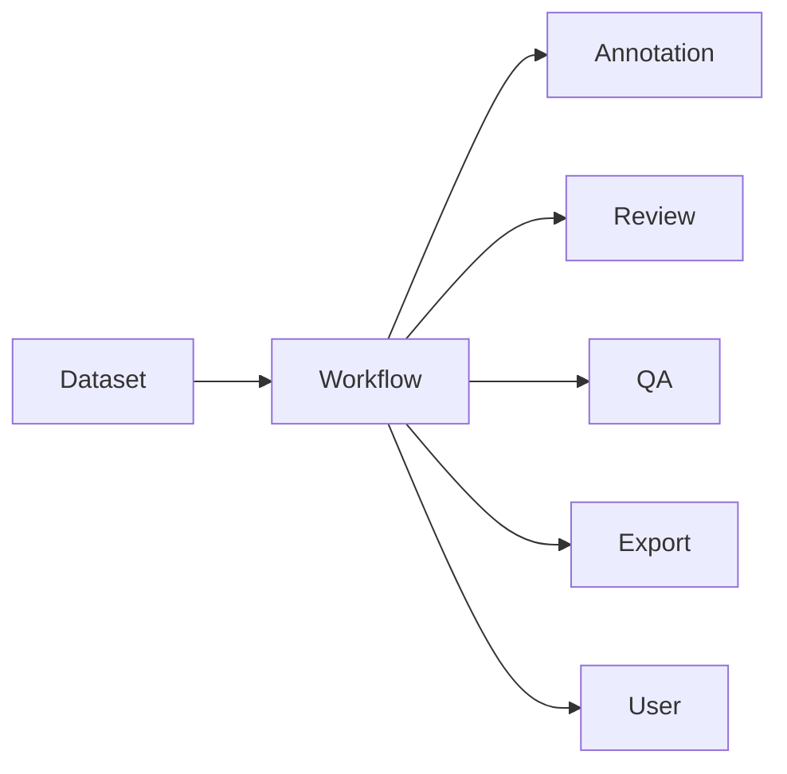
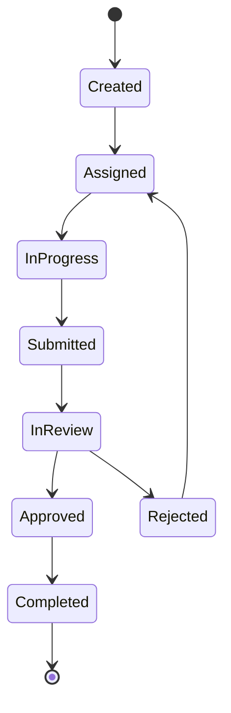
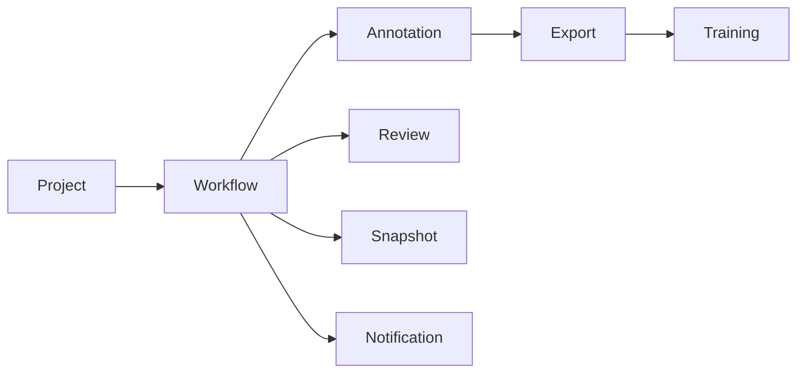

# Workflow Domain

# 1. Mục tiêu (Objective)

`Workflow Domain` chịu trách nhiệm quản lý toàn bộ quy trình nghiệp vụ (Business Process) trong AI Data Platform.

Khác với `Annotation Domain` chỉ quản lý dữ liệu gán nhãn, Workflow Domain quản lý quá trình xử lý dữ liệu, bao gồm phân công công việc, theo dõi tiến độ, chuyển trạng thái, kiểm duyệt và điều phối giữa các vai trò trong hệ thống.

Workflow Domain được thiết kế độc lập để có thể tái sử dụng cho nhiều nghiệp vụ khác nhau như Annotation, Review, Quality Assurance, Active Learning hoặc Data Validation.

---

# 2. Thiết kế (Design)

Workflow Domain không phụ thuộc vào một loại dữ liệu hoặc công cụ cụ thể.

Nó chỉ quản lý **Work Item** và vòng đời xử lý của Work Item.

Nhờ đó, cùng một cơ chế Workflow có thể áp dụng cho nhiều quy trình khác nhau trong hệ thống.

---

# 3. Thành phần (Components)

| Thành phần | Trách nhiệm |
| --- | --- |
| Workflow Definition | Định nghĩa quy trình nghiệp vụ |
| Work Item | Đại diện cho một đơn vị công việc |
| Assignment | Phân công công việc cho User hoặc Team |
| Workflow State Machine | Quản lý trạng thái của Work Item |
| Transition Engine | Kiểm soát việc chuyển trạng thái |
| Notification | Gửi thông báo khi trạng thái thay đổi |
| Audit Log | Lưu lịch sử thực hiện Workflow |

---

# 4. Trách nhiệm

Workflow Domain chịu trách nhiệm:

- Khởi tạo Work Item.
- Phân công Annotator hoặc Reviewer.
- Theo dõi tiến độ xử lý.
- Quản lý trạng thái của từng Work Item.
- Kiểm soát quyền chuyển trạng thái.
- Gửi Notification.
- Lưu lịch sử Workflow.

# 5. Work Item

`Work Item` là đơn vị công việc nhỏ nhất trong Workflow.

Work Item không đại diện cho Annotation mà đại diện cho **một công việc cần hoàn thành**.

Ví dụ:

- Gán nhãn một Asset.
- Review một Annotation.
- Kiểm tra chất lượng dữ liệu.
- Phê duyệt Snapshot.
- Thực hiện Export.

Điều này giúp Workflow có thể tái sử dụng cho nhiều loại nghiệp vụ khác nhau.

---

# 6. Workflow Definition

Workflow Definition định nghĩa các bước của một quy trình.

Ví dụ Workflow Annotation:

Trong tương lai, mỗi Project có thể sử dụng Workflow riêng.

---

# 7. Assignment

Assignment chịu trách nhiệm phân công Work Item.

Một Work Item có thể được giao cho:

- Một User.
- Một Team.
- Một Role.
- Hoặc được hệ thống tự động phân công.

Thông tin Assignment bao gồm:

| Thuộc tính | Mô tả |
| --- | --- |
| Assignee | Người thực hiện |
| Assigned By | Người phân công |
| Assigned At | Thời gian phân công |
| Due Date | Hạn hoàn thành |
| Priority | Mức ưu tiên |

---

# 8. Workflow State Machine

Workflow State Machine chịu trách nhiệm kiểm soát trạng thái của Work Item.

Ví dụ:

| Trạng thái | Mô tả |
| --- | --- |
| Created | Công việc vừa được tạo |
| Assigned | Đã được giao |
| In Progress | Đang thực hiện |
| Submitted | Đã hoàn thành và chờ kiểm duyệt |
| In Review | Đang được Reviewer kiểm tra |
| Approved | Được phê duyệt |
| Rejected | Cần chỉnh sửa |
| Completed | Kết thúc quy trình |
| Cancelled | Hủy bỏ |

State Machine giúp đảm bảo Work Item luôn tuân theo đúng quy trình nghiệp vụ.

---

# 9. Transition Engine

Transition Engine kiểm tra tính hợp lệ của việc chuyển trạng thái.

Ví dụ:

| Từ trạng thái | Có thể chuyển sang |
| --- | --- |
| Created | Assigned, Cancelled |
| Assigned | In Progress |
| In Progress | Submitted |
| Submitted | In Review |
| In Review | Approved, Rejected |
| Rejected | Assigned |
| Approved | Completed |

Mọi thay đổi trạng thái đều phải đi qua Transition Engine.

---

# 10. Notification

Notification chịu trách nhiệm gửi thông báo khi Workflow thay đổi.

Ví dụ:

- Công việc được giao.
- Reviewer yêu cầu chỉnh sửa.
- Công việc quá hạn.
- Workflow hoàn thành.

Notification có thể tích hợp:

- Email.
- WebSocket.
- Slack.
- Discord.
- Microsoft Teams.

---

# 11. Audit Log

Workflow Domain lưu toàn bộ lịch sử xử lý.

Ví dụ:

| Thời gian | Người thực hiện | Hành động |
| --- | --- | --- |
| 09:00 | Admin | Created Work Item |
| 09:05 | Admin | Assigned to User A |
| 10:15 | User A | Submitted |
| 10:30 | Reviewer | Rejected |
| 11:00 | User A | Submitted |
| 11:20 | Reviewer | Approved |

Audit Log phục vụ:

- Kiểm toán.
- Truy vết.
- Thống kê hiệu suất.

---

# 12. Quan hệ với các Domain khác

| Domain | Vai trò |
| --- | --- |
| Project | Chứa Workflow Definition |
| Annotation | Sinh Work Item cho quá trình gán nhãn |
| Snapshot | Chỉ được tạo khi Workflow hoàn thành |
| Notification | Thông báo trạng thái Workflow |

---

# 13. Database Design

## workflow_definitions

| Cột | Mô tả |
| --- | --- |
| id | Workflow ID |
| project_id | Project |
| name | Tên Workflow |
| description | Mô tả |
| config | JSON cấu hình Workflow |

---

## work_items

| Cột | Mô tả |
| --- | --- |
| id | Work Item ID |
| workflow_id | Workflow |
| resource_type | Annotation, QA... |
| resource_id | ID của tài nguyên |
| status | Trạng thái hiện tại |
| priority | Độ ưu tiên |
| created_at | Thời gian tạo |

---

## assignments

| Cột | Mô tả |
| --- | --- |
| id | Assignment ID |
| work_item_id | Work Item |
| assignee_id | Người được giao |
| assigned_by | Người giao |
| due_date | Hạn hoàn thành |

---

## workflow_history

| Cột | Mô tả |
| --- | --- |
| id | History ID |
| work_item_id | Work Item |
| from_state | Trạng thái cũ |
| to_state | Trạng thái mới |
| changed_by | Người thực hiện |
| changed_at | Thời gian |

---

# 14. Design Decisions

## Workflow là Generic Domain

Workflow không được thiết kế riêng cho Annotation.

Một Workflow có thể được sử dụng cho:

- Annotation.
- Review.
- Data Validation.
- Active Learning.
- Dataset Approval.
- Export Approval.
- Model Evaluation.

Điều này giúp tránh việc xây dựng nhiều cơ chế quản lý trạng thái cho từng module.

---

## Workflow chỉ quản lý Process

Workflow chỉ quản lý **quy trình xử lý**, không quản lý dữ liệu nghiệp vụ.

Ví dụ:

- Annotation Domain lưu dữ liệu gán nhãn.
- Workflow Domain quản lý ai thực hiện, đang ở bước nào và trạng thái hiện tại.

Sự phân tách này giúp kiến trúc tuân thủ nguyên tắc **Single Responsibility**.

---

## Work Item là thực thể trung tâm

Workflow không làm việc trực tiếp với `Annotation`, `Dataset` hay `Snapshot`.

Thay vào đó, Workflow quản lý các `Work Item` tham chiếu tới tài nguyên nghiệp vụ thông qua `resource_type` và `resource_id`.

Thiết kế này giúp Workflow có thể mở rộng để hỗ trợ bất kỳ loại nghiệp vụ nào mà không cần thay đổi mô hình dữ liệu.

---

# 15. Benefits

- Tách biệt dữ liệu nghiệp vụ và quy trình xử lý.
- Có thể tái sử dụng cho nhiều Domain khác nhau.
- Hỗ trợ quy trình nhiều bước với nhiều vai trò.
- Dễ tích hợp Notification, SLA và Dashboard.
- Giảm sự phụ thuộc giữa các Domain nghiệp vụ.

---

# 16. Limitations

- Làm tăng số lượng Domain và thực thể trong hệ thống.
- Cần thiết kế State Machine đủ linh hoạt để đáp ứng nhiều loại Workflow.
- Việc tùy biến Workflow theo từng Project có thể làm tăng độ phức tạp trong quản lý cấu hình.

---

# 17. Future Extension

Workflow Domain có thể mở rộng theo các hướng sau:

- **Workflow Builder:** Cho phép người dùng định nghĩa quy trình bằng giao diện kéo thả (Low-code/No-code).
- **Rule Engine:** Tự động chuyển trạng thái dựa trên các điều kiện nghiệp vụ hoặc kết quả từ AI.
- **SLA Management:** Theo dõi thời gian xử lý, cảnh báo công việc quá hạn và thống kê hiệu suất.
- **Workflow Template:** Cung cấp các mẫu quy trình chuẩn cho Annotation, Review, Active Learning hoặc Data Validation.
- **Event-Driven Workflow:** Phát sinh hoặc chuyển bước Work Item dựa trên các sự kiện từ Dataset, Inference hoặc Training, thay vì chỉ thông qua thao tác của người dùng.