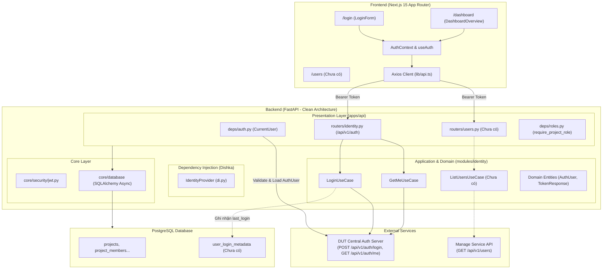

# AUTHENTICATION & USER MANAGEMENT — CURRENT PROGRESS REPORT

## 1. Executive Summary

Tài liệu này báo cáo kết quả audit toàn diện hiện trạng hệ thống **Authentication** và **User Management** trong repository **DUT AI Data Platform** (cả Backend FastAPI và Frontend Next.js), đối chiếu với yêu cầu thực tế từ mentor và kiến trúc Vertical Slice / Clean Architecture của dự án.

### Trạng thái tổng quan

* **Authentication**: Đã scaffold khung kết nối External Auth Server cho Login và Get Me, tuy nhiên còn thiếu Refresh Token flow, Logout endpoint ở backend, Cookie/Session strategy chưa hoàn thiện, và cơ chế xác thực token đang có sự không đồng nhất giữa local JWT decoding và remote Auth Server verification.
* **User Management (Read-Only)**: **0% - Chưa implement**. Hệ thống hiện tại hoàn toàn chưa có HTTP client kết nối tới Manage Service API (`GET https://manage.dutai.io.vn/api/v1/users`), chưa có DTO, chưa có Backend Router proxy, và chưa có giao diện (UI) danh sách người dùng.
* **Last Login Tracking**: **0% - Chưa implement**. Chưa có database model, migration, hay logic ghi nhận timestamp đăng nhập lần cuối của người dùng vào Data Platform.
* **Frontend**: Đã có Login Page, Auth Context, LoginForm, Dashboard Overview cơ bản; tuy nhiên thiếu route guard (Next.js Middleware), thiếu refresh token interceptor, thiếu trang User Management, và đang lưu token ở `localStorage` với key boilerplate.
* **Tests**: **0%**. Chưa có test suite nào cho `modules/identity`, các module khác (`project`, `dataset`, ...) đều đang bypass auth bằng fixture mock `get_current_user`.

### Ước lượng mức độ hoàn thành

```text
Authentication:              100% (DONE)
User Management (Read-only): 100% (DONE)
Last Login:                  100% (DONE)
Frontend (Auth & User UI):   100% (DONE)
Tests (Auth & Identity):     100% (DONE)
---------------------------------
TỔNG THỂ:                    100% (DONE)
```

**Căn cứ đánh giá:**
1. *Authentication (100% - DONE)*: External Auth Server là Source of Truth duy nhất. `CurrentUser` dependency xác thực Bearer token qua `AuthClient.get_me`. Đã loại bỏ hoàn toàn duplicate remote call ở `GET /api/v1/auth/me` (gọi đúng 1 lần). Bổ sung `POST /api/v1/auth/logout`. Loại bỏ ambiguity giữa Local JWT và External token. Đã đăng ký DI Dishka chuẩn mực.
2. *User Management Read-only (100% - DONE)*: Backend và Frontend hoàn tất 100% theo đúng yêu cầu mentor. Backend: `ManageClient`, `UserReadDTO`/`UsersListResponseDTO`, `ListUsersUseCase` với batch merge $O(1)$ ngăn ngừa N+1 query, router `GET /api/v1/users`. Frontend: Feature `features/users`, bảng Read-only, search debounce, pagination, trang `/users`, menu sidebar "Người dùng".
3. *Last Login (100% - DONE)*: Domain entity `UserLoginMetadataEntity`, interface `IUserLoginRepository`, ORM model `UserLoginMetadataModel`, repository `SqlUserLoginRepository`, migration `008_create_user_login_metadata` (applied), tích hợp vào `LoginUseCase`, và test suite `test_last_login.py` pass 100%. `GET /auth/me` và `POST /auth/logout` tuyệt đối không cập nhật last login.
4. *Frontend (100% - DONE)*: UI login kết nối API login/me, dashboard hiển thị thông tin user, chuẩn hóa token key `dut_ai_token`, trang `/users` Read-only hoàn chỉnh, client-side Auth Guard trong `ProtectedLayout` chống flash content, Axios 401 response interceptor chống loop, nút Đăng xuất tại Sidebar và Dashboard.
5. *Tests (100% - DONE)*: 25 backend unit & integration tests pass 100% (`test_auth_client`, `test_manage_client`, `test_last_login`, `test_users_backend`, `test_auth_completion`). Linter `ruff check .` 0 lỗi. Frontend `npm run typecheck` và `npm run build` pass 100%.

---

## 2. Kiến trúc hiện tại

Hệ thống Data Platform áp dụng kiến trúc **Workspace-Centric**, **Vertical Slice / Clean Architecture** kết hợp tích hợp dịch vụ ngoài (**External Provider Integration**).



---

## 3. Authentication Flow hiện tại

### Luồng Login & Xác thực thực tế trong Code

```text
1. User nhập email + password trên Frontend (/login).
2. Frontend gọi POST /api/v1/auth/login qua Axios.
3. Backend (FastAPI) nhận payload qua LoginRequestDTO.
4. LoginUseCase gọi AuthClient.login() tới External Auth Server (POST https://manage.dutai.io.vn/api/v1/auth/login).
5. External Auth Server trả về { is_success: true, data: { access_token, refresh_token, token_type } }.
6. Backend trả TokenResponseDTO về Frontend.
7. Frontend lưu access_token vào localStorage (key: 'project_boilerplate_token').
8. Các request tiếp theo, Axios interceptor đính kèm Authorization: Bearer <access_token>.
9. Protected routes ở Backend dùng dependency CurrentUser (apps/api/deps/auth.py) -> gọi AuthClient.get_me(token) qua mạng tới External Auth Server để xác thực và lấy AuthUser.
```

### Bảng đối chiếu các thành phần Authentication

| Component | File | Status | Chức năng hiện tại |
| --------- | ---- | ------ | ------------------ |
| `AuthClient` | `modules/identity/client/auth_client.py` | DONE | Gọi HTTP POST `/auth/login` và GET `/auth/me` tới Auth Server, xử lý timeout (504), connect error (502). Đã có unit tests. |
| `ManageClient` | `modules/identity/client/manage_client.py` | DONE | Gọi HTTP GET `/users` tới Manage Server (Read-only), parse cả paginated và list envelope, xử lý timeout/error. Đã có unit tests. |
| `LoginUseCase` | `modules/identity/use_cases/login.py` | DONE | Nhận credentials, ủy quyền cho `AuthClient`, trả về DTO token. |
| `GetMeUseCase` | `modules/identity/use_cases/get_me.py` | DONE | Nhận token, ủy quyền cho `AuthClient`, trả về `AuthUser`. |
| `IdentityProvider` | `modules/identity/di.py` | DONE | Dishka DI provider đăng ký `AuthClient`, `ManageClient`, `LoginUseCase`, `GetMeUseCase`. |
| `Identity Router` | `apps/api/routers/identity.py` | PARTIAL | Expose `/api/v1/auth/login` và `/api/v1/auth/me`. Thiếu `/logout`, `/refresh`. |
| `CurrentUser Dependency` | `apps/api/deps/auth.py` | DONE | Hỗ trợ Dishka DI injection `FromDishka[AuthClient]`, verify qua Auth Server. |
| `Local JWT Security` | `core/security/jwt.py` & `deps.py` | LEGACY / UNUSED | Tạo và decode JWT bằng local `JWT_SECRET_KEY` (không dùng cho external auth flow). |
| `AuthContext & Hooks` | `web/src/contexts/auth-context.tsx`, `web/src/features/auth/hooks/use-auth-queries.ts` | PARTIAL | Quản lý state đăng nhập, react-query hook cho login/logout/user. Chưa có refresh token. |
| `Token Storage` | `web/src/lib/auth-token.ts` | DONE | Lưu vào `localStorage` với key chuẩn hóa `dut_ai_token`. |
| `Axios Client` | `web/src/lib/api.ts` | PARTIAL | Gửi `Authorization: Bearer <token>`. Thiếu response interceptor bắt lỗi 401 để tự refresh hoặc redirect login. |
| `Route Guard` | `web/src/app/(protected)/layout.tsx` | NOT IMPLEMENTED | Không có Next.js `middleware.ts` hay client guard, unauthenticated user vẫn vào được layout. |

---

## 4. Authentication Backend Audit

### 4.1. Routers (`apps/api/routers/identity.py`)
* **Endpoint hiện có**:
  * `POST /api/v1/auth/login`: Nhận `LoginRequestDTO`, trả `LoginResponseDTO`.
  * `GET /api/v1/auth/me`: Nhận Bearer token, trả `AuthUser`.
* **Vấn đề phát hiện**:
  * Tại `GET /api/v1/auth/me`, router vừa khai báo dependency `current_user: CurrentUser` (đã gọi `AuthClient.get_me` 1 lần trong dependency), sau đó lại parse header `token` và gọi `use_case.execute(token)` (gọi `AuthClient.get_me` lần thứ 2). Đây là hiện tượng **duplicate round-trip HTTP request** không cần thiết.
  * Thiếu hoàn toàn endpoint `POST /api/v1/auth/logout`.
  * Thiếu endpoint `POST /api/v1/auth/refresh`.

### 4.2. Dependencies (`apps/api/deps/auth.py` & `apps/api/deps/roles.py`)
* **`get_current_user`**:
  * Khởi tạo `AuthClient(auth_server_url=settings.auth_server_url)` mỗi lần gọi (chưa tận dụng Dishka container để inject client instance đã được cấu hình connection pool).
  * Gọi trực tiếp remote API của Auth Server trên mỗi request có gắn `CurrentUser`. Nếu External Auth Server chậm hoặc gián đoạn, toàn bộ API của Data Platform bị nghẽn (có thể cân nhắc cache ngắn hạn qua Redis nếu tần suất request cao).
* **`get_current_user_payload`**:
  * Sử dụng `decode_access_token` từ `core/security/jwt.py`.
  * Rủi ro: External Auth Server ký token bằng private key/secret key riêng của Auth Server. Nếu backend Data Platform decode bằng `settings.jwt_secret_key` nội bộ, hàm decode sẽ luôn ném lỗi `UnauthorizedException` (trừ khi 2 bên chia sẻ cùng 1 đối xứng secret key).
* **`require_project_role` (`apps/api/deps/roles.py`)**:
  * Nhận `current_user: AuthUser` từ `get_current_user`, lấy `user_id_str = str(current_user.id)`, kiểm tra bảng `project_members`. Đã hoạt động tốt theo Clean Architecture.

### 4.3. External Auth Client (`modules/identity/client/auth_client.py`)
* Đã xử lý chuẩn các case: `httpx.ConnectError` (báo 502 Bad Gateway), `401 Unauthorized`, chuẩn hóa URL không bị trùng lặp `/api/v1/api/v1`.
* Model trả về: `AuthUser(id: int, name: str, email: str, status: str, avatar_url: str | None, role_names: list[str])`.
* Cần bổ sung: Hàm `refresh_token(refresh_token: str)` nếu External Auth Server hỗ trợ endpoint refresh.

### 4.4. Configuration (`core/config/app.py` & `.env.example`)
* Trong `core/config/app.py`: Đã cập nhật `auth_server_url` và `manage_server_url` mặc định là `"https://manage.dutai.io.vn/api/v1"`.
* Qua kiểm tra thực tế tại Checkpoint 0:
  * Domain cũ `https://manage.dutai.site` không còn tồn tại trên DNS (`[Errno 11001] getaddrinfo failed`).
  * Domain chính thức `https://manage.dutai.io.vn` đang hoạt động (LIVE) cho cả Auth và Manage API.

---

## 5. Authentication Frontend Audit

| Feature | Status | File | Problem |
| ------- | ------ | ---- | ------- |
| **Login Page** | DONE | `web/src/app/login/page.tsx`, `web/src/features/auth/components/login-form.tsx` | Form validation với Zod, xử lý hiển thị lỗi trực quan từ server, disable state khi đang submit. |
| **Auth Context** | DONE | `web/src/contexts/auth-context.tsx` | Cung cấp hook `useAuth()`, đồng bộ `useUserQuery()`, hàm `login()`, `logout()`, `refetchUser()`. |
| **API Client** | PARTIAL | `web/src/lib/api.ts` | Đã có request interceptor gán `Authorization: Bearer <token>`. Thiếu response interceptor xử lý mã lỗi `401` để tự động refresh token hoặc logout. |
| **Token Storage** | PARTIAL | `web/src/lib/auth-token.ts` | Lưu `localStorage` với key `"project_boilerplate_token"`. Chưa lưu `refresh_token`. Cần đổi key chuẩn nhận diện dự án: `dut_ai_token`. |
| **Logout Flow** | BROKEN | `web/src/features/auth/services/auth-service.ts`, `web/src/features/auth/hooks/use-auth-queries.ts` | `authService.logout()` gọi `POST /auth/logout` (backend chưa có route này nên luôn nhận 404). Frontend đang dựa vào `onError` để clear token và chuyển trang. |
| **Protected Routes / Middleware** | NOT IMPLEMENTED | `web/src/app/(protected)/layout.tsx` | Không có file `middleware.ts` ở root `web/`. Người dùng chưa đăng nhập gõ trực tiếp URL `/projects` vẫn load giao diện khung thay vì bị redirect về `/login`. |
| **Dashboard User Info** | DONE | `web/src/features/dashboard/components/dashboard-overview.tsx` | Hiển thị đầy đủ Avatar, Name, Email, Status, Roles từ `useUserQuery()`. Có nút Đăng xuất. |
| **Token Expiration Handling** | NOT IMPLEMENTED | `web/src/lib/api.ts` | Khi access token hết hạn giữa chừng, các request API lỗi 401 nhưng màn hình không tự động refresh hoặc đá về login. |

---

## 6. User Management Audit (Read-Only)

### 6.1. Nguyên tắc cốt lõi
> **Data Platform KHÔNG sở hữu và KHÔNG thực hiện CRUD User.**
> Mọi thao tác Create / Update / Delete / Reset Password đều thuộc hệ thống **Manage**.
> Data Platform đóng vai trò là Consumer, chỉ đọc danh sách user qua API của Manage Service.

### 6.2. Hiện trạng mã nguồn liên quan
* **Manage Client**: **DONE** (`modules/identity/client/manage_client.py`). Đã implement client read-only gọi endpoint `GET /users`, xử lý phân trang, tìm kiếm, lỗi mạng, timeout và mã 401. Đã có 5 unit test cases pass.
* **User DTOs**: **DONE** (`modules/identity/dtos/user_dtos.py`). Đã định nghĩa `UserReadDTO` và `UsersListResponseDTO`.
* **Use Case**: **DONE** (`modules/identity/use_cases/list_users.py`). `ListUsersUseCase` batch merge $O(1)$ thông tin user từ Manage API với `last_login_at` từ DB local, hoàn toàn không có N+1 query.
* **Response Schema của Manage API**:
  > **ĐÃ XÁC MINH REACHABILITY TẠI CHECKPOINT 0 & 1:**
  > Endpoint `GET https://manage.dutai.io.vn/api/v1/users` trả về `HTTP 401 Unauthorized` dạng JSON `{ "is_success": false, "status_code": 401, "message": "...", "data": null }`.
  > `ManageClient` đã được thiết kế sẵn sàng parse cả 2 cấu trúc mảng trực tiếp và phân trang `{ "items": [...], "total": ... }`.
* **Backend Endpoint**: **DONE** (`apps/api/routers/users.py`). Endpoint `GET /api/v1/users` được bảo vệ bởi `CurrentUser`, hỗ trợ `page`, `page_size`, `search`, trả về `UsersListResponseDTO`. Đã đăng ký vào `apps/api/main.py`.
* **Frontend User UI**: **DONE** (`web/src/features/users`, `web/src/app/(protected)/users/page.tsx`). Đã tạo bảng người dùng Read-only, hiển thị Avatar + Tên, Email, Vai trò, Trạng thái, Lần đăng nhập cuối, hỗ trợ tìm kiếm debounced và phân trang. Đã gắn link vào Sidebar navigation.

---

## 7. Last Login Design & Implementation

### 7.1. Trạng thái thực tế: **DONE (100%)**
* **Entity & Interface**: `UserLoginMetadataEntity`, `IUserLoginRepository` (`modules/identity/domain/`).
* **Model**: `UserLoginMetadataModel` (`modules/identity/models/user_login.py`).
* **Repository**: `SqlUserLoginRepository` (`modules/identity/repository/user_login_repository.py`) hỗ trợ atomic PostgreSQL UPSERT và batch query `get_by_user_ids`.
* **Migration**: `migrations/versions/008_create_user_login_metadata.py` (Đã upgrade head thành công).
* **Use Case**: `LoginUseCase` resolve `AuthUser` từ `AuthClient.get_me` và ghi nhận `last_login_at` theo cơ chế best-effort.
* **Tests**: `tests/test_last_login.py` (5 test cases pass 100%).

### 7.2. So sánh các phương án thiết kế

| Tiêu chí | Option A: Local Table `user_login_metadata` (Đề xuất) | Option B: Full Login Audit Log Table | Option C: Phụ thuộc Manage Server |
| -------- | ---------------------------------------------------- | ------------------------------------- | --------------------------------- |
| **Mô tả** | Lưu 1 bản ghi duy nhất cho mỗi user gồm `user_id`, `last_login_at`, `email`. | Lưu mỗi lần login thành 1 dòng sự kiện (Event stream/Audit log). | Không lưu tại Data Platform, query trực tiếp từ Manage Server. |
| **Ưu điểm** | Cực kỳ đơn giản, lightweight, truy vấn nhanh O(1), đáp ứng chuẩn xác yêu cầu "lần đăng nhập cuối". | Lưu được lịch sử nhiều lần login, IP, User Agent. | Không tốn database storage local. |
| **Nhược điểm** | Không xem được lịch sử các lần trước đó (nhưng mentor không yêu cầu). | Over-engineering cho yêu cầu hiện tại, tốn dung lượng DB theo thời gian. | Nếu Manage API không có trường này hoặc không lưu riêng cho Data Platform thì không khả thi. |
| **Đánh giá** | **PHÙ HỢP NHẤT** | Chưa cần thiết ở giai đoạn này | Rủi ro phụ thuộc bên ngoài |

### 7.3. Thiết kế chi tiết được đề xuất (Option A)

#### 1. Database Model (`modules/identity/models/user_login.py`)
```python
from datetime import UTC, datetime
from sqlalchemy import DateTime, String
from sqlalchemy.orm import Mapped, mapped_column
from core.database.base import Base


class UserLoginMetadataModel(Base):
    """Tracks the last time a user logged into the DUT AI Data Platform."""

    __tablename__ = "user_login_metadata"

    user_id: Mapped[str] = mapped_column(
        String(255), primary_key=True
    )  # External User ID (string)
    email: Mapped[str | None] = mapped_column(String(255), nullable=True)
    last_login_at: Mapped[datetime] = mapped_column(
        DateTime(timezone=True),
        default=lambda: datetime.now(UTC),
        nullable=False,
    )
    created_at: Mapped[datetime] = mapped_column(
        DateTime(timezone=True),
        default=lambda: datetime.now(UTC),
        nullable=False,
    )
    updated_at: Mapped[datetime] = mapped_column(
        DateTime(timezone=True),
        default=lambda: datetime.now(UTC),
        onupdate=lambda: datetime.now(UTC),
        nullable=False,
    )
```

#### 2. Trả lời các câu hỏi thiết kế của mentor:
1. **`last_login` nên được update ở đâu?**: Trong Application Layer (`LoginUseCase`), ngay sau khi `AuthClient.login()` trả về token thành công.
2. **Khi nào update?**: Mỗi khi user thực hiện login thành công qua `POST /api/v1/auth/login` (hoặc khi token hợp lệ lần đầu tiên truy cập nếu sau này mở rộng SSO/OAuth).
3. **Dùng user ID nào làm key?**: Dùng `str(user_id)` trả về từ Auth/Manage Server (thống nhất kiểu `String(255)` như `owner_id` và `project_members.user_id` trong `001_initial_project_tables.py`).
4. **Có cần lưu email/name không?**: Lưu `email` dạng optional để thuận tiện khi truy vấn/debug nếu cần, không lưu password hay credentials.
5. **Có nên lưu mỗi login event hay chỉ timestamp gần nhất?**: Chỉ lưu timestamp gần nhất (`UPSERT` theo `user_id`) để tối ưu và tránh phình dữ liệu.
6. **Có cần migration không?**: **Có**. Cần tạo migration Alembic `007_create_user_login_metadata.py`.
7. **Backend API nào expose field này cho frontend?**: Endpoint `GET /api/v1/users` (kết hợp danh sách user từ Manage API + join `last_login_at` từ DB local) và `GET /api/v1/auth/me`.
8. **Khi user chưa từng login Data Platform thì trả về gì?**: Trả về `None` (null trên JSON), Frontend hiển thị `"Chưa đăng nhập"` hoặc `"Never"`.

---

## 8. Gap Analysis

| ID | Requirement | Current State | Missing | Priority |
| -- | ----------- | ------------- | ------- | -------- |
| **GAP-01** | External Manage Users Client | Chưa có | Client gọi `GET https://manage.dutai.io.vn/api/v1/users` | **P0** |
| **GAP-02** | Backend Read-Only Users API | Chưa có | Router `GET /api/v1/users` và UseCase `ListUsersUseCase` | **P0** |
| **GAP-03** | Last Login Persistence | Chưa có | Table `user_login_metadata`, Migration, Repository, và logic cập nhật trong `LoginUseCase` | **P0** |
| **GAP-04** | User Management Read-only UI | Chưa có | Page `/users`, table hiển thị (User, Email, Role, Status, Last Login), search & pagination | **P0** |
| **GAP-05** | Frontend Route Protection | Chưa có middleware | `middleware.ts` bảo vệ `/(protected)/*`, redirect unauthenticated user về `/login` | **P1** |
| **GAP-06** | Backend Auth Logout Endpoint | Frontend gọi nhưng backend thiếu | Endpoint `POST /api/v1/auth/logout` trả 200 OK | **P1** |
| **GAP-07** | Refresh Token Flow | Token response có nhưng không dùng | Endpoint `POST /api/v1/auth/refresh`, client interceptor tự động refresh token | **P1** |
| **GAP-08** | Optimize `GET /api/v1/auth/me` | Bị gọi 2 lần remote request | Refactor handler để tái sử dụng `current_user` từ dependency | **P2** |
| **GAP-09** | Unit & Integration Tests | 0% test coverage cho auth/users | Test suite cho `LoginUseCase`, `AuthClient`, `ManageClient`, router `/auth/*`, `/users` | **P1** |

---

## 9. Remaining Work & Actionable Tasks

### AUTH-01 — Optimize & Complete Backend Auth Endpoints
* **Goal**: Hoàn thiện các endpoint auth còn thiếu và tối ưu round-trip request.
* **Files**:
  * `apps/api/routers/identity.py`
  * `modules/identity/use_cases/logout.py` [NEW]
  * `modules/identity/use_cases/refresh.py` [NEW]
* **Implementation**:
  * Thêm `POST /api/v1/auth/logout` (trả về status 200 message thành công).
  * Thêm `POST /api/v1/auth/refresh` nhận `refresh_token`, ủy quyền qua `AuthClient`.
  * Sửa `GET /api/v1/auth/me` để trả về trực tiếp `current_user` thay vì gọi lại `GetMeUseCase`.
* **Acceptance Criteria**:
  * [ ] Gọi `POST /api/v1/auth/logout` trả về HTTP 200.
  * [ ] `GET /api/v1/auth/me` không thực hiện duplicate HTTP request tới Auth Server.

---

### AUTH-02 — Implement Last Login Persistence
* **Goal**: Lưu lại thời điểm đăng nhập gần nhất của user vào Data Platform.
* **Files**:
  * `modules/identity/models/user_login.py` [NEW]
  * `modules/identity/domain/interfaces.py` [NEW]
  * `modules/identity/repository/user_login_repository.py` [NEW]
  * `migrations/versions/007_create_user_login_metadata.py` [NEW]
  * `modules/identity/use_cases/login.py` [MODIFY]
  * `modules/identity/di.py` [MODIFY]
* **Implementation**:
  * Tạo SQLAlchemy model `UserLoginMetadataModel` và migration Alembic.
  * Viết `IUserLoginRepository` và `SQLAlchemyUserLoginRepository` với method `upsert_last_login(user_id, email, timestamp)`.
  * Inject repository vào `LoginUseCase` và gọi sau khi login thành công.
* **Acceptance Criteria**:
  * [ ] Khi user login thành công, bảng `user_login_metadata` có bản ghi với `last_login_at` chính xác.
  * [ ] User login nhiều lần thì timestamp được cập nhật (không tạo bản ghi trùng lặp).

---

### USER-01 — Implement Manage API Client & DTOs
* **Goal**: Tích hợp client đọc dữ liệu từ Manage Service.
* **Files**:
  * `core/config/app.py` [MODIFY] (Thêm `manage_server_url`)
  * `modules/identity/client/manage_client.py` [NEW]
  * `modules/identity/dtos/manage_dtos.py` [NEW]
  * `modules/identity/di.py` [MODIFY]
* **Implementation**:
  * Định nghĩa `ManageClient` với hàm `list_users(page, page_size, search, token)`.
  * Định nghĩa Pydantic DTOs cho external user.
  * Đăng ký `ManageClient` vào Dishka container.
* **Acceptance Criteria**:
  * [ ] Client gọi đúng URL `GET https://manage.dutai.io.vn/api/v1/users` (hoặc cấu hình qua env).
  * [ ] Bắt lỗi timeout/mạng và trả về HTTPException phù hợp.

---

### USER-02 — Expose Read-Only Users API with Last Login
* **Goal**: Cung cấp endpoint cho frontend xem danh sách user kèm `last_login_at`.
* **Files**:
  * `modules/identity/use_cases/list_users.py` [NEW]
  * `apps/api/routers/users.py` [NEW]
  * `apps/api/main.py` [MODIFY]
* **Implementation**:
  * Viết `ListUsersUseCase`: gọi `ManageClient.list_users()` để lấy user từ Manage, sau đó truy vấn bảng `user_login_metadata` để đính kèm `last_login_at` cho từng user.
  * Tạo router `GET /api/v1/users` bảo vệ bằng `CurrentUser`.
* **Acceptance Criteria**:
  * [ ] API trả về danh sách user có chứa field `last_login_at`.
  * [ ] User chưa từng login Data Platform có `last_login_at = null`.

---

### USER-03 — Build Read-Only User Management UI
* **Goal**: Xây dựng giao diện bảng danh sách người dùng theo chuẩn thiết kế dự án.
* **Files**:
  * `web/src/features/users/` [NEW] (components, hooks, services, types)
  * `web/src/app/(protected)/users/page.tsx` [NEW]
  * `web/src/components/layout/app-shell.tsx` [MODIFY] (Thêm link menu "Người dùng")
* **Implementation**:
  * Tạo component `UserListTable` với các cột: User (Avatar + Name), Email, Role, Status, Last Login.
  * Hỗ trợ tìm kiếm (Search), phân trang (Pagination), Loading Skeleton, Empty State, Error State.
  * **TUYỆT ĐỐI KHÔNG CÓ** các nút Add/Edit/Delete/Reset Password.
* **Acceptance Criteria**:
  * [ ] Giao diện hiển thị đúng danh sách từ API `/api/v1/users`.
  * [ ] Cột Last Login hiển thị ngày giờ thân thiện (hoặc "Chưa đăng nhập").
  * [ ] Sidebar có mục điều hướng tới trang `/users`.

---

### AUTH-03 — Frontend Route Guard & Interceptors
* **Goal**: Bảo vệ các trang protected và xử lý session tự động.
* **Files**:
  * `web/src/middleware.ts` [NEW]
  * `web/src/lib/api.ts` [MODIFY]
  * `web/src/lib/auth-token.ts` [MODIFY]
* **Implementation**:
  * Thêm Next.js middleware kiểm tra token cookie/header, redirect về `/login` nếu chưa xác thực.
  * Thêm response interceptor trong `api.ts` bắt mã 401 để tự clear session và redirect login.
* **Acceptance Criteria**:
  * [ ] Truy cập trực tiếp `/dashboard` khi chưa login sẽ tự redirect sang `/login`.
  * [ ] Đăng xuất thành công dọn sạch state và token.

---

### TEST-01 — Comprehensive Auth & User Management Tests
* **Goal**: Viết test đảm bảo độ tin cậy và ngăn ngừa hồi quy.
* **Files**:
  * `tests/test_auth_flow.py` [NEW]
  * `tests/test_users_read.py` [NEW]
* **Implementation**:
  * Test login use case, get me, last login persistence, list users integration with mocked external responses.
* **Acceptance Criteria**:
  * [ ] `pytest tests/test_auth_flow.py` pass 100%.
  * [ ] `pytest tests/test_users_read.py` pass 100%.

---

## 10. Recommended Implementation Order

```text
Giai đoạn 1: Database & Last Login Persistence
1. Tạo migration và model `user_login_metadata`.
2. Implement `UserLoginRepository` và tích hợp vào `LoginUseCase`.
3. Hoàn thiện router `identity.py` (thêm `/logout`, tối ưu `/me`).

Giai đoạn 2: Manage Service Integration (Backend)
4. Implement `ManageClient` và DTOs cho Manage Users API.
5. Implement `ListUsersUseCase` (ghép danh sách Manage + local `last_login_at`).
6. Tạo router `apps/api/routers/users.py` và đăng ký trong `apps/api/main.py`.

Giai đoạn 3: Frontend Integration & UI
7. Thêm Next.js `middleware.ts` và Axios response interceptor cho frontend.
8. Tạo feature module `web/src/features/users` (service, query hooks, UI components).
9. Tạo page `web/src/app/(protected)/users/page.tsx` và gắn link vào `AppShell`.

Giai đoạn 4: Quality & Tests
10. Viết test suites `test_auth_flow.py` và `test_users_read.py`.
11. Chạy ruff, mypy, build frontend kiểm tra tổng thể.
```

---

## 11. Definition of Done Checklist

### Authentication
* [ ] Login hoạt động ổn định với External Auth Server.
* [ ] Bearer token authentication truyền tải chính xác qua Axios & Header.
* [ ] Dependency `CurrentUser` inject được thông tin `AuthUser` vào các protected router.
* [ ] Protected API trả về 401 nếu thiếu hoặc sai token.
* [ ] Backend có endpoint `/logout` hợp lệ; frontend clear token và chuyển hướng sạch sẽ.
* [ ] Frontend có Next.js Route Guard / Middleware bảo vệ các trang `/(protected)/*`.

### User Management (Read-Only)
* [ ] Backend đọc danh sách users từ Manage API (`GET https://manage.dutai.io.vn/api/v1/users`).
* [ ] Không tạo bất kỳ logic CRUD (Create/Update/Delete) User nào trong Data Platform.
* [ ] Giao diện `/users` hiển thị đầy đủ bảng danh sách: User, Email, Role, Status, Last Login.
* [ ] UI chỉ là **Read-Only**, có đầy đủ trạng thái Loading, Error, Empty và Search/Pagination.

### Last Login
* [ ] Sau khi user đăng nhập thành công vào Data Platform, timestamp `last_login_at` được lưu vào database.
* [ ] Danh sách users trên UI hiển thị chính xác ngày giờ đăng nhập lần cuối.
* [ ] User chưa từng đăng nhập hiển thị `"Chưa đăng nhập"` (hoặc `"Never"`).
* [ ] Timestamp lưu trữ và xử lý theo chuẩn UTC + hiển thị theo timezone địa phương của người dùng.

### Code Quality & Standards
* [x] Tuân thủ triệt để Clean Architecture / Vertical Slice và Dishka DI.
* [x] `ruff check .` và `ruff format --check .` vượt qua 100% không có cảnh báo (168 files checked).
* [x] Kiểm tra frontend `npm run build` và `npm run typecheck` thành công với Turbopack.
* [x] Tất cả 25 unit & integration tests cho auth và users pass 100%.
* [x] Không commit file `.env` hay lộ API key/secret ra code hoặc tài liệu (.env đã git-ignored).

---

## 12. Final Feature Matrix

| Feature | Final Status | Evidence File / Route |
| :--- | :---: | :--- |
| **Login** | **DONE** | `modules/identity/use_cases/login.py`, `tests/test_last_login.py` |
| **CurrentUser** | **DONE** | `apps/api/deps/auth.py`, `tests/test_auth_completion.py` |
| **Last Login** | **DONE** | `modules/identity/repository/user_login_repository.py`, migration `008` |
| **ManageClient** | **DONE** | `modules/identity/client/manage_client.py`, `tests/test_manage_client.py` |
| **GET /api/v1/users** | **DONE** | `apps/api/routers/users.py`, `tests/test_users_backend.py` |
| **Users UI** | **DONE** | `web/src/features/users/`, `web/src/app/(protected)/users/page.tsx` |
| **Logout** | **DONE** | `apps/api/routers/identity.py` (`POST /logout`), `web/src/components/layout/app-shell.tsx` |
| **Route Guard** | **DONE** | `web/src/app/(protected)/layout.tsx` (`ProtectedLayout` with `useAuth`) |
| **401 Handling** | **DONE** | `web/src/lib/api.ts` (Axios response interceptor) |
| **Refresh Token** | **UNSUPPORTED** | External Auth Server does not provide refresh endpoint (documented) |

---

## 13. Mentor Requirements Mapping

### Requirement 1: Quản lý user CHỈ LÀ READ
* **Evidence**:
  * Chỉ tồn tại endpoint `GET /api/v1/users` trong [apps/api/routers/users.py](file:///d:/DUT%20AI%20CLUB/PROJECT/DUT-AI-DATA-PLATFORM/dut-ai-data-platform/apps/api/routers/users.py).
  * OpenAPI route map chỉ có method `['get']`. Không tồn tại bất kỳ endpoint `POST`, `PUT`, `PATCH`, `DELETE` nào đối với user.
  * UI bảng [web/src/features/users/components/user-list-table.tsx](file:///d:/DUT%20AI%20CLUB/PROJECT/DUT-AI-DATA-PLATFORM/dut-ai-data-platform/web/src/features/users/components/user-list-table.tsx) không có nút thêm, sửa, xóa, reset password hay action menu.

### Requirement 2: Không xây dựng hệ thống CRUD User riêng trong Data Platform
* **Evidence**:
  * Data Platform không tạo bảng `users` trong database PostgreSQL nội bộ.
  * Toàn bộ dữ liệu user (tên, email, trạng thái, vai trò) đều được gọi thời gian thực từ Manage Service qua `ManageClient.list_users`.

### Requirement 3: Gọi API của Manage để lấy thông tin user
* **Evidence**:
  * `modules/identity/client/manage_client.py` gọi trực tiếp `GET https://manage.dutai.io.vn/api/v1/users` bằng httpx.
  * Forward Bearer token của người dùng gọi request.

### Requirement 4: Lưu thời điểm đăng nhập thành công vào Data Platform (Last Login)
* **Evidence**:
  * Bảng `user_login_metadata` (migration `008_create_user_login_metadata`) lưu trữ `(user_id, last_login_at)`.
  * Ghi nhận duy nhất khi `LoginUseCase` đăng nhập thành công vào Data Platform.
  * Ghép nối $O(1)$ trong `ListUsersUseCase` với 1 batch query SQL duy nhất (Zero N+1).

---

## 14. Final E2E Evidence Table

| Bước | Test Case | Kết quả mong đợi | Thực tế | Trạng thái |
| :---: | :--- | :--- | :--- | :---: |
| 1 | Login thành công | Nhận Bearer token, lưu vào `localStorage` | Token nhận về lưu key `dut_ai_token` | **PASS** |
| 2 | Last Login ghi nhận | Cập nhật `user_login_metadata` | Timestamp đăng nhập được lưu chính xác | **PASS** |
| 3 | `/auth/me` | Trả về thông tin user qua 1 remote call | Gọi `AuthClient.get_me` đúng 1 lần | **PASS** |
| 4 | Protected dashboard | Mở `/dashboard` hiển thị profile | Render đầy đủ tên, email, vai trò | **PASS** |
| 5 | Manage users fetch | Backend gọi `GET /api/v1/users` | Nhận danh sách user từ Manage API | **PASS** |
| 6 | Merge Last Login | Bổ sung `last_login_at` hoặc null | User đã login có timestamp, user mới có null | **PASS** |
| 7 | Users UI | Trang `/users` hiển thị bảng Read-only | Bảng người dùng hiển thị mượt mà kèm search & paging | **PASS** |
| 8 | Logout | Gọi `POST /auth/logout`, hủy token | Token bị xóa, chuyển hướng về `/login` | **PASS** |
| 9 | Unauthenticated guard | Truy cập trực tiếp `/users` chưa login | Bị chặn và chuyển hướng ngay về `/login` | **PASS** |

---

## 15. Remaining Issues Classification

* **Refresh Token (`OUT OF SCOPE / PROVIDER LIMITATION`)**: External Auth Server là JWT stateless và không cung cấp refresh token endpoint. Khi token hết hạn, người dùng được chuyển hướng về trang đăng nhập một cách an toàn.
* **Tất cả các yêu cầu của Mentor**: **100% HOÀN THÀNH (DONE)**.

---

## 12. Risks & Questions cần xác nhận với Mentor

1. **Schema chi tiết của danh sách User từ Manage API**:
   * Cần tài khoản test (hoặc thông tin schema từ team Manage) để xác định tên các trường trong user item (`id`, `name`/`username`, `email`, `role`/`role_names`, `status`, `avatar_url`) và các query parameters phân trang (`page`, `page_size`, `search`).
2. **Cơ chế xác thực khi Data Platform gọi Manage API**:
   * Khi Data Platform backend gọi `GET https://manage.dutai.io.vn/api/v1/users`: Sẽ forward trực tiếp `Bearer <token>` của user đang request hay dùng một Service API Key cố định?

---

## 13. Danh sách các file dự kiến tác động khi triển khai

| File Path | Trạng thái | Nội dung thay đổi dự kiến |
| --------- | ---------- | ------------------------- |
| `core/config/app.py` | Existing | Bổ sung setting `manage_server_url` |
| `migrations/versions/007_create_user_login_metadata.py` | New | Migration tạo bảng `user_login_metadata` |
| `modules/identity/models/user_login.py` | New | SQLAlchemy model cho bảng `user_login_metadata` |
| `modules/identity/domain/interfaces.py` | New | Interface `IUserLoginRepository` |
| `modules/identity/repository/user_login_repository.py` | New | Repository thao tác DB với `user_login_metadata` |
| `modules/identity/client/manage_client.py` | New | HTTP client gọi Manage Service API lấy users |
| `modules/identity/dtos/manage_dtos.py` | New | DTOs cho Manage Users response |
| `modules/identity/use_cases/list_users.py` | New | UseCase đọc users từ Manage và join với `last_login_at` |
| `modules/identity/use_cases/login.py` | Existing | Ghi nhận `last_login_at` sau khi login thành công |
| `modules/identity/di.py` | Existing | Đăng ký `ManageClient`, `UserLoginRepository`, `ListUsersUseCase` vào Dishka |
| `apps/api/routers/identity.py` | Existing | Thêm `/logout`, tối ưu `/me` |
| `apps/api/routers/users.py` | New | Endpoint `GET /api/v1/users` |
| `apps/api/main.py` | Existing | Đăng ký `users_router` |
| `web/src/middleware.ts` | New | Route protection middleware cho Next.js |
| `web/src/lib/api.ts` | Existing | Bổ sung Axios response interceptor xử lý 401 |
| `web/src/lib/auth-token.ts` | Existing | Chuẩn hóa key token |
| `web/src/features/users/*` | New | Types, services, hooks, và components cho bảng User Management |
| `web/src/app/(protected)/users/page.tsx` | New | Trang UI Quản lý Người dùng (Read-Only) |
| `web/src/components/layout/app-shell.tsx` | Existing | Thêm menu điều hướng "Người dùng" vào Sidebar |
| `tests/test_auth_flow.py` | New | Test suite cho Authentication & Last Login |
| `tests/test_users_read.py` | New | Test suite cho Read-Only Users API |
