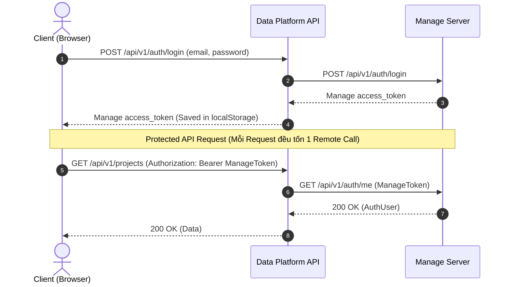
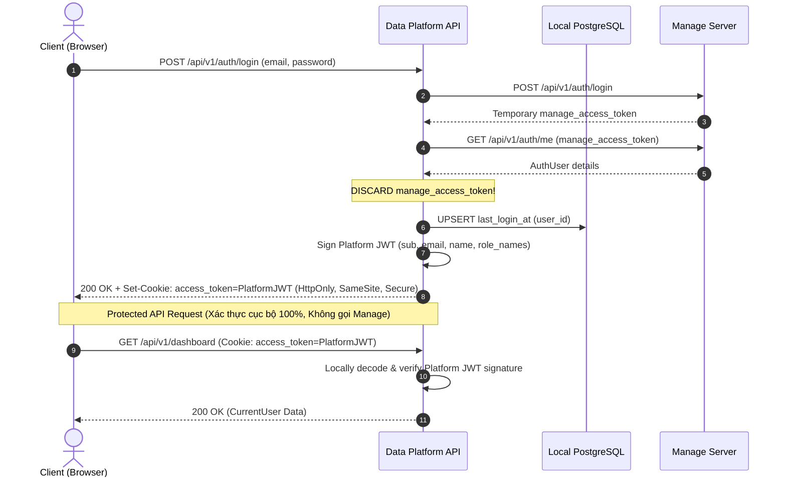

# Checkpoint — Authentication Token Architecture Refactor

Báo cáo chi tiết quá trình tái cấu trúc kiến trúc Authentication của **DUT AI Data Platform**: Chuyển đổi từ cơ chế chuyển tiếp Manage Token sang cơ chế **Data Platform tự phát hành và xác thực Token nội bộ (Platform's Own JWT)** kết hợp lưu trữ trong **HttpOnly Cookie**.

---

## 1. Bối cảnh & Lý do thay đổi (Context & Rationale)

* **Trước đây (Old Architecture)**:
  * Data Platform đăng nhập qua Manage Server và lấy trực tiếp `access_token` của Manage Server trả về cho Frontend.
  * Mỗi request đến các API cần bảo vệ của Data Platform (`CurrentUser`) đều phải thực hiện một HTTP request gọi từ xa (remote call) sang `GET https://manage.dutai.io.vn/api/v1/auth/me` để xác thực token.
  * Nhược điểm: Phụ thuộc 100% vào network latency của Manage Server trên từng API request; không phân định rõ ranh giới bảo mật (security boundary) giữa Data Platform và Manage Server; token được lưu trữ tại `localStorage` của trình duyệt tiềm ẩn nguy cơ rò rỉ qua XSS.

* **Kiến trúc mới (New Target Architecture)**:
  * Manage Server chỉ đóng vai trò xác thực thông tin đăng nhập (credentials) và trả về danh tính người dùng trong phiên đăng nhập ban đầu.
  * Sau khi xác minh danh tính thành công, **DUT AI Data Platform tự phát hành JWT riêng** (`platform_access_token`) có chữ ký số bí mật độc lập (`JWT_SECRET_KEY`).
  * Token tạm thời của Manage Server (`manage_access_token`) **bị hủy bỏ ngay lập tức** (DISCARD), không lưu vào DB, Cookie, localStorage hay nhét vào payload token.
  * `platform_access_token` được lưu trữ an toàn trong **HttpOnly Cookie** do trình duyệt tự động quản lý.
  * Mọi request được bảo vệ tiếp theo được Data Platform **xác thực tại chỗ (Locally)** qua việc giải mã và kiểm tra chữ ký số của Platform JWT, **hoàn toàn không gọi sang Manage Server**.

---

## 2. So sánh Kiến trúc (Before vs. After)

### 2.1. Trước (Before)
```text
Manage JWT -> Browser (localStorage) -> Data Platform -> Manage /me every request (N Remote Calls)
```



### 2.2. Sau (After)
```text
Manage Login -> Manage /me once -> Platform JWT -> HttpOnly Cookie -> Local JWT Verification (0 Remote Call)
```



---

## 3. Quản lý Vòng đời Token (Token Lifecycle & Boundary)

| Thuộc tính | Manage Token | Platform Token |
| :--- | :--- | :--- |
| **Issuer (Đơn vị phát hành)** | Manage Server (`manage.dutai.io.vn`) | DUT AI Data Platform (`iss: dut-ai-data-platform`) |
| **Consumer (Đơn vị sử dụng)** | Manage Server | DUT AI Data Platform |
| **Mục đích** | Xác thực credentials trong login flow / Manage API | Quản lý phiên đăng nhập Data Platform |
| **Thời gian tồn tại** | Tạm thời (ngay sau khi lấy AuthUser thì **DISCARD**) | Cấu hình qua `JWT_EXPIRE_MINUTES` (mặc định 1440m) |
| **Lưu trữ** | **KHÔNG** lưu vào DB, Cookie, localStorage, hay JWT | **HttpOnly Cookie** do trình duyệt tự động gửi |
| **Chữ ký số (Signature)** | Manage Server Secret Key | Data Platform `JWT_SECRET_KEY` |

> [!IMPORTANT]
> **Ranh giới bảo mật nghiêm ngặt**: Data Platform JWT tuyệt đối không được gửi sang Manage Server. Ngược lại, token của Manage Server không bao giờ được chuyển tiếp về trình duyệt người dùng.

---

## 4. Chi tiết Cấu trúc Payload của Platform JWT

Tệp tin [core/security/jwt.py](file:///d:/DUT%20AI%20CLUB/PROJECT/DUT-AI-DATA-PLATFORM/dut-ai-data-platform/core/security/jwt.py) chịu trách nhiệm tạo và xác thực token với các claims tiêu chuẩn:

```json
{
  "sub": "101",
  "email": "alice@example.com",
  "name": "Alice Nguyen",
  "role_names": ["ADMIN"],
  "iat": 1756435200,
  "exp": 1756521600,
  "iss": "dut-ai-data-platform"
}
```

* `sub`: Chuỗi ID người dùng từ Manage Server.
* `email`, `name`, `role_names`: Thông tin định danh cơ bản cần thiết cho CurrentUser.
* `iat` & `exp`: Thời điểm phát hành và thời gian hết hạn (lấy từ `settings.jwt_expire_minutes`).
* `iss`: Định danh nhà phát hành `"dut-ai-data-platform"`.
* **Tuyệt đối không chứa**: Manage token, refresh token, mật khẩu, credentials hay dữ liệu nhạy cảm.

---

## 5. Cấu hình HttpOnly Cookie

Thông số cấu hình cookie tập trung tại [core/config/app.py](file:///d:/DUT%20AI%20CLUB/PROJECT/DUT-AI-DATA-PLATFORM/dut-ai-data-platform/core/config/app.py):

* **Cookie Name**: `settings.auth_cookie_name` (mặc định: `"access_token"`).
* **HttpOnly**: `True` (ngăn ngừa hoàn toàn việc truy cập token qua JavaScript client-side, miễn nhiễm với tấn công XSS lấy cắp token).
* **Secure**: `settings.auth_cookie_secure` (`False` khi dev local HTTP, `True` trên môi trường Production HTTPS).
* **SameSite**: `settings.auth_cookie_samesite` (`"lax"` - cân bằng giữa bảo mật CSRF và trải nghiệm điều hướng).
* **Path**: `"/"`.
* **Max-Age**: `settings.auth_cookie_max_age` (mặc định: 86400 giây = 24 giờ).

---

## 6. Luồng CurrentUser & Xác thực Cục bộ

Tại [apps/api/deps/auth.py](file:///d:/DUT%20AI%20CLUB/PROJECT/DUT-AI-DATA-PLATFORM/dut-ai-data-platform/apps/api/deps/auth.py):

1. Trích xuất token ưu tiên từ HttpOnly Cookie: `request.cookies.get(settings.auth_cookie_name)`.
2. Fallback: Nếu không có cookie, kiểm tra `Authorization: Bearer <token>` (phục vụ API client / Swagger / Test suite).
3. Nếu không có token -> Ném lỗi `401 Unauthorized`.
4. Gọi `decode_access_token(platform_access_token)` để kiểm tra chữ ký số và hạn sử dụng ngay trong bộ nhớ.
5. Tạo thực thể `AuthUser(id=sub, email=email, name=name, role_names=role_names, status="ACTIVE")`.
6. **Không phát sinh bất kỳ network call nào sang Manage Server.**

---

## 7. Tác động tới Read-Only User Management (`/users`)

* Quản lý người dùng tại Data Platform vẫn là **CHỈ ĐỌC (READ-ONLY)**.
* Endpoint `GET /api/v1/users` được bảo vệ bởi `CurrentUser` (xác thực Platform Cookie cục bộ).
* Khi backend gọi `ManageClient.list_users`:
  * Sử dụng token service chuyên dụng hoặc `manage_api_token` nếu được cấu hình trong `AppSettings`.
  * **Tuyệt đối không lấy Platform JWT gửi sang Manage Server**, đảm bảo tính toàn vẹn của Token Boundary.

---

## 8. Kết quả Kiểm thử Tự động (Automated Verification)

Toàn bộ **46 test cases** đã vượt qua thành công:
```text
tests/test_annotation_full.py::test_annotation_full_lifecycle PASSED     [  2%]
tests/test_auth_client.py::test_auth_client_build_url PASSED             [  4%]
tests/test_auth_client.py::test_auth_client_login_success PASSED         [  6%]
tests/test_auth_client.py::test_auth_client_login_invalid_credentials PASSED [  8%]
tests/test_auth_client.py::test_auth_client_get_me_success PASSED        [ 10%]
tests/test_auth_client.py::test_auth_client_get_me_expired_token PASSED  [ 13%]
tests/test_auth_completion.py::test_login_issues_platform_jwt_and_sets_httponly_cookie PASSED [ 15%]
tests/test_auth_completion.py::test_login_fails_when_manage_login_fails PASSED [ 17%]
tests/test_auth_completion.py::test_login_fails_when_manage_get_me_fails PASSED [ 19%]
tests/test_auth_completion.py::test_get_me_verifies_platform_jwt_locally_without_calling_manage PASSED [ 21%]
tests/test_auth_completion.py::test_get_me_backward_compatibility_with_bearer_header PASSED [ 23%]
tests/test_auth_completion.py::test_get_me_expired_platform_token_returns_401 PASSED [ 26%]
tests/test_auth_completion.py::test_get_me_unauthenticated_returns_401 PASSED [ 28%]
tests/test_auth_completion.py::test_logout_endpoint_clears_cookie PASSED [ 30%]
tests/test_dataset_full.py::test_dataset_full_lifecycle PASSED           [ 32%]
tests/test_domain.py::test_ulid_generator PASSED                         [ 34%]
tests/test_domain.py::test_domain_exceptions PASSED                      [ 36%]
tests/test_health.py::test_health_check PASSED                           [ 39%]
tests/test_health.py::test_readiness_check_success PASSED                [ 41%]
tests/test_health.py::test_readiness_check_unhealthy PASSED              [ 43%]
tests/test_last_login.py::test_first_login_creates_last_login_record PASSED [ 45%]
tests/test_last_login.py::test_second_login_updates_existing_record PASSED [ 47%]
tests/test_last_login.py::test_failed_login_does_not_update_last_login PASSED [ 50%]
tests/test_last_login.py::test_failed_me_verification_does_not_issue_token PASSED [ 52%]
tests/test_last_login.py::test_db_failure_does_not_break_login PASSED    [ 54%]
tests/test_last_login.py::test_repository_model_conversion_and_batch_query PASSED [ 56%]
tests/test_manage_client.py::test_manage_client_build_url PASSED         [ 58%]
tests/test_manage_client.py::test_manage_client_list_users_paginated PASSED [ 60%]
tests/test_manage_client.py::test_manage_client_list_users_list_envelope PASSED [ 63%]
tests/test_manage_client.py::test_manage_client_unauthorized PASSED      [ 65%]
tests/test_manage_client.py::test_manage_client_timeout PASSED           [ 67%]
tests/test_ontology_full.py::test_ontology_full_lifecycle PASSED         [ 69%]
tests/test_projects_full.py::test_project_full_lifecycle PASSED          [ 71%]
tests/test_storage_uri.py::test_build_storage_public_url PASSED          [ 72%]
tests/test_storage_uri.py::test_parse_storage_uri PASSED                 [ 74%]
tests/test_storage_uri.py::test_asset_response_dto_resolves_full_uri PASSED [ 76%]
tests/test_storage_uri.py::test_minio_storage_adapter_upload_and_build_url PASSED [ 79%]
tests/test_storage_uri.py::test_s3_settings_configuration PASSED         [ 81%]
tests/test_storage_uri.py::test_database_and_redis_settings_configuration PASSED [ 83%]
tests/test_users_backend.py::test_list_users_use_case_merge_last_login PASSED [ 86%]
tests/test_users_backend.py::test_list_users_use_case_empty_users PASSED [ 88%]
tests/test_users_backend.py::test_list_users_use_case_manage_failure PASSED [ 90%]
tests/test_users_backend.py::test_list_users_use_case_pagination_and_search_forwarding PASSED [ 93%]
tests/test_users_backend.py::test_api_get_users_unauthenticated PASSED   [ 95%]
tests/test_users_backend.py::test_api_get_users_authenticated_success PASSED [ 97%]
tests/test_users_backend.py::test_api_get_users_authenticated_via_cookie_success PASSED [100%]
======================= 46 passed, 1 warning in 30.61s ========================
```

* **Frontend Build**: `tsc --noEmit` và `next build` hoàn thành với 0 lỗi, toàn bộ route được tối ưu hóa.

---

## 9. Kết luận

Kiến trúc Authentication mới của DUT AI Data Platform đã đạt được:
1. **Độc lập và tự chủ**: Tự cấp phát và quản lý phiên thông qua JWT và HttpOnly Cookie.
2. **Hiệu năng vượt trội**: Giảm $N$ network calls sang Manage Server xuống còn đúng 1 call lúc đăng nhập.
3. **Bảo mật tối đa**: Token không thể truy cập từ JavaScript client-side; ranh giới giữa Manage Token và Platform Token được bảo vệ tuyệt đối.
