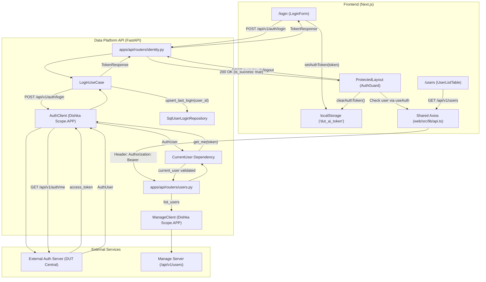

# Checkpoint 5 — Authentication Completion & Cleanup Report

## 1. Previous State

Trước Checkpoint 5:
* **Duplicate Remote Call**: Endpoint `GET /api/v1/auth/me` gọi `CurrentUser` (đã gọi `AuthClient.get_me`) rồi lại lấy token từ header gọi thêm `GetMeUseCase.execute(token)` (gọi `AuthClient.get_me` lần 2).
* **Local JWT Ambiguity**: Tồn tại hàm `get_current_user_payload` dùng `decode_access_token` với `settings.jwt_secret_key` cục bộ, nhập nhằng với token phát hành bởi External Auth Server.
* **Thiếu Logout Endpoint**: Backend chưa có route `POST /api/v1/auth/logout`, frontend phải dựa vào `onError` để clear session.
* **Frontend Protected Layout**: Thiếu client-side auth guard; khi truy cập trực tiếp route protected mà chưa đăng nhập, giao diện có thể bị flash trước khi gọi API lỗi 401.
* **Axios Interceptor**: Chưa có response interceptor tập trung bắt mã 401 để xóa token và chuyển hướng về `/login`.

---

## 2. Final Auth Flow



---

## 3. External Auth Contract

* **Base URL**: `https://manage.dutai.io.vn/api/v1` (từ biến `AUTH_SERVER_URL`).
* **Source of Truth**: External Auth Server là nơi duy nhất phát hành, ký và kiểm tra tính hợp lệ của token (`access_token`).
* **Token Verification**: Xác minh bằng cách gọi `GET /api/v1/auth/me` với Bearer Token. Không thực hiện decode cục bộ bằng secret nội bộ.

---

## 4. CurrentUser Strategy

* Được định nghĩa tại [apps/api/deps/auth.py](file:///d:/DUT%20AI%20CLUB/PROJECT/DUT-AI-DATA-PLATFORM/dut-ai-data-platform/apps/api/deps/auth.py):
  ```python
  CurrentUser = Annotated[AuthUser, Depends(get_current_user)]
  ```
* Dependency `get_current_user`:
  * Trích xuất Bearer token từ `Authorization` header qua `HTTPBearer`.
  * Nếu thiếu token -> `HTTP 401 Unauthorized`.
  * Gửi token tới `AuthClient.get_me(token)`.
  * Trả về entity `AuthUser`.

---

## 5. Local JWT Decision

* Loại bỏ hoàn toàn `get_current_user_payload` và `CurrentUserPayload` khỏi `apps/api/deps/auth.py` và `apps/api/deps/__init__.py`.
* File [core/security/jwt.py](file:///d:/DUT%20AI%20CLUB/PROJECT/DUT-AI-DATA-PLATFORM/dut-ai-data-platform/core/security/jwt.py) được giữ nguyên làm module tiện ích nội bộ cho tác vụ ký token riêng của nền tảng (nếu cần), kèm chú thích rõ ràng rằng **không dùng để xác thực External Auth token**.

---

## 6. `/auth/me` Cleanup (Fix Duplicate Call)

* Trong [apps/api/routers/identity.py](file:///d:/DUT%20AI%20CLUB/PROJECT/DUT-AI-DATA-PLATFORM/dut-ai-data-platform/apps/api/routers/identity.py):
  ```python
  @router.get("/me", response_model=AuthUser)
  async def get_me(current_user: CurrentUser) -> AuthUser:
      return current_user
  ```
* Dependency `CurrentUser` thực hiện xác minh token qua `AuthClient.get_me` đúng 1 lần.
* Đã có automated test `test_get_me_single_remote_call` chứng minh `AuthClient.get_me` được gọi chính xác 1 lần (`call_count == 1`).

---

## 7. Logout Strategy

* **Backend**: Thêm endpoint `POST /api/v1/auth/logout` trả về `LogoutResponseDTO(is_success=True, message="Đăng xuất thành công.")`.
  * Semantic: Client-side session disposal.
  * Vì External Auth Server là API stateless JWT không hỗ trợ server-side revocation list, backend trả về 200 OK để client hủy bỏ token.
* **Frontend**:
  * Khi bấm "Đăng xuất" (tại Dashboard hoặc menu Sidebar mới):
  * Gọi `POST /auth/logout` -> xóa `dut_ai_token` khỏi `localStorage` -> xóa React Query cache `AUTH_QUERY_KEY` -> chuyển hướng về `/login`.

---

## 8. Refresh Token Decision

* **Trạng thái**: **Unsupported by External Auth Provider**.
* Provider không expose endpoint `/auth/refresh` và không cam kết hợp đồng token refresh.
* Data Platform tuân thủ quy tắc: Không tự ý sáng tạo cơ chế refresh cục bộ. Khi token hết hạn (401), người dùng được chuyển hướng về trang `/login` để tái xác thực an toàn.

---

## 9. Frontend Token Storage

* Định danh lưu trữ duy nhất: `const AUTH_TOKEN_KEY = "dut_ai_token"` ([web/src/lib/auth-token.ts](file:///d:/DUT%20AI%20CLUB/PROJECT/DUT-AI-DATA-PLATFORM/dut-ai-data-platform/web/src/lib/auth-token.ts)).
* Hoàn toàn không còn bất kỳ dấu vết nào của `project_boilerplate_token`.

---

## 10. 401 Handling (Axios Response Interceptor)

* Trong [web/src/lib/api.ts](file:///d:/DUT%20AI%20CLUB/PROJECT/DUT-AI-DATA-PLATFORM/dut-ai-data-platform/web/src/lib/api.ts):
  * Interceptor bắt mã lỗi `401 Unauthorized`.
  * Xóa token khỏi `localStorage` qua `clearAuthToken()`.
  * **Chống Loop**: Nếu request là `/auth/login` (người dùng nhập sai mật khẩu) hoặc trình duyệt đang ở `/login`, không chuyển hướng để trang đăng nhập hiển thị thông báo lỗi phù hợp.
  * Với các request khác trong ứng dụng, chuyển hướng người dùng về `/login`.

---

## 11. Protected Route Strategy

* **Chiến lược**: Strategy A — Client-side Route Guard ([web/src/app/(protected)/layout.tsx](file:///d:/DUT%20AI%20CLUB/PROJECT/DUT-AI-DATA-PLATFORM/dut-ai-data-platform/web/src/app/%28protected%29/layout.tsx)).
* Vì token lưu ở `localStorage`, server-side middleware không thể đọc được.
* Component `ProtectedLayout` kiểm tra `useAuth()`:
  * Khi `isLoading == true`: hiển thị spinner toàn màn hình "Đang kiểm tra quyền truy cập...". Tuyệt đối không render nội dung nhạy cảm trước.
  * Khi `!isLoading && !user`: thực hiện `router.replace("/login")` và trả về `null`.
  * Khi `user` hợp lệ: render `<AppShell>{children}</AppShell>`.

---

## 12. Regression Verification

* **Last Login**:
  * Chỉ được cập nhật trong `LoginUseCase` khi đăng nhập thành công.
  * Được kiểm chứng qua test `test_get_me_does_not_update_last_login`: Gọi `GET /auth/me` không bao giờ gọi `upsert_last_login`.
* **User Management (/users)**:
  * Tiếp tục hoạt động bình thường, bảo vệ bằng `CurrentUser`.

---

## 13. Tests & Build Results

* **Backend Pytest**: **25 passed in 20.76s** (100% pass)
  * `tests/test_auth_client.py`: 5 tests pass
  * `tests/test_manage_client.py`: 5 tests pass
  * `tests/test_last_login.py`: 5 tests pass
  * `tests/test_users_backend.py`: 6 tests pass
  * `tests/test_auth_completion.py`: 4 tests pass (`test_get_me_single_remote_call`, `test_get_me_unauthenticated`, `test_logout_endpoint`, `test_get_me_does_not_update_last_login`)
* **Backend Linter (`ruff check .`)**: `All checks passed!`
* **Frontend Typecheck (`npm run typecheck`)**: `tsc --noEmit` -> 0 errors.
* **Frontend Production Build (`npm run build`)**: Biên dịch thành công Turbopack trong 16.7s, tất cả các routes được tạo hoàn chỉnh.

---

## 14. Files Changed / Created

* [apps/api/routers/identity.py](file:///d:/DUT%20AI%20CLUB/PROJECT/DUT-AI-DATA-PLATFORM/dut-ai-data-platform/apps/api/routers/identity.py) — Fix duplicate `/me` call, thêm `POST /auth/logout`.
* [apps/api/deps/auth.py](file:///d:/DUT%20AI%20CLUB/PROJECT/DUT-AI-DATA-PLATFORM/dut-ai-data-platform/apps/api/deps/auth.py) — Xóa bỏ legacy `get_current_user_payload`, chuẩn hóa `CurrentUser`.
* [apps/api/deps/__init__.py](file:///d:/DUT%20AI%20CLUB/PROJECT/DUT-AI-DATA-PLATFORM/dut-ai-data-platform/apps/api/deps/__init__.py) — Dọn dẹp export dependencies.
* [core/security/jwt.py](file:///d:/DUT%20AI%20CLUB/PROJECT/DUT-AI-DATA-PLATFORM/dut-ai-data-platform/core/security/jwt.py) — Bổ sung docstring phân định ranh giới Local JWT vs External Auth.
* [modules/identity/dtos/auth_dtos.py](file:///d:/DUT%20AI%20CLUB/PROJECT/DUT-AI-DATA-PLATFORM/dut-ai-data-platform/modules/identity/dtos/auth_dtos.py) — Thêm `LogoutResponseDTO`.
* [modules/identity/dtos/__init__.py](file:///d:/DUT%20AI%20CLUB/PROJECT/DUT-AI-DATA-PLATFORM/dut-ai-data-platform/modules/identity/dtos/__init__.py) — Export `LogoutResponseDTO`.
* [web/src/lib/api.ts](file:///d:/DUT%20AI%20CLUB/PROJECT/DUT-AI-DATA-PLATFORM/dut-ai-data-platform/web/src/lib/api.ts) — Thêm Axios 401 response interceptor.
* [web/src/app/(protected)/layout.tsx](file:///d:/DUT%20AI%20CLUB/PROJECT/DUT-AI-DATA-PLATFORM/dut-ai-data-platform/web/src/app/%28protected%29/layout.tsx) — Thêm client-side Auth Guard.
* [web/src/components/layout/app-shell.tsx](file:///d:/DUT%20AI%20CLUB/PROJECT/DUT-AI-DATA-PLATFORM/dut-ai-data-platform/web/src/components/layout/app-shell.tsx) — Thêm nút Đăng xuất trên Sidebar.
* [tests/test_auth_completion.py](file:///d:/DUT%20AI%20CLUB/PROJECT/DUT-AI-DATA-PLATFORM/dut-ai-data-platform/tests/test_auth_completion.py) **[NEW]** — Bộ test kiểm chứng CP5.

---

## 15. Result

**PASS (100% COMPLETE)**
