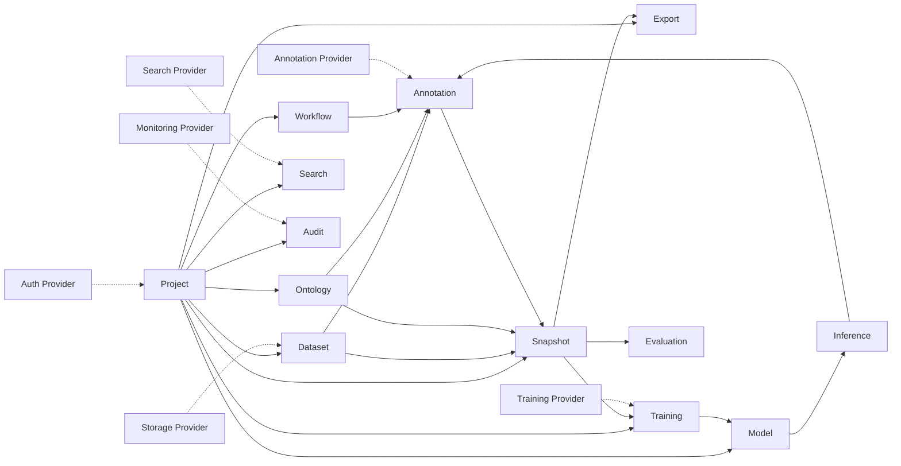

# Template

Project Domain Design

Dataset Domain

Annotation Domain

Workflow Domain

Snapshot Domain

Export Domain

Model Domain

Inference Domain

# Mục tiêu

AI Data Platform là một nền tảng hợp nhất nhiều công cụ mã nguồn mở và các dịch vụ nội bộ để quản lý toàn bộ vòng đời dữ liệu AI, từ khởi tạo Project, định nghĩa Ontology, quản lý Dataset và Asset, gán nhãn Annotation, điều phối Workflow, tạo Snapshot bất biến, Export dữ liệu, Training mô hình, quản lý Model, suy luận Inference, đến Search và Audit.

Mục tiêu của nền tảng là:

- Cung cấp một **workspace thống nhất** cho từng bài toán AI.
- Chuẩn hóa dữ liệu và quy trình để có thể tái lập, audit và mở rộng.
- Tích hợp nhiều open-source tool thông qua lớp adapter/provider thay vì phụ thuộc trực tiếp vào từng tool.
- Tách biệt rõ giữa **core business domains** và **integration layer**.

# Phạm vi trách nhiệm

AI Data Platform chịu trách nhiệm:

- Quản lý Project và quyền truy cập.
- Quản lý Ontology và schema annotation.
- Quản lý Dataset, Asset và Dataset Version.
- Quản lý Annotation, Revision và dữ liệu chuẩn hóa.
- Điều phối Workflow cho các nghiệp vụ annotation, review, approval.
- Tạo Snapshot bất biến từ dữ liệu đã được chuẩn hóa.
- Export dữ liệu sang nhiều định dạng khác nhau.
- Training mô hình từ Snapshot.
- Quản lý Model registry và artifact.
- Thực hiện Inference và pre-annotation.
- Index và search dữ liệu.
- Audit toàn bộ hoạt động.

Nền tảng không nên tự mình viết lại toàn bộ chức năng chuyên sâu của các công cụ đã có sẵn, ví dụ:

- Annotation editor hoàn chỉnh như Label Studio hoặc CVAT.
- Storage engine như MinIO hoặc S3.
- Experiment tracking engine như MLflow.
- Search engine như OpenSearch.

Những thành phần này được tích hợp qua provider/adapter layer.

VD:

- **Annotation Provider**: dùng **Label Studio** cho workflow gán nhãn tổng quát vì nó có API, hỗ trợ import/export annotations, và có cơ chế predictions để nạp pre-annotation; dùng **CVAT** khi bạn cần task management, import annotations, export dataset theo nhiều format và webhook; dùng **doccano** cho các bài toán text như text classification, sequence labeling và sequence-to-sequence, đồng thời có REST APIs để tích hợp script/model.
- **Storage Provider**: dùng **MinIO** cho object storage vì MinIO là S3-compatible object store, hỗ trợ lưu trữ object và versioning, nên khớp rất tốt với `Asset` và `Dataset Version`.
- **Auth: Manager Service**
- **Training Provider**: dùng **MLflow** cho experiment tracking, artifact storage và model registry; nếu bạn muốn chạy training pipeline trên Kubernetes thì **Kubeflow Pipelines** phù hợp vì nó là platform để xây ML workflows portable và scalable, còn **Kubeflow Trainer** phù hợp cho distributed training trên Kubernetes.
- **Inference Provider**: dùng **KServe** vì đây là inference platform trên Kubernetes cho predictive và generative AI, có data plane chuyên cho inference request và hỗ trợ protocol chuẩn V1/V2.
- **Search Provider**: dùng **OpenSearch** cho document search/indexing vì nó có search APIs, Query DSL và index APIs; dùng **Qdrant** khi bạn cần vector search hoặc semantic search cho embedding.
- **Monitoring Provider**: dùng **Prometheus** để thu thập time series và alerting, kết hợp **Grafana** để làm dashboard và alerting trên nhiều data source.
- **Workflow execution provider**: nếu bạn muốn một backend thực thi workflow trên Kubernetes thì **Argo Workflows** là lựa chọn rất hợp vì nó là container-native workflow engine, còn **Kubeflow Pipelines** thì hợp hơn nếu workflow thiên về ML pipeline.

---

# Thiết kế (Design)

Hệ thống được thiết kế theo nguyên tắc **Domain-Driven Design**, **workspace-centric architecture**, và **plugin/provider integration**.

## Kiến trúc tổng quan

## Nguyên tắc thiết kế

- **Project là workspace boundary**: mỗi Project đại diện cho một bài toán AI hoặc một sản phẩm AI.
- **Ontology là schema contract**: định nghĩa cách dữ liệu được gán nhãn trong phạm vi Project.
- **Dataset là data catalog**: quản lý Asset và Dataset Version.
- **Annotation là dữ liệu chuẩn hóa**: lưu kết quả gán nhãn độc lập với tool.
- **Workflow là process orchestration**: quản lý công việc, phân công, review và approval.
- **Snapshot là immutable source**: nguồn dữ liệu bất biến cho Export, Training và Evaluation.
- **Provider layer**: các open-source tool là implementation có thể thay thế, không phải business core.
- **Immutable artifacts**: Dataset Version, Ontology Version, Annotation Revision, Snapshot đều phải bất biến sau khi phát hành.

---

# Domain Model

## Danh sách Domain

| Domain | Trách nhiệm |
| --- | --- |
| **Project** | Quản lý workspace, member, permission, project configuration |
| **Ontology** | Quản lý annotation schema, version, category, attribute |
| **Dataset** | Quản lý dataset, dataset version, asset, metadata, storage URI |
| **Annotation** | Quản lý annotation, revision, result, internal schema |
| **Workflow** | Quản lý work item, assignment, review, approval, notification |
| **Snapshot** | Tạo bản bất biến từ dataset version và annotation revision |
| **Export** | Chuyển Snapshot sang các định dạng khác |
| **Training** | Huấn luyện mô hình từ Snapshot |
| **Model** | Quản lý registry, version, artifact, deployment metadata |
| **Inference** | Suy luận mô hình và tạo pre-annotation |
| **Search** | Lập chỉ mục và truy vấn tài nguyên |
| **Audit** | Ghi nhận lịch sử hoạt động và truy vết |
| **Provider Layer** | Kết nối các open-source tool và dịch vụ bên ngoài |

## Project Domain

Project là đơn vị quản lý nghiệp vụ cao nhất trong phạm vi một bài toán AI.

Project chịu trách nhiệm:

- Định nghĩa không gian làm việc.
- Quản lý thành viên và quyền.
- Quản lý cấu hình dùng chung.
- Là điểm gắn kết các domain khác trong cùng một workspace.

Project không sở hữu trực tiếp dữ liệu annotation, dataset hay snapshot.

---

## Ontology Domain

Ontology là domain quản lý **Annotation Schema**.

Ontology chịu trách nhiệm:

- Quản lý ontology.
- Quản lý ontology version.
- Quản lý category.
- Quản lý attribute.

Ontology là nguồn định nghĩa thống nhất cho dữ liệu gán nhãn trong Project.

Ontology version là bất biến sau khi published.

---

## Dataset Domain

Dataset Domain quản lý dữ liệu vật lý và phiên bản tập dữ liệu.

Dataset Domain chịu trách nhiệm:

- Quản lý Dataset.
- Quản lý Dataset Version.
- Quản lý Asset.
- Quản lý metadata của Asset và Dataset.
- Phát hiện trùng lặp bằng checksum.
- Quản lý storage URI.
- Cung cấp Asset cho các domain khác.

Dataset Domain được thiết kế theo nguyên tắc **data catalog**: dữ liệu vật lý chỉ tồn tại một lần dưới dạng Asset, còn Dataset chỉ tổ chức Asset theo mục đích nghiệp vụ.

---

## Annotation Domain

Annotation Domain quản lý dữ liệu gán nhãn đã chuẩn hóa.

Annotation Domain chịu trách nhiệm:

- Quản lý Annotation.
- Quản lý Annotation Revision.
- Quản lý Annotation Result.
- Chuẩn hóa dữ liệu từ tool bên ngoài sang internal schema.
- Kiểm tra tính hợp lệ của dữ liệu gán nhãn.
- Cung cấp dữ liệu cho Snapshot, Export và Training.

Annotation Domain không quản lý workflow, assignment hay review.

---

## Workflow Domain

Workflow Domain quản lý quy trình xử lý công việc.

Workflow Domain chịu trách nhiệm:

- Quản lý Work Item.
- Phân công công việc.
- Quản lý trạng thái công việc.
- Review và approval.
- Notification.
- Audit lịch sử xử lý workflow.

Workflow không sở hữu dữ liệu annotation, dataset hay snapshot.

---

## Snapshot Domain

Snapshot Domain quản lý các phiên bản bất biến của dữ liệu để phục vụ downstream.

Snapshot Domain chịu trách nhiệm:

- Tạo Snapshot từ Dataset Version, Ontology Version và Annotation Revision.
- Lưu Snapshot Item.
- Quản lý Snapshot Manifest.
- Đảm bảo tính bất biến.
- Cung cấp dữ liệu cho Export, Training và Evaluation.

Snapshot chỉ lưu tham chiếu, không sao chép dữ liệu vật lý.

---

## Export Domain

Export Domain chịu trách nhiệm chuyển Snapshot sang các định dạng đích như:

- COCO
- YOLO
- Pascal VOC
- CSV
- JSON
- HuggingFace Datasets
- các định dạng tùy chỉnh khác

Export Domain không truy cập trực tiếp dữ liệu live, chỉ đọc từ Snapshot.

---

## Training Domain

Training Domain chịu trách nhiệm:

- Khởi tạo Training Job.
- Quản lý Experiment.
- Ghi nhận Checkpoint.
- Lưu Metrics.
- Điều phối training pipeline.

Training Domain đọc dữ liệu từ Snapshot để đảm bảo reproducibility.

---

## Model Domain

Model Domain chịu trách nhiệm:

- Quản lý Model Registry.
- Quản lý Model Version.
- Quản lý Artifact.
- Lưu Deployment Metadata.

Model Domain là nơi lưu trạng thái của mô hình sau huấn luyện.

---

## Inference Domain

Inference Domain chịu trách nhiệm:

- Suy luận mô hình.
- Batch prediction.
- Auto-label.
- Pre-annotation.

Inference Domain có thể tạo ra dữ liệu mới để đẩy ngược lại Annotation Domain thông qua workflow phù hợp.

---

## Search Domain

Search Domain chịu trách nhiệm:

- Index Project.
- Index Dataset.
- Index Annotation.
- Index Snapshot.
- Cung cấp Query Service.

Search Domain nên được triển khai bằng search engine chuyên dụng qua provider layer.

---

## Audit Domain

Audit Domain chịu trách nhiệm:

- Ghi nhận thay đổi.
- Ghi log hoạt động người dùng.
- Truy vết sự kiện nghiệp vụ.
- Hỗ trợ compliance và forensic trace.

Audit Domain là domain phụ trợ nhưng rất quan trọng cho nền tảng nhiều người dùng.

# Provider Layer

Provider Layer là lớp tích hợp với các công cụ bên ngoài.

Ví dụ:

- Annotation Provider: Label Studio, CVAT, Doccano, Prodigy
- Storage Provider: MinIO, S3, GCS, Azure Blob
- Training Provider: MLflow, Kubeflow, ClearML
- Search Provider: OpenSearch, Elasticsearch, Meilisearch
- Auth Provider: Keycloak, Authentik, Zitadel
- Monitoring Provider: Prometheus, Grafana, Loki

Provider Layer giúp hệ thống có khả năng thay thế công cụ mà không làm thay đổi core domains.

---

# Design Decisions

### Project là workspace boundary

Mọi tài nguyên đều phải thuộc về đúng một Project để tránh lẫn lộn ngữ cảnh giữa các bài toán AI khác nhau.

### Ontology là domain riêng

Ontology có lifecycle và versioning riêng, nên được tách thành domain riêng thay vì nhét vào Project như một cấu hình đơn giản.

### Dataset là data catalog

Asset chỉ tồn tại một lần, Dataset chỉ tổ chức Asset theo mục đích nghiệp vụ. Đây là cách giảm trùng lặp và tăng khả năng truy vết.

### Annotation là dữ liệu chuẩn hóa

Tất cả annotation tool bên ngoài phải được chuyển sang internal schema trước khi lưu.

### Snapshot là source of truth cho downstream

Export, Training và Evaluation chỉ đọc Snapshot thay vì đọc dữ liệu live.

### Provider layer giúp thay thế tool

Label Studio, CVAT, MLflow, MinIO, OpenSearch... đều là implementation có thể thay thế, không phải core business logic.

### Immutable artifacts

Dataset Version, Ontology Version, Annotation Revision và Snapshot đều nên bất biến sau khi phát hành để đảm bảo reproducibility.

---

## 12. Benefits

- Kiến trúc rõ ràng, dễ mở rộng.
- Tách biệt domain và integration layer.
- Hỗ trợ nhiều loại bài toán AI khác nhau.
- Dễ thay thế open-source tool mà không phá core system.
- Dễ audit, trace và reproduce dữ liệu.
- Hỗ trợ tốt cho annotation, training và inference trong cùng một nền tảng.

---

## 13. Limitations

- Số lượng domain và service khá nhiều, đòi hỏi kỷ luật kiến trúc cao.
- Cần thiết kế provider layer cẩn thận để tránh coupling ngược.
- Quản lý immutable artifacts và versioning làm tăng độ phức tạp ban đầu.
- Snapshot creation phụ thuộc nhiều domain, nên cần orchestration tốt.
- Nếu Ontology phát triển quá mạnh, có thể cần thêm tách biệt sâu hơn ở giai đoạn sau.

---

## 14. Future Extension

- Hỗ trợ Organization và multi-workspace.
- Hỗ trợ shared ontology template giữa nhiều project.
- Hỗ trợ branching và merging cho Dataset Version và Ontology Version.
- Hỗ trợ incremental snapshot.
- Hỗ trợ active learning và human-in-the-loop annotation.
- Hỗ trợ nhiều annotation provider hoạt động đồng thời trong một project.
- Hỗ trợ plugin marketplace cho core provider layer.
- Hỗ trợ data lineage và compliance dashboard.
- Hỗ trợ vector search và multimodal retrieval ở mức platform.