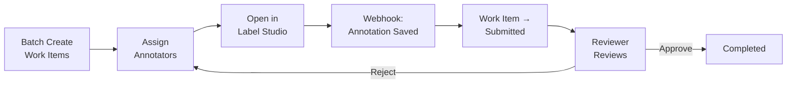

# Phase 2 — Annotation + Workflow Domain

> **Thời gian**: 6 tuần · **Team**: 5 devs  
> **Phụ thuộc**: Phase 1 (Project, Ontology, Dataset)  
> **Mục tiêu**: Annotator nhận việc, gán nhãn qua Label Studio, dữ liệu sync về platform theo Internal Schema, trải qua review/approval workflow.

---

## 2A — Annotation Domain (Tuần 1–3)

### Database Tables

| Table | Columns chính | Ghi chú |
|-------|---------------|---------|
| `annotations` | id, asset_id, project_id, ontology_version_id, created_by, created_at, updated_at | 1 Annotation per Asset per OntologyVersion |
| `annotation_revisions` | id, annotation_id, revision_number, created_by, source (human/machine), created_at | Immutable sau khi tạo. source để phân biệt human vs pre-annotation |
| `annotation_results` | id, revision_id, category_id, result_type, geometry (JSONB), payload (JSONB), attributes (JSONB) | result_type: bbox, polygon, text_region, caption, classification, ner... |

### API Endpoints

| Method | Path | Mô tả | Quyền |
|--------|------|--------|-------|
| `GET` | `/api/v1/assets/{aid}/annotations` | List annotations cho asset | Member |
| `GET` | `/api/v1/annotations/{id}` | Chi tiết annotation + latest revision | Member |
| `GET` | `/api/v1/annotations/{id}/revisions` | List revisions | Member |
| `GET` | `/api/v1/annotation-revisions/{rid}` | Chi tiết revision + results | Member |
| `POST` | `/api/v1/annotations` | Tạo annotation + revision mới | Annotator+ |
| `POST` | `/api/v1/annotations/{id}/revisions` | Tạo revision mới (sửa annotation) | Annotator+ |
| `POST` | `/api/v1/annotations/sync` | Webhook endpoint cho Label Studio | System |

### Cần làm

- **Internal Annotation Schema**: schema thống nhất cho mọi loại annotation (bbox, polygon, text, NER...). Mọi tool bên ngoài phải convert về schema này
- **Annotation Service**: tạo annotation, tạo revision (mỗi lần sửa = 1 revision mới, immutable)
- **Annotation Validator**: kiểm tra category_id tồn tại trong Ontology Version, attributes hợp lệ theo schema
- **Tool Adapter Interface**: abstract layer cho annotation tools — `push_tasks()`, `pull_annotations()`, `handle_webhook()`
- **Label Studio Adapter**:
  - Tạo Label Studio project tương ứng với Dataset Version
  - Push assets (tasks) lên Label Studio
  - Map Ontology → Label Studio label config XML
  - Nhận webhook khi annotator submit → convert LS format → Internal Schema → save revision
  - Convert Internal Schema → Label Studio predictions (cho pre-annotation)
- **Webhook Handler**: nhận events từ Label Studio, validate, convert, save

### Frontend

- Annotation viewer: hiển thị annotation results trên asset (overlay bbox, polygon...)
- Revision history: list revisions, diff giữa 2 revisions
- Button "Open in Label Studio" → redirect tới LS task
- Annotation stats: progress per dataset version (annotated/total)

---

## 2B — Workflow Domain (Tuần 4–6)

### Database Tables

| Table | Columns chính | Ghi chú |
|-------|---------------|---------|
| `workflow_definitions` | id, project_id, name, description, config (JSONB), created_at | Config chứa state machine definition |
| `work_items` | id, workflow_id, resource_type, resource_id, status, priority, created_at, updated_at | resource_type: annotation, qa, export... Generic work unit |
| `assignments` | id, work_item_id, assignee_id, assigned_by, assigned_at, due_date | Ai được giao việc |
| `workflow_history` | id, work_item_id, from_state, to_state, changed_by, comment, changed_at | Audit trail cho mỗi state change |

### API Endpoints

| Method | Path | Mô tả | Quyền |
|--------|------|--------|-------|
| `POST` | `/api/v1/projects/{pid}/workflow-definitions` | Tạo workflow definition | Owner/Admin |
| `GET` | `/api/v1/projects/{pid}/workflow-definitions` | List definitions | Member |
| `GET` | `/api/v1/work-items` | List work items (filter by status, assignee, project) | Member |
| `GET` | `/api/v1/work-items/{id}` | Chi tiết work item | Member |
| `POST` | `/api/v1/work-items/{id}/assign` | Assign cho user | Owner/Admin |
| `POST` | `/api/v1/work-items/{id}/transition` | Chuyển trạng thái | Depends on role |
| `GET` | `/api/v1/work-items/{id}/history` | Lịch sử transitions | Member |
| `POST` | `/api/v1/projects/{pid}/work-items/batch` | Tạo batch work items từ dataset version | Owner/Admin |

### Cần làm

- **Workflow Definition**: cấu hình state machine cho project (states + allowed transitions + required roles)
- **Default Annotation Workflow**: Created → Assigned → InProgress → Submitted → InReview → Approved/Rejected → Completed
- **Work Item**: generic work unit, link tới resource qua `resource_type` + `resource_id`
- **Workflow State Machine**: validate transitions (chỉ cho phép chuyển theo đúng graph)
- **Transition Engine**: kiểm tra quyền (chỉ Reviewer mới Approve/Reject, chỉ Annotator mới Submit)
- **Assignment Service**:
  - Manual assign: admin chọn user
  - Auto-assign: round-robin hoặc random
  - Batch assign: assign nhiều work items cùng lúc
- **Batch Work Item Creation**: khi có dataset version mới → tạo work items cho từng asset cần annotation
- **Notification Service**: gửi thông báo khi work item được assign, rejected, completed (in-app trước, mở rộng email/Slack sau)
- **Workflow Audit Log**: ghi mỗi state transition với actor + timestamp + comment

### Integration: Annotation ↔ Workflow

- Khi tạo batch work items cho annotation → mỗi work item link tới 1 asset
- Annotator nhận work item → mở Label Studio → gán nhãn → webhook → annotation saved → work item chuyển sang Submitted
- Reviewer review → Approve/Reject → work item chuyển trạng thái
- Rejected → gán lại cho annotator → sửa → re-submit

### Frontend

- Work item dashboard: list items by status, filter by assignee/project
- Kanban board view: columns = states, cards = work items
- Work item detail: annotation preview, history timeline, assign/transition buttons
- Notification center: bell icon, unread count, list notifications
- Admin view: batch create work items, batch assign, progress overview

---

## Phân công (6 tuần × 5 devs)

| Tuần | Dev 1 | Dev 2 | Dev 3 | Dev 4 | Dev 5 (Frontend) |
|------|-------|-------|-------|-------|-------------------|
| **1** | Annotation model + repo | Internal Annotation Schema design | Tool Adapter interface | Label Studio Adapter: project setup | Annotation viewer UI |
| **2** | Annotation Service + Validator | Annotation revision flow | LS Adapter: push tasks, label config | LS Adapter: webhook handler | Annotation overlay (bbox, polygon) |
| **3** | Webhook endpoint + convert | Integration tests (LS ↔ Platform) | LS Adapter: predictions push | Annotation API router | Revision history + stats UI |
| **4** | Workflow Definition model | Work Item + State Machine | Transition Engine + role check | Assignment Service | Work item dashboard |
| **5** | Batch work item creation | Auto-assign (round-robin) | Notification Service | Workflow API router | Kanban board view |
| **6** | Annotation ↔ Workflow integration | Workflow audit log | Integration tests | API review + fixes | Notification center |

---

## Acceptance Criteria

### Annotation
- [ ] Tạo annotation → revision immutable
- [ ] Annotation Result validate theo Ontology (category exists, attributes valid)
- [ ] Label Studio webhook → convert → save as Internal Schema
- [ ] Push assets lên Label Studio thành công
- [ ] Ontology → LS label config mapping hoạt động

### Workflow
- [ ] State machine: chỉ cho phép transitions hợp lệ
- [ ] Role check: chỉ Reviewer approve/reject, chỉ Annotator submit
- [ ] Batch create work items từ dataset version
- [ ] Auto-assign round-robin hoạt động
- [ ] Notification gửi khi assign/reject/complete
- [ ] Workflow history ghi đầy đủ

### Integration
- [ ] Flow end-to-end: Batch create → Assign → LS annotation → Webhook → Submitted → Review → Approve
- [ ] Rejected → Re-assign → Re-annotate → Re-submit
