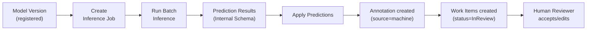

# Phase 5 — Inference + Search + Audit Domain

> **Thời gian**: 6 tuần · **Team**: 5 devs  
> **Phụ thuộc**: Phase 4 (Training + Model)  
> **Mục tiêu**: Đóng vòng lặp AI: Model → Inference → Pre-annotation → Annotation → Review. Đồng thời thêm Search index và Audit trail cho toàn platform.

---

## 5A — Inference Domain (Tuần 1–3)

### Database Tables

| Table | Columns chính | Ghi chú |
|-------|---------------|---------|
| `inference_jobs` | id, project_id, model_version_id, runtime_provider, status, config (JSONB), created_by, created_at, started_at, completed_at | status: pending/running/completed/failed |
| `prediction_results` | id, job_id, asset_id, annotation_schema (JSONB), confidence, latency_ms | annotation_schema = Internal Annotation Schema |
| `runtime_providers` | id, name, runtime_type, version, config (JSONB), status | runtime_type: yolo/paddleocr/onnx/huggingface/... |

### API Endpoints

| Method | Path | Mô tả | Quyền |
|--------|------|--------|-------|
| `POST` | `/api/v1/inference-jobs` | Tạo inference job | Owner/Admin |
| `GET` | `/api/v1/projects/{pid}/inference-jobs` | List inference jobs | Member |
| `GET` | `/api/v1/inference-jobs/{id}` | Chi tiết + status | Member |
| `DELETE` | `/api/v1/inference-jobs/{id}` | Cancel job | Owner/Admin |
| `GET` | `/api/v1/inference-jobs/{id}/results` | Prediction results (paginated) | Member |
| `POST` | `/api/v1/inference-jobs/{id}/apply` | Apply predictions → tạo Annotations | Owner/Admin |
| `GET` | `/api/v1/runtime-providers` | List available runtimes | Member |

### Cần làm

- **Inference Service**: nhận model_version_id + danh sách asset_ids + runtime → dispatch Celery task
- **Model Resolver**: tải Model Version từ Model Domain → download artifact từ MinIO → cache locally
- **Runtime Provider Interface**: abstract `load_model(artifact_path, config)`, `predict(inputs) → raw_output`, `postprocess(raw_output) → InternalAnnotationSchema`
- **Runtime Adapters** (implement theo thứ tự ưu tiên):
  1. **YOLO Runtime**: dùng ultralytics, output → bbox + category → Internal Schema
  2. **PaddleOCR Runtime**: output → text regions + transcripts → Internal Schema
  3. **ONNX Runtime**: generic ONNX inference, postprocess customizable per model
  4. **HuggingFace Runtime**: pipeline-based inference (classification, NER, captioning...)
- **Prediction Converter**: chuẩn hóa raw output của mỗi runtime → Internal Annotation Schema (category_id mapping theo Ontology)
- **Batch Inference**: Celery task xử lý từng asset, update progress, store results
- **Model Cache**: cache model file locally sau khi download lần đầu → tránh re-download mỗi job
- **Apply Predictions** (`POST /inference-jobs/{id}/apply`):
  - Lấy prediction results đã approve → tạo Annotation + Revision với `source = "machine"`
  - Tạo Work Items trong Workflow với status = Submitted (chờ human review)
  - Đây là luồng **Pre-annotation / Auto-Label**

### Pre-annotation Flow

### Frontend

- Inference jobs list: model used, asset count, status
- Create inference job: chọn model version, chọn dataset version (assets), chọn runtime config
- Inference job detail: progress bar, prediction results preview
- Prediction result viewer: overlay predictions trên ảnh (bbox, text regions...)
- Apply predictions panel: review sample predictions → apply all / apply selected
- Runtime provider list: available runtimes + version info

---

## 5B — Search Domain (Tuần 4–5)

### Architecture

Search Domain dùng **OpenSearch** qua Search Provider Interface. Không có tables riêng trong PostgreSQL — dữ liệu được index vào OpenSearch từ domain events.

### Indices cần tạo

| Index | Indexed fields | Triggered khi |
|-------|----------------|---------------|
| `projects` | name, description, project_type, owner_id, status | Project created/updated |
| `datasets` | name, description, project_id, status | Dataset created/updated |
| `assets` | filename, mime_type, project_id, metadata | Asset created |
| `annotations` | project_id, asset_id, category_names, revision_count | Annotation created/updated |
| `snapshots` | project_id, version, asset_count, status | Snapshot created |
| `models` | name, project_id, task_type, status | Model created/updated |

### API Endpoints

| Method | Path | Mô tả | Quyền |
|--------|------|--------|-------|
| `GET` | `/api/v1/search` | Global search | Authenticated |
| `GET` | `/api/v1/search/assets` | Search assets (by filename, metadata) | Member |
| `GET` | `/api/v1/search/annotations` | Search annotations (by category) | Member |

### Query params cho `/api/v1/search`

- `q`: full-text query
- `type`: project/dataset/asset/annotation/model
- `project_id`: filter by project
- `from`, `size`: pagination

### Cần làm

- **Docker Compose**: thêm OpenSearch service + OpenSearch Dashboards
- **Search Provider Interface**: abstract `index_document()`, `delete_document()`, `search()`, `create_index()`
- **OpenSearch Adapter**: implementation dùng `opensearch-py` client
- **Index Schemas**: định nghĩa mapping cho từng index (field types, analyzers cho tiếng Việt)
- **Event-driven Indexing**: subscribe domain events → index/update/delete document trong OpenSearch
  - Project created/updated → index project
  - Asset created → index asset
  - Annotation revision created → update annotation index
  - Model version registered → index model
- **Search Service**: nhận query → build OpenSearch query DSL → return results với highlight
- **Permission Filtering**: search results chỉ trả về resources mà user có quyền truy cập (filter by project membership)
- **Re-index endpoint**: admin có thể trigger re-index toàn bộ data (dùng khi schema thay đổi)

### Frontend

- Global search bar: header → real-time suggestions → full results page
- Search results page: tabs per type (Projects, Datasets, Assets, Models)
- Asset search: filter by mime_type, project, date range
- Annotation search: filter by category, project

---

## 5C — Audit Domain (Tuần 5–6)

### Database Tables

| Table | Columns chính | Ghi chú |
|-------|---------------|---------|
| `audit_events` | id, project_id, actor_id, actor_name, action, resource_type, resource_id, resource_name, old_value (JSONB), new_value (JSONB), ip_address, user_agent, created_at | Append-only. Không update/delete |

### API Endpoints

| Method | Path | Mô tả | Quyền |
|--------|------|--------|-------|
| `GET` | `/api/v1/projects/{pid}/audit-events` | Audit log của project | Owner/Admin |
| `GET` | `/api/v1/audit-events` | Global audit (platform-wide) | Platform Admin |

### Query params

- `actor_id`: filter by user
- `resource_type`: project/dataset/asset/annotation/model/...
- `resource_id`: filter by specific resource
- `action`: created/updated/deleted/published/...
- `from_date`, `to_date`: date range
- `page`, `page_size`: pagination

### Cần làm

- **Audit Event Model**: append-only table, không có update/delete
- **Audit Service**: `log_event(actor, action, resource, old_value, new_value)` → insert record
- **Audit Middleware / Decorator**: decorator `@audit("resource_type", "action")` để tự động log trên service methods
- **Domain Event → Audit**: subscribe domain events → convert → save audit event
- **Key actions cần audit** (ít nhất):
  - Project: created, updated, archived, member_added, member_removed, member_role_changed
  - Ontology: version_published, category_added, attribute_added
  - Dataset: created, version_published, asset_uploaded, asset_removed
  - Annotation: created, revision_created
  - Workflow: work_item_created, work_item_assigned, work_item_transitioned
  - Snapshot: created
  - Export: job_created, job_completed, job_failed
  - Training: job_started, job_completed, job_failed
  - Model: version_registered, status_changed, deployed
  - Inference: job_created, predictions_applied
- **Retention Policy**: cron job archive/delete audit events cũ hơn N ngày (configurable)
- **Audit Export**: export audit log ra CSV cho compliance

### Frontend

- Audit log page (per project): table với filter, pagination
- Filter panel: by actor, resource_type, action, date range
- Event detail: old_value vs new_value diff
- Admin: global audit log across all projects

---

## Phân công (6 tuần × 5 devs)

| Tuần | Dev 1 | Dev 2 | Dev 3 | Dev 4 | Dev 5 (Frontend) |
|------|-------|-------|-------|-------|-------------------|
| **1** | Inference model + service | Model Resolver + cache | Runtime Provider interface | YOLO Runtime Adapter | Inference jobs UI |
| **2** | PaddleOCR + ONNX Adapters | Prediction Converter | Batch Inference (Celery) | Apply Predictions → Annotation | Prediction viewer (overlay) |
| **3** | HuggingFace Runtime Adapter | Inference API router + tests | Pre-annotation pipeline e2e | Integration tests | Apply predictions panel |
| **4** | Search Provider interface + OS Adapter | Index schemas + mappings | Event-driven indexing setup | Search Service + query DSL | Search bar + results page |
| **5** | Re-index endpoint + permission filter | Audit Event model + service | Audit middleware/decorator | Domain events → Audit | Asset/Annotation search filters |
| **6** | Audit key actions coverage | Audit API router + tests | Retention policy + export | Full integration tests | Audit log page + diff viewer |

---

## End-to-End Demo Flow (Cuối Phase 5)

> Đây là luồng hoàn chỉnh chứng minh platform hoạt động end-to-end:

1. **Create Project** → Add members (Owner, Admin, Annotator, Reviewer)
2. **Create Ontology** → Define categories (e.g., Car, Person) → Publish version
3. **Create Dataset** → Upload images → Create Dataset Version
4. **Batch Create Work Items** → Auto-assign to Annotators
5. **Annotate in Label Studio** → Webhook sync → Annotations saved
6. **Review & Approve** → Work items completed
7. **Create Snapshot** → Train/Val/Test split
8. **Export** → COCO format → Download zip
9. **Create Training Job** → Run YOLO training → MLflow tracks metrics
10. **Training completes** → Model Version registered
11. **Create Inference Job** → Run predictions on new assets
12. **Apply Predictions** → Pre-annotations created → Review work items generated
13. **Search** "Car" → thấy annotations, models, datasets
14. **Audit Log** → xem toàn bộ lịch sử từ bước 1

---

## Acceptance Criteria

### Inference
- [ ] Inference job chạy async, store results
- [ ] YOLO predictions: bbox đúng format, category mapping đúng Ontology
- [ ] Apply predictions → tạo Annotation (source=machine) + Work Items
- [ ] Model cache: không re-download model cùng version
- [ ] Pre-annotation flow end-to-end hoạt động

### Search
- [ ] Index tất cả resource types
- [ ] Full-text search trả kết quả đúng
- [ ] Permission filtering: chỉ thấy resources có quyền
- [ ] Real-time index khi resource được tạo/cập nhật
- [ ] Vietnamese text search hoạt động (analyzer)

### Audit
- [ ] Tất cả key actions được ghi audit
- [ ] Append-only: không update/delete audit events
- [ ] Filter by actor, resource, date range
- [ ] Export audit log CSV
- [ ] Retention policy chạy đúng

### End-to-End
- [ ] Full loop: Upload → Annotate → Approve → Snapshot → Export → Train → Model → Inference → Pre-annotate → Review
